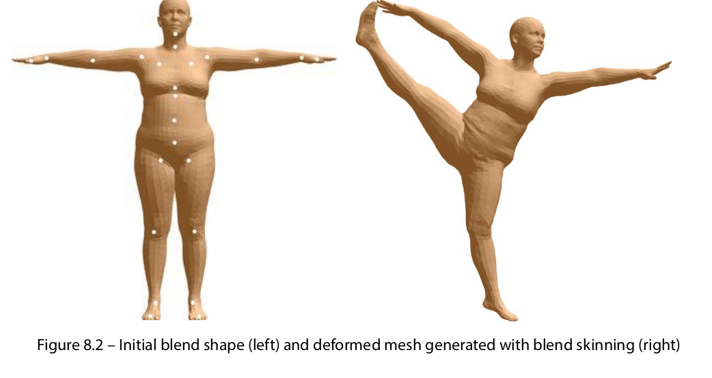

# 3D Deep Learning with Python

[Book](https://www.packtpub.com/product/3d-deep-learning-with-python/9781803247823)

## Setup environment

```
conda create -n dl3d python=3.7

conda activate dl3d

conda install pytorch torchvision torchaudio cudatoolkit-11.1 -c pytorch -c nvidia

conda install pytorch3d -c pytorch3d

conda install -c open3d-admin open3d

pip install -U scikit-learn scipy matplotlib

```

## Table Of Contents <a name="top"></a>

I. [Introduction - 3D Data processing](#c1)

1. [3D data representation](#c1.1)

    1.1. [Point cloud representation](#c1.1.1)
    
    1.2. [Mesh representation](#c1.1.2)
    
    1.3. [Voxel representation](#c1.1.3)

2. [3D data file formats](#c1.1.2)

    2.1. [Ply files](#c1.2.1)
    
    2.2. [Obj files](#c1.2.2)

3. [3D Coordinate Systems](#c1.1.3)
    
    3.1. [World coordinate system](#c1.3.1)
    
    3.2. [Normalized device coordinate (NDC)](#c1.3.2)

II. [Introduction - 3D Computer Vision and Geometry](#c2)

1. [Exploring the basic concepts of rendering, rasterization, and shading](#c2.1)

    1.1. [Barycentric coordinates](#c2.1.1)
    
    1.2. [Shading Models](#c2.1.2)

2. [Transformation and rotation](#c2.2)


III. [3D Deep Learning using PyTorch3D](#c3)

1. [Fitting Deformable Mesh Models to Raw Point Clouds](#c3.1)

    1.1. [Fitting meshes to point clouds – the problem](#c3.1.1)

    1.2. [Formulating a deformable mesh fitting problem into an optimization problem](#c3.1.2)

    1.3. [Loss functions for regularization](#c3.1.3)

    1.3.1. [Mesh Laplacian smoothing loss](#c3.1.3.1)

    1.3.2. [Mesh normal consistency loss](#c3.1.3.2)

    1.3.3. [Mesh edge loss](#c3.1.3.3)

2. [Object Pose Detection and Tracking by Differentiable Rendering](#c3.2) 

    2.1. [Why we want to have differentiable rendering](#c3.2.1)

    2.2. [How to make rendering differentiable](#c3.2.2)

    2.3. [The object pose estimation problem](#c3.2.3)

3. [Differentiable Volumetric Rendering](#3.3)

    3.1. [Overview of volumetric rendering](#c3.3.1)

    3.1.1. [Ray sampling](#c3.3.1.1)

    3.1.2. [Volume sampling](#c3.3.1.1)

    3.1.3. [Ray marching](#c3.3.1.1)

    3.2. [Differentiable volumetric rendering](#c3.3.2)

    3.3. [Reconstructing 3D models from multi-view images](#c3.3.2.1)

4. [Neural Radiance Fields (NeRF)](#3.4)

    4.1. [Overview of NeRF](#c3.4.1)

    4.1.1. [What is a radiance field?](#c3.4.1.1)

    4.1.2. [Representing radiance fields with neural networks](#c3.4.1.2)

    4.2. [NeRF architecture](#c3.4.2)

    4.3. [Volume rendering with radiance fields](#c3.4.3)

    4.3.1. [Projecting ráy into the scene](#c3.4.3.1)

    4.3.2. [Accumulating the color of a ray](#c3.4.3.2)

IV. [State-of-the-art 3D Deep Learning Using PyTorch3D](#c4)

1. [Controllable Neural Feature Fields](#c4.1)

    1.1. [GAN-based image synthesis](#c4.1.1)

    1.2. [Compositional 3D-aware image synthesis](#c4.1.2)

    1.2.1. [Generating feature fields](#c4.1.2.1)

    1.2.2. [Mapping feature fields to images](#c4.1.2.2)

2. [Modeling the Human Body in 3D](#c4.2)

    2.1. [Formulating the 3D modeling problem](#c4.2.1)

    2.1.1. [Defining a good representation](#c4.2.1.1)

    2.1.2. [Linear Blend Skinning](#c4.2.1.2)

    2.2. [SMPL model](#c4.2.2)

    2.2.1. [Defining the SMPL model](#c4.2.2.1)

    2.2.2. [Using the SMPL model](#c4.2.2.2)

    2.3. [Estimating 3D human pose and shape using SMPLify](#c4.2.3)

    2.3.1. [Defining the optimization objective function](#c4.2.3.1)

    2.3.2. [Exploring SMPLify](#c4.2.3.2)

3. [Performing End-to-End View Synthesis with SynSin](#c4.3)

    3.1. [Overview of view synthesis](#c4.3.1)

    3.2. [SynSin network architecture](#c4.3.2)

    3.2.1. [Spatial feature and depth networks](#c4.3.2.1)

    3.2.2. [Neural point cloud renderer](#c4.3.2.2)

    3.2.3. [Refinement module and discriminator](#c4.3.2.3)

4.  [Mesh R-CNN](#c4.4)

    4.1. [ Overview of meshes and voxels](#c4.4.1)

    4.2. [Mesh R-CNN architecture](#c4.4.2)

    4.2.1. [Graph convolutions](#c4.4.2.1)

    4.2.2. [Mesh predictor](#c4.4.2.2)

```
```
# I. Introduction - 3D Data processing <a name="c1"></a> 
 
## 1. 3D data representation <a name="c1.1"></a>

### 1.1. Point cloud representation <a name="c1.1.1"></a>

A 3D point cloud is a very straightforward representation of 3D objects, where each point cloud is just a collection of 3D points, and each 3D point is represented by one three-dimensional tuple (x, y, or z). The raw measurements of many depth cameras are usually 3D point clouds.

From a deep learning point of view, 3D point clouds are one of the unordered and irregular data types. Unlike regular images, where we can define neighboring pixels for each individual pixel, there are no clear and regular definitions for neighboring points for each point in a point cloud – that is, convolutions usually cannot be applied to point clouds.

Another issue for point clouds as training data for 3D deep learning is the heterogeneous data issue – that is, for one training dataset, different point clouds may contain different numbers of 3D points. One approach for avoiding such a heterogeneous data issue is forcing all the point clouds to have the same number of points. However, this may not be always possible – for example, the number of points returned by depth cameras may be different from frame to frame.

The heterogeneous data may create some difficulties for mini-batch gradient descent in training deep learning models. Most deep learning frameworks assume that each mini-batch contains training examples of the same size and dimensions. Such homogeneous data is preferred because it can be most efficiently processed by modern parallel processing hardware, such as GPUs. Handling heterogeneous mini-batches in an efficient way needs some additional work.


### 1.2. Mesh representation <a name="c1.1.2"></a>

Meshes are another widely used 3D data representation. Like points in point clouds, each mesh contains a set of 3D points called vertices. In addition, each mesh also contains a set of polygons called faces, which are defined on vertices.

In most data-driven applications, meshes are a result of post-processing from raw measurements of depth cameras. Often, they are manually created during the process of 3D asset design. Compared to point clouds, meshes contain additional geometric information, encode topology, and have surface normal information. This additional information becomes especially useful in training learning models. For example, graph convolutional neural networks usually treat meshes as graphs and define convolutional operations using the vertex neighboring information.

Just like point clouds, meshes also have similar heterogeneous data issues.


### 1.3. Voxel representation <a name="c1.1.3"></a>

Another important 3D data representation is voxel representation. A voxel is the counterpart of a pixel in 3D computer vision. A pixel is defined by dividing a rectangle in 2D into smaller rectangles and each small rectangle is one pixel. Similarly, a voxel is defined by dividing a 3D cube into smaller-sized cubes and each cube is called one voxel.

Voxel representations usually use <b> Truncated Signed Distance Functions (TSDFs) </b> to represent 3D surfaces. A Signed Distance Function (SDF) can be defined at each voxel as the (signed) distance between the center of the voxel to the closest point on the surface. A positive sign in an SDF indicates that the voxel center is outside an object. The only difference between a TSDF and an SDF is that the values of a TSDF are truncated, such that the values of a TSDF always range from -1 to +1.

Unlike point clouds and meshes, voxel representation is ordered and regular. This property is like pixels in images and enables the use of convolutional filters in deep learning models. One potential disadvantage of voxel representation is that it usually requires more computer memory, but this can be reduced by using techniques such as hashing. Nevertheless, voxel representation is an important 3D data representation.

There are 3D data representations other than the ones mentioned here. For example, multi-view representations use multiple images taken from different viewpoints to represent a 3D scene. RGB-D representations use an additional depth channel to represent a 3D scene. However, in this book, we will not be diving too deep into these 3D representations. Now that we have learned the basics of 3D data representations, we will dive into a few commonly used file formats for point clouds and meshes.


## 2. 3D data file formats <a name="c1.2"></a>

### 2.1. Ply files  <a name="c1.2.1"></a>

The PLY file format is one of the most commonly used file formats for point clouds and meshes. It is a simple file format that can be easily parsed by most programming languages. The PLY file format is a text-based file format, which means that it is human-readable. The following is an example of a PLY file:

```
ply
format ascii 1.0
comment created for the book 3D Deep Learning with Python
element vertex 8
property float32 x
property float32 y
property float32 z
element face 12
property list uint8 int32 vertex_indices
end_header
-1 -1 -1
1 -1 -1
1 1 -1
-1 1 -1
-1 -1 1
1 -1 1
1 1 1
-1 1 1
3 0 1 2
3 5 4 7
3 6 2 1
3 3 7 4
3 7 3 2
3 5 1 0
3 0 2 3
3 5 7 6
3 6 1 5
3 3 4 0
3 7 2 6
3 5 0 4
```

[Example of a PLY file](./Introduction/ply_io/README.md)

### 2.2. Obj files <a name="c1.2.2"></a>

Obj files are another commonly used file format for meshes. They are also text-based and human-readable. 

[Example of a Obj file](./Introduction/obj_io/README.md)

## 3. 3D Coordinate Systems <a name="c1.3"></a>

### 3.1. World coordinate system <a name="c1.3.1"></a>

The world coordinate system is the coordinate system that is used to represent the 3D world. It is usually defined by the 3D sensor that is used to capture the 3D data. For example, the world coordinate system of a depth camera is defined by the depth camera itself. The world coordinate system is usually defined as a right-handed coordinate system, where the x-axis points to the right, the y-axis points up, and the z-axis points forward.


### 3.2. Normalized device coordinate (NDC) <a name="c1.3.2"></a>

The normalized device coordinate (NDC) confines the volume that a camera can render. The x coordinate values in the NDC space range from -1 to +1, as do the y coordinate values. The z coordinate values range from znear to zfar, where znear is the nearest depth and zfar is the farthest depth. Any object out of this znear to zfar range would not be rendered by the camera.

Finally, the screen coordinate system is defined in terms of how the rendered images are shown on our screens. The coordinate system contains the x coordinate as the columns of the pixels, the y coordinate as the rows of the pixels, and the z coordinate corresponding to the depth of the object.

To render the 3D object correctly on our 2D screens, we need to switch between these coordinate systems.


### 3.3. Camera models <a name="c1.3.3"></a>


The orthographic cameras use orthographic projections to map objects in the 3D world to 2D images, while the perspective cameras use perspective projections to map objects in the 3D world to 2D images. The orthographic projections map objects to 2D images, disregarding the object depth. For example, just as shown in the figure, two objects with the same geometric size at different depths would be mapped to 2D images of the same size. On the other hand, in perspective projections, if an object moved far away from the camera, it would be mapped to a smaller size on the 2D images.

[Example of a Camera model](./Introduction/camera/README.md)

```
```
# II. Introduction - 3D Computer Vision and Geometry <a name="c2"></a> 

## 1. Exploring the basic concepts of rendering, rasterization, and shading <a name="c2.1"></a>

- <b>Rendering: </b> is a process that takes 3D data models of the world around our camera as input and output images. It is an approximation to the physical process where images are formed in our camera in the real world. Typically, the 3D data models are meshes. In this case, rendering is usually done using ray tracing:


An example of ray tracing processing is shown in Figure above. In the example, the world model contains one 3D sphere, which is represented by a mesh model. To form the image of the 3D sphere, for each image pixel, we generate one ray, starting from the camera origin and going through the image pixel. If one ray intersects with one mesh face, then we know the mesh face can project its color to the image pixel. We also need to trace the depth of each intersection because a face with a smaller depth would occlude faces with larger depths.

Thus, the process of rendering can usually be divided into two stages – rasterization and shading.

- <b>Rasterization: </b> The ray tracing process is a typical rasterization process – that is, the process of finding relevant geometric objects for each image pixel.

- <b>Shading: </b> is the process of taking the outputs of the rasterization and computing the pixel value for each image pixel.

### 1.1. Barycentric coordinates <a name="c2.1.1"></a>

For each point coplanar with a mesh face, the coordinates of the point can always be written as a linear combination of the coordinates of the three vertices of the mesh face. For example, as shown in the following diagram, the point p can be written as $uA + vB + wC$ , where A, B, and C are the coordinates of the three vertices of the mesh face. Thus, we can represent each such point with the coefficients $u$, $v$, and $w$. This representation is called the <b>barycentric coordinates</b> of the point. For point lays within the mesh face triangle, $u + v + w = 1$ and all $u,v,w$ are positive numbers. Since barycentric coordinates define any point inside a face as a function of face vertices, we can use the same coefficients to interpolate other properties across the whole face as a function of the properties defined at the vertices of the face. For example, we can use it for shading as shown in Figure below:


### 1.2. Shading Models <a name="c2.1.2"></a>

#### 1.2.1. Light source models <a name="c2.1.2.1"></a>

Light propagation in the real world can be a sophisticated process. Several approximations of light sources are usually used in shading to reduce computational costs:

- The first assumption is ambient lighting, where we assume that there is some background light radiation after sufficient reflections, such that they usually come from all directions with almost the same amplitude at all image pixels.

- Another assumption that we usually use is that some light sources can be considered point light sources. A point light source radiates lights from one single point and the radiations at all directions have the same color and amplitude.

- A third assumption that we usually use is that some light sources can be modeled as directional light sources. In such a case, the light directions from the light source are identical at all the 3D spatial locations. Directional lighting is a good approximation model for cases where the light sources are far away from the rendered objects – for example, sunlight.

#### 1.2.2. Lambertian shading model <a name="c2.1.2.2"></a>

The first physical model that we will discuss is Lambert’s cosine law. Lambertian surfaces are types of objects that are not shiny at all, such as paper, unfinished wood, and unpolished stones:


Figure above shows an example of how lights diffuse on a Lambertian surface. One basic idea of the Lambertian cosine law is that for Lambertian surfaces, the amplitude of the reflected light does not depend on the viewer’s angle, but only depends on the angle $θ$ between the surface normal and the direction of the incident light. More precisely, the intensity of the reflected light $c$ is as follows:

$c = c_{r} c_{l} cos(\theta)$

where $c_{r}$ is the amplitude of the reflected light, $c_{l}$ is the amplitude of the incident light, and $θ$ is the angle between the surface normal and the direction of the incident ligh

If we further consider the ambient light, the amplitude of the reflected light is as follows:

$c = c_{r} (c_{a} + c_{l} cos(\theta))$

where $c_{a}$ is the amplitude of the ambient light.

#### 1.2.3. Phong shading model <a name="c2.1.2.3"></a>

For shiny surfaces, such as polished tile floors and glossy paint, the reflected light also contains a highlight component. The Phong lighting model is a frequently used model for these glossy components:


An example of the Phong lighting model is shown in Figure above. One basic principle of the Phong lighting model is that the shiny light component should be strongest in the direction of reflection of the incoming light. The component would become weaker as the angle $c$ between the direction of
reflection and the viewing angle becomes larger.

More precisely, the amplitude of the shiny light component $c$ is equal to the following:

$c = c_{r} c_{l} c_{p} [cos(σ)]^p$

Here, the exponent $p$ is a parameter of the model for controlling the speed at which the shiny components attenuate when the viewing angle is away from the direction of reflection.

Finally, if we consider all three major components – ambient lighting, diffusion, and highlights – the final equation for the amplitude of light is as follows:

$c = c_{r} (c_{a} + c_{l} cos(\theta) + c_{l} c_{p} [cos(σ)]^p)$

Note that the preceding equation applies to each color component. In other words, we will have one of these equations for each color channel (red, green, and blue) with a distinct set of $c_{r}$, $c_{l}$, $c_{a}$ values.

[Example for 3D rendering](./3DRendering/)

## 2. Transformation and rotation <a name="c2.2"></a>

SO(3) denotes the special orthogonal group in 3D and SE(3) denotes the special Euclidean group in 3D. Informally speaking, SO(3) denotes the set of all the rotation transformations and SE(3) denotes the set of all the rigid transformations in 3D.

[Pytoech3D example](./3DRendering/)

```
```
# III. 3D Deep Learning using PyTorch3D <a name="c3"></a>

## 1. Fitting Deformable Mesh Models to Raw Point Clouds <a name="c3.1"></a>

### 1.1. Fitting meshes to point clouds – the problem <a name="c3.1.1"></a>

Real-world depth cameras, such as LiDAR, time-of-flight cameras, and stereo vision cameras, usually output either depth images or point clouds. For example, in the case of time-of-flight cameras, a modulated light ray is projected from the camera to the world, and the depth at each pixel is measured from the phase of the reflected light rays received at the pixel. Thus, at each pixel, we can usually get one depth measurement and one reflected light amplitude measurement. However, other than the sampled depth information, we usually do not have direct measurements of the surfaces. For example, we cannot measure the smoothness or norm of the surface directly.

Similarly, in the case of stereo vision cameras, at each time slot, the camera can take two RGB images from the camera pair at roughly the same time. The camera then estimates the depth by finding the pixel correspondences between the two images. The output is thus a depth estimation at each pixel. Again, the camera cannot give us any direct measurements of surfaces.

However, in many real-world applications, surface information is sought. For example, in robotic picking tasks, usually, we need to find regions on an object such that the robotic hands can grasp firmly. In such a scenario, it is usually desirable that the regions are large in size and reasonably flat.

There are many other scenarios in which we want to fit a (deformable) mesh model to a point cloud. For example, there are some machine vision applications where we have the mesh model for an industrial part and the point cloud measurement from the depth camera has an unknown orientation and pose. In this case, finding a fitting of the mesh model to the point cloud would recover the unknown object pose.

For another example, in human face tracking, sometimes, we want to fit a deformable face mesh model to point cloud measurements, such that we can recover the identity of the human being and/or facial expressions.

<b>Loss functions</b> are central concepts in almost all optimizations. Essentially, to fit a point cloud, we need to design a loss function, such that when the loss function is minimized, the mesh as the optimization variable fits to the point cloud.

Actually, selecting the right loss function is usually a critical design decision in many real-world projects. Different choices of loss function usually result in significantly different system performance. The requirements for a loss function usually include at least the following properties:

• The loss function needs to have desirable numerical properties, such as smooth, convex, without the issue of vanishing gradients, and so on

• The loss function (and its gradients) can be easily computed; for example, they can be efficiently computed on GPUs

• The loss function is a good measurement of model fitting; that is, minimizing the loss function results in a satisfactory mesh model fitting for the input point clouds

Other than one primary loss function in such model fitting optimization problems, we usually also need to have other loss functions for regularizing the model fitting. For example, if we have some prior knowledge that the surfaces should be smooth, then we usually need to introduce an additional regularization loss function, such that not-smooth meshes would be penalized more.

### 1.2. Formulating a deformable mesh fitting problem into an optimization problem <a name="c3.1.2"></a>

In this section, we are going to talk about how to formulate the mesh fitting problem into an optimization problem. One key observation here is that object surfaces such as pedestrians can always be continuously deformed into a sphere. Thus, the approach we are going to take will start from the surface of a sphere and deform the surface to minimize a cost function.

The cost function should be chosen such that it is a good measurement of how similar the point cloud is to the mesh. Here, we choose the major cost function to be the Chamfer set distance. The Chamfer distance is defined between two sets of points as follows:


The Chamfer distance is symmetric and is a sum of two terms. In the first term, for each point x in the first point cloud, the closest point y in the other point cloud is found. For each such pair x and y, their distance is obtained and the distances for all the pairs are summed up. Similarly, in the second term, for each y in the second point cloud, one x is found and the distances between such x and y pairs are summed up.

The Chamfer distance is a good measurement of how similar two point clouds are. If the two point clouds are the same, then the Chamfer distance is zero. If the two point clouds are different, then the Chamfer distance is positive.

### 1.3. Loss functions for regularization <a name="c3.1.3"></a>

In the previous section, we successfully formulated the deformable mesh fitting problem into an optimization problem. However, the approach of directly optimizing this primary loss function can be problematic. The issues lie in that there may exist multiple mesh models that can be good fits to the same point cloud. These mesh models that are good fits may include some mesh models that are far away from smooth meshes.

On the other hand, we usually have prior knowledge about pedestrians. For example, the surfaces of pedestrians are usually smooth, the surface norms are smooth also. Thus, even if a non-smooth mesh is close to the input point cloud in terms of Chamfer distance, we know with a certain level of confidence that it is far away from the ground truth.

Machine learning literature has provided solutions for excluding such undesirable non-smooth solutions for several decades. The solution is called <b>regularization</b>. Essentially, the loss we want to optimize is chosen to be a sum of multiple loss functions. Certainly, the first term of the sum will be the primary Chamfer distance. The other terms are for penalizing surface non-smoothness and norm non-smoothness.

#### 1.3.1. Mesh Laplacian smoothing loss <a name="c3.1.3.1"></a>

The mesh Laplacian is a discrete version of the well-known Laplace-Beltrami operator. One version (usually called uniform Laplacian) is as follows:


In the preceding definition, the Laplacian at the i-th vertex is just a sum of differences, where each difference is between the coordinates of the current vertex and those of a neighboring vertex.

The Laplacian is a measurement for smoothness. If the i-th vertex and its neighbors lie all within one plane, then the Laplacian should be zero. Here, we are using a uniform version of the Laplacian, where the contribution to the sum from each neighbor is equally weighted. There are more complicated versions of Laplacians, where the preceding contributions are weighted according to various schemes.

#### 1.3.2. Mesh normal consistency loss <a name="c3.1.3.2"></a>

The mesh normal consistency loss is a loss function for penalizing the distances between adjacent normal vectors on the mesh.

#### 1.3.3. Mesh edge loss <a name="c3.1.3.3"></a>

Mesh edge loss is for penalizing long edges in meshes. For example, in the mesh model fitting problem we consider in this chapter, we want to eventually obtain a solution, such that the obtained mesh model fits the input point cloud uniformly. In other words, each local region of the point cloud is covered by small triangles of the mesh. Otherwise, the mesh model cannot capture the fine details of slowly varying surfaces, meaning the model may not be that accurate or trustworthy.

The aforementioned problem can be easily avoided by including the mesh edge loss in the objective function. The mesh edge loss is essentially a sum of all the edge lengths in the mesh.

[Implementing the mesh fitting with PyTorch3D](./meshesFitting/)

## 2. Object Pose Detection and Tracking by Differentiable Rendering <a name="c3.2"></a>

### 2.1. Why we want to have differentiable rendering <a name="c3.2.1"></a>

The physical process of image formation is a mapping from 3D models to 2D images. As shown in the example in Figure below, depending on the positions of the red and blue spheres in 3D (two possible configurations are shown on the left-hand side), we may get different 2D images (the images corresponding to the two configurations are shown on the right-hand side).


Many 3D computer vision problems are a reversal of image formation. In these problems, we are usually given 2D images and need to estimate the 3D models from the 2D images. For example, in Figure below, we are given the 2D image shown on the right-hand side and the question is, which 3D model is the one that corresponds to the observed image?


According to some ideas that were first discussed in the computer vision community decades ago, we can formulate the problem as an optimization problem. In this case, the optimization variables here are the position of two 3D spheres. We want to optimize the two centers, such that the rendered images are like the preceding 2D observed image. To measure similarity precisely, we need to use a cost function – for example, we can use pixel-wise mean-square errors. We then need to compute a gradient from the cost function to the two centers of spheres, so that we can minimize the cost function iteratively by going toward the gradient descent direction.

However, we can calculate a gradient from the cost function to the optimization variables only under the condition that the mapping from the optimization variables to the cost functions is differentiable, which implies that the rendering process is also differentiable.

### 2.2. How to make rendering differentiable <a name="c3.2.2"></a>

Rendering is an imitation of the physical process of image formation. This physical process of image formation itself is differentiable in many cases. Suppose that the surface is normal and the material properties of the object are all smooth. Then, the pixel color in the example is a differentiable function of the positions of the spheres.

However, there are cases where the pixel color is not a smooth function of the position. This can happen at the occlusion boundaries, for example. This is shown in Figure 4.3, where the blue sphere is at a location that would occlude the red sphere at that view if the blue sphere moved up a little bit. The pixel moved at that view is thus not a differentiable function of the sphere center locations.


When we use conventional rendering algorithms, information about local gradients is lost due to discretization. As we discussed in the previous section, rasterization is a step of rendering where for each pixel on the imaging plane, we find the most relevant mesh face (or decide that no relevant mesh face can be found).

In conventional rasterization, for each pixel, we generate a ray from the camera center going through the pixel on the imaging plane. We will find all the mesh faces that intersect with this ray. In the conventional approach, the rasterizer will only return the mesh face that is nearest to the camera. The returned mesh face will then be passed to the shader, which is the next step of the rendering pipeline. The shader will then be applied to one of the shading algorithms (such as the Lambertian model or Phong model) to determine the pixel color. This step of choosing the mesh to render is a non-differentiable process, since it is mathematically modeled as a step function.

There has been a large body of literature in the computer vision community on how to make rendering differentiable.
The differentiable rendering implemented in the PyTorch3D library mainly used the approach in <b>Soft Rasterizer</b> by Liu, Li, Chen, and Li (arXiv:1904.01786).

The main idea of differentiable rendering is illustrated in Figure below. In the rasterization step, instead of returning only one relevant mesh face, we will find all the mesh faces, such that the distance of the mesh face to the ray is within a certain threshold.


<b>What problems can be solved by using differentiable rendering?</b>

Differentiable rendering is a technique in that we can formulate the estimation problems in 3D computer vision into optimization problems. It can be applied to a wide range of problems. More interestingly, one exciting recent trend is to combine differentiable rendering with deep learning. Usually, differentiable rendering is used as the generator part of the deep learning models. The whole pipeline can thus be trained end to end.


### 2.3. The object pose estimation problem <a name="c3.2.3"></a>

In this section, we are going to show a concrete example of using differentiable rendering for 3D computer vision problems. The problem is object pose estimation from one single observed image. In addition, we assume that we have the 3D mesh model of the object.

For example, we assume we have the 3D mesh model for a toy cow, as shown in Figure 2.3.1. Now, suppose we have taken one image of the toy cow (Figure 2.3.2). The problem is then to estimate the orientation and location of the toy cow at the moments when these images are taken.


Because it is cumbersome to rotate and move the meshes, we choose instead to fix the orientations and locations of the meshes and optimize the orientations and locations of the cameras. By assuming that the camera orientations are always pointing toward the meshes, we can further simplify the problem, such that all we need to optimize is the camera locations.

Thus, we formulate our optimization problem, such that the optimization variables will be the camera locations. By using differentiable rendering, we can render RGB images and silhouette images for the two meshes. The rendered images are compared with the observed images and, thus, loss functions between the rendered images and observed images can be calculated. Here, we use mean-square errors as the loss function. Because everything is differentiable, we can then compute gradients from the loss functions to the optimization variables. Gradient descent algorithms can then be used to find the best camera positions, such that the rendered images are matched to the observed images.

[Code Implementation](./objectPoseEstimation/)

## 3. Differentiable Volumetric Rendering <a name="c3.3"></a>

### 3.1. Overview of volumetric rendering <a name="c3.3.1"></a>

Volumetric rendering is a collection of techniques used to generate a 2D view of discrete 3D data. This 3D discrete data could be a collection of images, voxel representation, or any other discrete representation of data. The main goal of volumetric rendering is to render a 2D projection of 3D data since that is what our eyes can perceive on a flat screen. This method generated such projections without any explicit conversion to a geometric representation (such as meshes). Volumetric rendering is typically used when generating surfaces is difficult or can lead to errors. It can also be used when the content (and not just the geometry and surface) of the volume is important. It is typically used for data visualization. For example, in brain scans, a visualization of the content of the interior of the brain is typically very important.


We will get a high-level overview of volumetric rendering:

- First, we represent the 3D space and objects in it by using a volume, which is a 3D grid of regularly spaced nodes. Each node has two properties: density and color features. The density typically ranges from 0 to 1. Density can also be understood as the probability of occupancy. That is, how sure we think that the node is occupied by a certain object. In some cases, the probability can also be opacity.

- We need to define one or multiple cameras. The rendering is the process that determines what the cameras can observe from their views.

- To determine the RGB values at each pixel of the preceding cameras, a ray is generated from the projection center going through each image pixel of the cameras. We need to check the probability of occupancy or opacity and colors along this ray to determine RGB values for the pixel. Note there are infinitely many points on each such ray. Thus, we need to have a sampling scheme to select a certain number of points along this ray. This sampling operation is called ray sampling.

- Note that we have densities and colors defined on the nodes of the volume but not on the points on the rays. Thus, we need to have a way to convert densities and colors of volumes to points on rays. This operation is called volume sampling.

- Finally, from the densities and colors of the rays, we need to determine the RGB values of each pixel. In this process, we need to compute how many incident lights can arrive at each point along the ray and how many lights are reflected to the image pixel. We call this process ray marching.

#### 3.1.1. Ray sampling <a name="c3.3.1.1"></a>

Ray sampling is the process of emitting rays from the camera that goes through the image pixels and sampling points along these rays. The ray sampling scheme depends on the use case. For example, sometimes we might want to randomly sample rays that go through some random subset of image pixels. Typically, we need to use such a sampler during training since we only need a representative sample from the full data.

[Example code](./volumetricRendering/understand_ray_sampling.py)

#### 3.1.2. Volume sampling <a name="c3.3.1.2"></a>

Volume sampling is the process of getting color and occupancy information along the points provided by the ray samples. The volume representation we are working with is discrete. Therefore, the points defined in the ray sampling step might not fall exactly on a point. The nodes of the volume grids and points on rays typically have different spatial locations. We need to use an interpolation scheme to interpolate the densities and colors at points of rays from the densities and colors at volumes.

[Example code](./volumetricRendering/understand_volume_sampling.py)

#### 3.1.3. Ray marching <a name="c3.3.1.3"></a>

Now that we have the color and density values for all the points sampled with the ray sampler, we need to figure out how to use it to finally render the pixel value on the projected image. In this section, we are going to discuss the process of converting the densities and colors on points of rays to RGB values on images. This process models the physical process of image formation.

In this section, we discuss a very simple model, where the RGB value of each image pixel is a weighted sum of the colors on the points of the corresponding ray. If we consider the densities as probabilities of occupancy or opacity, then the incident light intensity at each point of the ray is a = product of $(1-p_{i})$, where $p_{i}$ are the densities. Given the probability that this point is occupied by a certain object is $p_{i}$, the expected light intensity reflected from this point is $w_{i} = a p_{i}$. We just use $w_{i}$ as the weights for the weighted sum of colors. Usually, we normalize the weights by applying a softmax operation, such that the weights all sum up to one.

[Example code](./volumetricRendering/understan_ray_marcher.py)

### 3.2. Differentiable volumetric rendering <a name="c3.3.2"></a>

While standard volumetric rendering is used to render 2D projections of 3D data, differentiable volume rendering is used to do the opposite: construct 3D data from 2D images. This is how it works: we represent the shape and texture of the object as a parametric function. This function can be used to generate 2D projections. But, given 2D projections (this is typically multiple views of the 3D scene), we can optimize the parameters of these implicit shape and texture functions so that its projections are the multi-view 2D images. This optimization is possible since the rendering process is completely differentiable, and the implicit functions used are also differentiable.

#### 3.2.1. Reconstructing 3D models from multi-view images <a name="c3.3.2.1"></a>

In this section, we are going to show an example of using differentiable volumetric rendering for reconstructing 3D models from multi-view images. Reconstructing 3D models is a frequently sought problem. Usually, the direct ways of measuring the 3D world are difficult and costly, for example, LiDAR and Radar are typically expensive. On the other hand, 2D cameras have much lower costs, which makes reconstructing the 3D world from 2D images incredibly attractive. Of course, to reconstruct the 3D world, we need multiple images from multiple views.

[Example code](./differentiableVolumetricRendering/volume_render.py)

## 4. Neural Radiance Fields (NeRF) <a name="c3.4"></a>

### 4.1. Overview of NeRF <a name="c3.4.1"></a>

View synthesis is a long-standing problem in 3D computer vision. The challenge is to synthesize new views of a 3D scene using a small number of available 2D snapshots of the scene. It is particularly challenging because the view of a complex scene can depend on a lot of factors such as object artifacts, light sources, reflections, opacity, object surface texture, and occlusions. Any good representation should capture this information either implicitly or explicitly. Additionally, many objects have complex structures that are not completely visible from a certain viewpoint. The challenge is to construct complete information about the world given incomplete and noisy information.

As the name suggests, NeRF uses neural networks to model the world. As we will learn later in the chapter, NeRF uses neural networks in a very unconventional manner. It was a concept first developed by a team of researchers from UC Berkeley, Google Research, and UC San Diego. Because of their unconventional use of neural networks and the quality of the learned models, it has spawned multiple new inventions in the fields of view synthesis, depth sensing, and 3D reconstruction.

#### 4.1.1. What is a radiance field? <a name="c3.4.1.1"></a>

Before we get to NeRF, let us understand what radiance fields are first. You see an object when the light from that object is processed by your body’s sensory system. The light from the object can either be generated by the object itself or reflected off it.

Radiance is the standard metric for measuring the amount of light that passes through or is emitted from an area inside a particular solid angle. For our purposes, we can treat the radiance to be the intensity of a point in space when viewed in a particular direction. When capturing this information in RGB, the radiance will have three components corresponding to the colors Red, Green, and Blue. The radiance of a point in space can depend on many factors, including the following:

- Light sources illuminating that point
- The existence of a surface (or volume density) that can reflect light at that point
- The texture properties of the surface

The following figure depicts the radiance value at a certain point in the 3D scene when viewed at a certain angle. The radiance field is just a collection of these radiance values at all points and viewing angles in the 3D scene:


If we know the radiance of all the points in a scene in all directions, we have all the visual information we need about the scene. This field of radiance values constitutes a radiance field. We can store the radiance field information as a volume in a 3D voxel grid data structure. We saw this in the previous chapter when discussing volume rendering.

#### 4.1.2. Representing radiance fields with neural networks <a name="c3.4.1.2"></a>

In this section, we will explore a new way of using neural networks. In typical computer vision tasks, we use neural networks to map an input in the pixel space to an output. In the case of a discriminative model, the output is a class label. In the case of a generative model, the output is also in the pixel space. A NeRF model is neither of these.
 
NeRF uses a neural network to represent a volumetric scene function. This neural network takes a 5-dimensional input. These are the three spatial locations $(x, y, z)$ and two viewing angles $(θ, ∅)$. Its output is the volume density $σ$ at $(x, y, z)$ and the emitted color $(r, g, b)$ of the point $(x, y, z)$ when viewed from the viewing angle $(θ, ∅)$. The emitted color is a proxy used to estimate the radiance at that point. In practice, instead of directly using $(θ, ∅)$ to represent the viewing angle, NeRF uses the unit direction vector $d$ in the 3D Cartesian coordinate system. These are equivalent representations of the viewing angle.

The model therefore maps any point in the 3D scene and a viewing angle to the volume density and radiance at that point. You can then use this model to synthesize views by querying the 5D coordinates along camera rays and using the volume rendering technique you learned about in the previous chapter to project the output colors and volume densities into an image.

With the following figure, let us find out how a neural network can be used to predict the density and radiance at a certain point $(x, y, z)$ when viewed along a certain direction $(θ, ∅)$:


Note that this is a fully connected network – typically, this is referred to as a <b> Multi-Layer Perceptron (MLP) </b>. More importantly, this is not a convolutional neural network. We refer to this model as the NeRF model. A single NeRF model is optimized on a set of images from a single scene. Therefore, each model only knows the scene on which it is optimized. This is not the standard way to use a neural network, where we typically need the model to generalize unseen images. In the case of NeRF, we need the network to generalize unseen viewpoints well.

[Training a NeRF model](./NeRF/train_nerf.py)

### 4.2. NeRF architecture <a name="c3.4.2"></a>

So far, we have used the NeRF model class without fully knowing what it looks like. In this section, we will first visualize what the neural network looks like and then go through the code in detail and understand how it is implemented.

The neural network takes the harmonic embedding of the spatial location $(x, y, z)$ and the harmonic embedding of $(θ, ∅)$ as its input and outputs the predicted density $σ$ and the predicted color $(r, g, b)$. The following figure illustrates the network architecture that we are going to implement in this section:


### 4.3. Volume rendering with radiance fields <a name="c3.4.3"></a>

Volume rendering allows you to create a 2D projection of a 3D image or scene. In this section, we will learn about rendering a 3D scene from different viewpoints. For the purposes of this section, assume that the NeRF model is fully trained and that it accurately maps the input coordinates $(x, y, z, d­­­_{x} , d_{y} , d_{z} )$ to an output $(r, g, b, σ)$. Here are the definitions of these input and output coordinates:

- $(x, y, z)$: The spatial location of the point in the 3D scene
- $(d_{x} , d_{y} , d_{z} )$: The direction vector of the viewing angle
- $(r, g, b)$: The color of the point in the 3D scene
- $σ$: The volume density of the point in the 3D scene

In the previous section, you came to understand the concepts underlying volumetric rendering. You used the technique of ray sampling to get volume densities and colors from the volume. We called this volume sampling. In this chapter, we are going to use ray sampling on the radiance field to get the volume densities and colors. We can then perform ray marching to obtain the color intensities of that point. The ray marching technique used in the previous chapter and what is used in this chapter are conceptually similar. The difference is that 3D voxels are discrete representations of 3D space whereas radiance fields are a continuous representation of it (because we use a neural network to encode this representation). This slightly changes the way we accumulate color intensities along a ray.

#### 4.3.1. Projecting ráy into the scene <a name="c3.4.3.1"></a>

Imagine placing a camera at a viewpoint and pointing it towards the 3D scene of interest. This is the scene on which the NeRF model is trained. To synthesize a 2D projection of the scene, we first send out of ray into the 3D scene originating from the viewpoint.

The ray can be parameterized as follows:

$r(t) = o + td$ 

Here, $r$ is the ray starting from the origin $o$ and traveling along the direction $d$. It is parametrized by $t$, which can be varied in order to move to different points on the ray. Note that $r$ is a 3D vector representing a point in space.

#### 4.3.2. Accumulating the color of a ray <a name="c3.4.3.2"></a>

We can use some well-known classical color rendering techniques to render the color of the ray. Before we do that, let us get a feeling for some standard definitions:


Our NeRF model is a continuous function representing the radiance field of the scene. We can use it to obtain $c(r(t), d)$ and $σ(r(t))$ at various points along the ray. There are many techniques for numerically estimating the integral $C(r)$. While training and visualizing the outputs of the NeRF model, we used the standard EmissionAbsorptionRaymarcher method to accumulate the radiance along a ray.

```
```
# IV. State-of-the-art 3D Deep Learning Using PyTorch3D <a name="c4"></a>

## 1. Controllable Neural Feature Fields <a name="c4.1"></a>

### 1.1. GAN-based image synthesis <a name="c4.1.1"></a>

Deep generative models have been shown to produce photorealistic 2D images when trained on a distribution from a particular domain. <b>Generative Adversarial Networks (GANs)</b> are one of the most widely used frameworks for this purpose. They can synthesize high-quality photorealistic images at resolutions of 1,024 x 1,024 and beyond. For example, they have been used to generate realistic faces:


GANs can be trained to generate similar-looking images from any data distribution. The same StyleGAN2 model, when trained on a car dataset, can generate high-resolution images of cars:


GANs are based on a game-theoretic scenario where a generator neural network generates an image. However, in order to be successful, it must fool the discriminator into classifying it as a realistic image. This tug of war between the two neural networks (that is, the generator and the discriminator) can lead to a generator that produces photorealistic images. The generator network does this by creating a probability distribution on a multi-dimensional latent space such that the points on that distribution are realistic images from the domain of the training images. In order to generate a novel image, we just need to sample a point on the latent space and let the generator create an image from it:


Synthesizing high-resolution photorealistic images is great, but it is not the only desirable property of a generative model. More real-life applications open if the generation process is disentangled and controllable in a simple and predictable manner. More importantly, we need attributes such as object shape, size, and pose to be as disentangled as possible so that we can vary them without changing other attributes in the image.

Existing GAN-based image generation approaches generate 2D images without truly understanding the underlying 3D nature of the image. Therefore, there are no built-in explicit controls for varying attributes such as object position, shape, size, and pose. This results in GANs that have entangled attributes. For simplicity, think about an example of a GAN model that generates realistic faces, where changing the head pose also changes the perceived gender of the generated face. This can happen if the gender and head pose attributes become entangled. This is undesirable for most practical use cases. We need to be able to vary one attribute without affecting any of the others.

###  1.2. Compositional 3D-aware image synthesis <a name="c4.1.2"></a>

Our goal is controllable image synthesis. We need control over the number of objects in the image, their position, shape, size, and pose. The GIRAFFE model is one of the first to achieve all these desirable properties while also generating high-resolution photorealistic images. In order to have control over these attributes, the model must have some awareness of the 3D nature of the scene.

Now, let us look at how the GIRAFFE model builds on top of other established ideas to achieve this. It makes use of the following high-level concepts:

- <b>Learning 3D representation: </b> A NeRF-like model for learning implicit 3D representation and feature fields. Unlike the standard NeRF model, this model outputs a feature field instead of the color intensity. This NeRF-like model is used to enforce a 3D consistency in the images generated.

- <b>Compositional operator:</b> A parameter-free compositional operator to compose feature fields of multiple objects into a single feature field. This will help in creating images with the desired number of objects in them.

- <b>Neural rendering model: </b> This uses the composed feature field to create an image. This is a 2D Convolutional Neural Network (CNN) that upsamples the feature field to create a higher dimensional output image.

- <b>GAN:</b> The GIRAFFE model uses the GAN model architecture to generate new scenes. The preceding three components form the generator. The model also consists of a discriminator  neural network that distinguishes between fake images and real images. Due to the presence of a NeRF model along with a composition operator, this model will make the image generation process both compositional and 3D aware.

Generating an image is a two-step process:

1. Volume-render a feature field given the camera viewing angle along with some information about the objects you want to render. This object information is some abstract vectors that you will learn about in future sections.

2. Use a neural rendering model to map the feature field to a high-resolution image.

This two-step approach was found to be better at generating high-resolution images as compared to directly generating the RGB values from the NeRF model output. From the previous chapter, we know that a NeRF model is trained on images from the same scene. A trained model can only generate an image from the same scene. This was one of the big limitations of the NeRF model. 

In contrast, the GIRAFFE model is trained on images of unposed images from different scenes. A trained model can generate images from the same distribution as what it was trained on. Typically, this model is trained on the same kind of data. That is, the training data distribution comes from a single domain. For example, if we train a model on the Cars dataset, we can expect the images generated by this model to be some version of a car. It cannot generate images from a completely unseen distribution such as faces. While this is still a limitation of what the model can do, it is much less limited as compared to the standard NeRF model.

The fundamental concepts implemented in the GIRAFFE model that we have discussed so far are summarized in the following diagram:

 

The generator model uses the chosen camera pose and N, the number of objects (including the background), and the corresponding number of shape and appearance codes along with affine transformations to first synthesize feature fields. The individual feature fields corresponding to individual objects are then composed together to form an aggregate feature field. It then volume renders the feature field along the ray using the standard principles of volume rendering. Following this, a neural rendering network transforms this feature field to a pixel value in the image space.

#### 1.2.1. Generating feature fields <a name="c4.1.2.1"></a>

The first step of the scene generation process is generating a feature field. This is analogous to generating an RGB image in the NeRF model. In the NeRF model, the output of the model is a feature field that happens to be an image made up of RGB values. However, a feature field can be any abstract notion of the image. It is a generalization of an image matrix. The difference here is that instead of generating a three-channel RGB image, the GIRAFFE model generates a more abstract image that we refer to as the feature field with dimensions $H_{v}$ , $W_{v}$ , and $M_{f}$ , where $H_{v}$ is the height of the feature field, $W_{v}$ is its width, and $M_{f}$ is the number of channels in the feature field.

For this section, let us assume that we have a trained GIRAFFE model. It has been trained on some predefined dataset that we are not going to think about now. To generate a new image, we need to do the following three things:

1. Specify the camera pose: This defines the viewing angle of the camera. As a preprocessing step,
we use this camera pose to cast a ray into the scene and generate a direction vector ($d_{j}$) along
with sampled points ($x _{ij}$). We will project many such rays into the scene.

2. Sample 2N latent codes: We sample two latent codes corresponding to each object we wish to see in the rendered output image. One latent code corresponds to the shape of the object and the other latent code corresponds to its appearance. These codes are sampled from a standard normal distribution.

3. Specify N affine transformations: This corresponds to the pose of the object in the scene.

The generator part of the model does the following:

- For each expected object in the scene, use the shape code, the appearance code, the object’s pose information (that is, the affine transformation), the viewing direction vector, and a point in the scene ($x_{ij}$) to generate a feature field (a vector) and a volume density for that point. This is the NeRF model in action.

- Use the compositional operator to compose these feature fields and densities into a single feature field and density value for that point. Here, the compositional operator does the following:


The volume density at a point can be simply summed up. The feature field is averaged by assigning importance proportional to the volume density of the object at that point. One important benefit of such a simple operator is that it is differentiable. Therefore, it can be introduced inside a neural network since the gradients can flow through this operator during the model training phase.

We use volume rendering to render a feature field for each ray generated for the input camera pose by aggregating feature field values along the ray. We do this for multiple rays to create a full feature field of dimension $H_{v} x W_{v}$ . Here, V is generally a small value. So, we are creating a low-resolution feature field.

##### Note
```
Feature fields

A feature field is an abstract notion of an image. They are not RGB values and are typically in low spatial dimensions (such as 16 x 16 or 64 x 64) but high channel dimensions. We need an image that is spatially high dimensional (for example, 512 x 512), but in three channels (RGB). Let us look at a way to do that with a neural network.
```

#### 1.2.2. Mapping feature fields to images <a name="c4.1.2.2"></a>

After we generate a feature field of dimensions $H_{v} x W_{v} x M_{f}$ , we need to map this to an image of dimension $H x W x 3$. Typically, $H_{v} < H$, $W_{v} < W$, and $M_{f} > 3$. The GIRAFFE model uses the two-stage approach since an ablation analysis showed it to be better than using a single-stage approach to generate the image directly.

The mapping operation is a parametric function that can be learned with data, and using a 2D CNN is best suited for this task since it is a function in the image domain. You can think of this function as an upsampling neural network like a decoder in an auto-encoder. The output of this neural network is the rendered image that we can see, understand, and evaluate. Mathematically, this can be defined as follows:


This neural network consists of a series of upsampling layers done using n blocks of nearest neighbor upsampling, followed by a 3 x 3 convolution and leaky ReLU. This creates a series of n different spatial resolutions of the feature field. However, in each spatial resolution, the feature field is mapped to a three-channel image of the same spatial resolution via a 3 x 3 convolution. At the same time, images from the previous spatial resolution are upsampled using a non-parametric bilinear upsampling operator and added to the image of the new spatial resolution. This is repeated until we reach the desired spatial resolution of H x W.

The skip connections from the feature field to a similar dimensional image help with a strong gradient flow to the feature fields in each spatial resolution. Intuitively, this ensures that the neural rendering model has a strong understanding of the image in each spatial resolution. Additionally, the skip connections ensure that the final image that is generated is a combination of the image understanding at various resolutions.

This concept becomes very clear with the following diagram of the neural rendering model:


The neural rendering model takes the feature field output from the previous stage and generates a high-resolution RGB image. Since the feature field is generated using a NeRF-based generator, it should understand the 3D nature of the scene, the objects in them, and their position, pose, shape, and appearance. And since we use a compositional operator, the feature field also encodes the number of objects in the scene.

[GIRAFFE](https://arxiv.org/pdf/2007.02442.pdf)

## 2. Modeling the Human Body in 3D <a name="c4.2"></a>

### 2.1. Formulating the 3D modeling problem <a name="c4.2.1"></a>

<i>“All models are wrong, but some are useful”</i> is a popular aphorism in statistics. It suggests that it is often hard to mathematically model all the tiny details of a problem. A model will always be an approximation of reality, but some models are more accurate and, therefore, more useful than others.

In the field of machine learning, modeling a problem generally involves the following two components:

- Mathematically formulating the problem
- Building algorithms to solve that problem under the constraints and boundaries of that formulation

Good algorithms used on badly formulated problems often result in sub-optimal models. However, less powerful algorithms applied to a well-formulated model can sometimes result in great solutions. This insight is especially true for building 3D human body models.

The goal of this modeling problem is to create realistic animated human bodies. More importantly, this should represent realistic body shapes and must deform naturally according to changes in body pose and capture soft tissue motions. Modeling the human body in 3D is a hard challenge. The human body has a mass of bones, organs, skin, muscles, and water and they interact with each other in complex ways.

To exactly model the human body, we need to model the behavior of all these individual components and their interactions with each other. This is a hard challenge, and for some practical applications, this level of exactness is unnecessary. In this chapter, we will model the human body’s surface and shape in 3D as a proxy for modeling the entire human body. We do not need the model to be exact; we just need it to have a realistic external appearance. This makes the problem more approachable.

#### 2.1.1. Defining a good representation <a name="c4.2.1.1"></a>

The goal is to represent the human body accurately with a low-dimensional representation. Joint models are low-dimensional representations (typically 17 to 25 points in 3D space) but do not carry a lot of information about the shape and texture of the person. On another end, we can consider the voxel grid representation. This can model the 3D body shape and texture, but it is extremely highly dimensional and does not naturally lend itself to modeling body dynamics due to pose changes. 

Therefore, we need a representation that can jointly represent body joints and surfaces, which contains information about body volume. There are several candidate representations for surfaces; one such representation is a mesh of vertices. The Skinned Multi-Person Linear (SMPL) model uses this representation. Once specified, this mesh of vertices will describe the 3D shape of a human body. 

Because there is a lot of history to this problem, we will find that many artists in the character animation industry have worked on building good body meshes. The SMPL model uses such expert insights to build a good initial template of a body mesh. This is an important first step because certain parts of the body have high-frequency variations (such as the face and hands). Such high-frequency variations need more densely packed points to describe them, but body parts with lower frequency variations (such as thighs) need less dense points to accurately describe them. Such a hand-crafted initial mesh will help bring down the dimensionality of the problem while keeping the necessary information to accurately model it. This mesh in the SMPL model is gender-neutral, but you can build variations for men and women separately.


More concretely, the initial template mesh consists of 6,890 points in 3D space to represent the human body surface. When this is vectorized, this template mesh has a vector length of 6,890 x 3 = 20,670. Any human body can be obtained by distorting this template mesh vector to fit the body surface.

It sounds like a remarkably simple concept on paper, but the number of configurations of a 20,670-dimensional vector is extremely high. The set of configurations that represents a real human body is an extremely tiny subset of all the possibilities. The problem then becomes defining a method to obtain a plausible configuration that represents a real human body.

Before we understand how the SMPL model is designed, we need to learn about skinning models. In the next section, we will look at one of the simplest skinning techniques: the Linear Blend Skinning technique. This is important because the SMPL model is built on top of this technique.


#### 2.1.2. Linear Blend Skinning <a name="c4.2.1.2"></a>

Once we have a good representation of the 3D human body, we want to model how it looks in different poses. This is particularly important for character animation. The idea is that skinning involves enveloping an underlying skeleton with a skin (a surface) that conveys the appearance of the object being animated. This is a term used in the animation industry. Typically, this representation takes the form of vertices, which are then used to define connected polygons to form the surface.

The Linear Blend Skinning model is used to take a skin in the resting pose and transform it into a skin in any arbitrary pose using a simple linear model. This is so efficient to render that many game engines support this technique, and it is also used to render game characters in real time.



Let us now understand what this technique involves. This technique is a model that uses the
following parameters:

- A template mesh, T, with N vertices. In this case, N = 6,890.
- We have the K joint locations represented by the vector J. These joints correspond to joints in the human body (such as shoulders, wrists, and ankles). There are 23 of these joints (K = 23).
- Blend weights, W. This is typically a matrix of size N x K that captures the relationship between the N surface vertices and the K joints of the body.
- The pose parameters, $Ɵ$. These are the rotation parameters for each of the K joints. There are 3K of these parameters. In this case, we have 72 of them. 69 of these parameters correspond to 23 joints and 3 correspond to the overall body rotation.

The skinning function takes the resting pose mesh, the joint locations, the blend weights, and the pose parameters as input and produces the output vertices:


In Linear Blend Skinning, the function takes the form of a simple linear function of the transformed template vertices as described in the following equation:


The meaning of these terms is the following:

- $t_{i}$ represents the vertices in the original mesh in the resting pose.
- $G(Ɵ, J)$ is the matrix that transforms the joint k from the resting pose to the target pose.
- $w_{k}$, $i$ are elements of the blend weights, W. They represent the amount of influence the joint
k has on the vertex i.

While this is an easy-to-use linear model and is very well used in the animation industry, it does not explicitly preserve volume. Therefore, transformations can look unnatural.

In order to fix this problem, artists tweak the template mesh so that when the skinning model is applied, the outcome looks natural and realistic. Such linear deformations applied to the template mesh to obtain realistic-looking transformed mesh are called blend shapes. These blend shapes are artist-designed for all of the different poses the animated character can have. This is a very time-consuming process.

### 2.2. SMPL model <a name="c4.2.2"></a>

As the acronym of SMPL suggests, this is a learned linear model trained on data from thousands of people. This model is built upon concepts from the Linear Blend Skinning model. It is an unsupervised and generative model that generates a 20,670-dimensional vector using the provided input parameters that we can control. This model calculates the blend shapes required to produce the correct deformations for varying input parameters. We need these input parameters to have the following important properties:

- It should correspond to a real tangible attribute of the human body.

- The features must be low-dimensional in nature. This will enable us to easily control the generative process.

- The features must be disentangled and controllable in a predictable manner. That is, varying one parameter should not change the output characteristics attributed to other parameters.

Keeping these requirements in mind, the creators of the SMPL model came up with the two most important input attributes: some notion of body identity and body pose. The SMPL model decomposes the final 3D body mesh into an identity-based shape and pose-based shape (identity-based shape is also referred to as shape-based shape because the body shape is tied to a person’s identity). This gives the model the desired property of feature disentanglement. There are some other important factors such as breathing and soft tissue dynamics (when the body is in motion) that we do not explain in this chapter but are part of the SMPL model. 

Most importantly, the SMPL model is an additive model of deformations. That is, the desired output body shape vector is obtained by adding deformations to the original template body vector. This additive property makes this model very intuitive to understand and optimize.

#### 2.2.1. Defining the SMPL model <a name="c4.2.2.1"></a>

The SMPL model builds on top of the standard skinning models. It makes the following changes to it:

• Rather than using the standard resting pose template, it uses a template mesh that is a function of the body shape and poses

• Joint locations are a function of the body shape

The function specified by the SMPL model takes the following form:


The following is the meaning of the terms in the preceding definitions:

- $β$ is a vector representing the identity (also called the shape) of the body. We will later learn more about what it represents.

- $Ɵ$ is the pose parameter corresponding to the target pose.

- $W$ is the blend weight from the Linear Blend Skinning model.

This function looks very similar to the Linear Blend Skinning model. In this function, the template mesh is a function of shape and pose parameters, and the joint’s location is a function of shape parameters. This is not the case in the Linear Blend Skinning model.

#### Shape and pose-dependent template mesh


#### Shape-dependent joints


#### 2.2.2. Using the SMPL model <a name="c4.2.2.2"></a>

[Code example](./Human3D/smpl/render_smpl.py)

### 2.3. Estimating 3D human pose and shape using SMPLify <a name="c4.2.3"></a>

In the previous section, you explored the SMPL model and used it to generate a 3D human body with a random shape and pose. It is natural to wonder whether it is possible to use the SMPL model to fit a 3D human body onto a person in a 2D image. This has multiple practical applications, such as understanding human actions or creating animations from 2D videos. This is indeed possible, and in this section, we are going to explore this idea in more detail.

Imagine that you are given a single RGB image of a person without any information about body pose, camera parameters, or shape parameters. Our goal is to deduce the 3D shape and pose from just this single image. Estimating the 3D shape from a 2D image is not always error-free. It is a challenging problem because of the complexity of the human body, articulation, occlusion, clothing, lighting, and the inherent ambiguity in inferring 3D from 2D (because multiple 3D poses can have the same 2D pose when projected). We also need an automatic way of estimating this without much manual intervention. It also needs to work on complex poses in natural images with a variety of backgrounds, lighting conditions, and camera parameters.

One of the best methods of doing this was invented by researchers from the Max Planck Institute of Intelligent Systems (where the SMPL model was invented), Microsoft, the University of Maryland, and the University of Tübingen. This approach is called SMPLify. Let us explore this approach in more detail.

The SMPLify approach consists of the following two stages:

1. Automatically detect 2D joints using established pose detection models such as OpenPose or DeepCut. Any 2D joint detectors can be used in their place as long as they are predicting the same joints.

2. Use the SMPL model to generate the 3D shape. Directly optimize the parameters of the SMPL model so that the model joints of the SMPL model project to the 2D joints predicted in the previous stage.

We know that SMPL captures shapes from just the joints. With the SMPL model, we can therefore capture information about body shape just from the joints. In the SMPL model, the body shape parameters are characterized by β. They are the coefficients of the principal components in the PCA shape model. The pose is parametrized by the relative rotation and theta of the 23 joints in the kinematic tree. We need to fit these parameters, β and theta, so that we minimize an objective function.

#### 2.3.1. Defining the optimization objective function <a name="c4.2.3.1"></a>


In summary, the objective function consists of five components that, together, ensure that the solution to this objective function is a set of pose and shape parameters (theta and beta) that ensure that the 2D join projection distances are minimized while simultaneously ensuring that there are no large joint angles, no unnatural self-penetrations, and that the pose and shape parameters adhere to a prior distribution we see in a large dataset consisting of natural body poses and shapes.

#### 2.3.2. Exploring SMPLify <a name="c4.2.3.2"></a>

[Code](./Human3D/smpl/smplify/run_fir3d.py)

## 3. Performing End-to-End View Synthesis with SynSin <a name="c4.3"></a>

[Github](https://github.com/facebookresearch/synsin)

### 3.1. Overview of view synthesis <a name="c4.3.1"></a>

One of the most popular research directions in 3D computer vision is view synthesis. Given the data and the viewpoint, the idea of this research direction is to generate a new image that renders the object from another viewpoint.

View synthesis comes with two challenges. The model should understand the 3D structure and semantic information of the image. By 3D structure, we mean that when changing the viewpoint, we get closer to some objects and far away from others. A good model should handle this by rendering images where some objects are bigger and some are smaller to view - change. By semantic information, we mean that the model should differentiate the objects and should understand what objects are presented in the image. This is important because some objects can be partially included in the image; therefore, during the reconstruction, the model should understand the semantics of the object to know how to reconstruct the continuation of that object. For example, given an image of a car on one side where we only see two wheels, we know that there are two more wheels on the other side of the car. The model must contain these semantics during reconstruction:


Many challenges need to be addressed. For the models, it’s hard to understand the 3D scene from an image. There are several methods for view synthesis:

- <b>View synthesis from multiple images:</b> Deep neural networks can be used to learn the depth of multiple images, and then reconstruct new images from another view. However, as mentioned earlier, this implies that we have multiple images from slightly different views, and sometimes, it’s hard to obtain such data.

- <b>View synthesis using ground-truth depth:</b> This involves a group of techniques where a ground-truth mask is used beside the image, which represents the depth of the image and semantics. Although in some cases, these types of models can achieve good results, it’s hard and expensive to gather data on a large scale, especially when it comes to outdoor scenes. Also, it’s expensive and time-consuming to annotate such data on a large scale, too.

- <b>View synthesis from a single image:</b> This is a more realistic setting when we have only one image and we aim to reconstruct an image from the new view. It’s harder to get more accurate results by only using one image. SynSin belongs to a group of methods that can achieve a state-of-the-art view synthesis.

### 3.2. SynSin network architecture <a name="c4.3.2"></a>

The idea of SynSin is to solve the view synthesis problem with an end-to-end model using only one image at test time. This is a model that doesn’t need 3D data annotations and acheives very good accuracy compared to its baseline:


The model is trained end-to-end, and it consists of three different modules:

• Spatial feature and depth networks

• Neural point cloud renderer

• Refinement module and discriminator

Let’s dive deeper into each one to better understand the architecture.

#### 3.2.1. Spatial feature and depth networks <a name="c4.3.2.1"></a>

These are the spatial feature network (f) and the depth network (d):


Given a reference image and the desired change in pose (T), we wish to generate an image as if that change in the pose were applied to the reference image. For the first part, we only use a reference image and feed it to two networks. A spatial feature network aims to learn feature maps, which are higher-resolution representations of the image. This part of the model is responsible for learning semantic information about the image. This model consists of eight ResNet blocks and outputs 64-dimensional feature maps for each pixel of the image. The output has the same resolution as the original image.

Next, the depth network aims to learn the 3D structure of the image. It won’t be an accurate 3D structure, as we don’t use exact 3D annotations. However, the model will further improve it. UNet with eight downsampling and upsampling layers are used for this network, followed by the sigmoid layer. Again, the output has the same resolution as the original image.

As you might have noticed, both models keep a high resolution for the output channels. This will further help to reconstruct more accurate and higher-quality images.

#### 3.2.2. Neural point cloud renderer <a name="c4.3.2.2"></a>

The next step is to create a 3D point cloud that can then be used with a view transform point to render a new image from the new viewpoint. For that, we use the combined output of the spatial feature and depth networks.

The next step should be rendering the image from another point. In most scenarios, a naïve renderer would be used. This projects 3D points to one pixel or a small region in the new view. A naïve renderer uses a z-buffer, which keeps all the distances from the point to the camera. The problem with the naïve renderer is that it’s not differentiable, which means we can’t use gradients to update our depth and spatial feature networks. Moreover, we want to render features instead of RGB images. This means the naïve renderer won’t work for this technique:


Why not just differentiate naïve renderers? Here, we face two problems:

- <b>Small neighborhoods:</b> As mentioned earlier, each point only appears on one or a few pixels of the rendered image. Therefore, there are only a few gradients for each point. This is a drawback of local gradients, which degrades the performance of the network relying on gradient updates.

- <b>The hard z-buffer:</b> The z-buffer only keeps the nearest point for rendering the image. If new points appear closer, suddenly the output will change drastically.


To overcome the issues presented here, the model tries to soften the hard decision. This technique is called a <b> neural point cloud renderer </b>. To do that, the renderer, instead of assigning a pixel for a point, splats with varying influence. This solves a small neighborhood problem. For the hard z-buffer issue, we then accumulate the effect of the nearest points, not just the nearest point:


A 3D point is projected and splatted with radius r (Figure above). Then, the influence of the 3D point on that pixel is measured by the Euclidean distance between the center of the splatted point to that point:


As you can see in the preceding figure, each point is splatted, which helps us to not lose too much information and helps in solving tricky problems.

The advantage of this approach is that it allows you to gather more gradients for one 3D point, which improves the network learning process for both spatial features and depth networks:


Lastly, we need to gather and accumulate points in the z-buffer. First, we sort points according to\ their distance from the new camera, and then K-nearest neighbors with alpha compositing are used to accumulate points:


#### 3.2.3. Refinement module and discriminator <a name="c4.3.2.3"></a>

Last but not least, the model consists of a refinement module. This module has two missions: first to improve the accuracy of the projected feature and, second, to fill the nonvisible part of the image from the new view. It should output semantically meaningful and geometrically accurate images. For example, if only one part of the table is visible in the image and in the new view, the image should contain a larger part of it, this module should understand semantically that this is a table, and during the reconstruction, it should keep the lines of the new part geometrically correct (for instance, the straight lines should remain straight). The model learns these properties from a dataset of real-world images:


The refinement module (g) gets inputs from the neural point cloud renderer and then outputs the final reconstructed image. Then, it is used in loss objectives to improve the training process.

This task is solved with generative models. ResNet with eight blocks is used, and to keep the resolution of the image good, downsampling and upsampling blocks were used, too. We use GAN with two multilayer discriminators and feature matching loss on the discriminator. The final loss of the model consists of the L1 loss, content loss, and discriminator loss between the generated and target images:


The loss function is then used for model optimization as usual.

## 4. Mesh R-CNN <a name="c4.4"></a>

[Github](https://github.com/facebookresearch/meshrcnn)

### 4.1. Overview of meshes and voxels <a name="c4.4.1"></a>

As mentioned earlier in this book, meshes and voxels are two different 3D data representations. Mesh R-CNN uses both representations to get better quality 3D structure predictions.

A mesh is the surface of a 3D model represented as polygons, where each polygon can be represented as a triangle. Meshes consist of vertices connected by edges. The edge and vertex connection creates faces that have a commonly triangular shape. This representation is good for faster transformations and rendering.

Voxels are the 3D analogs of 2D pixels. As each image consists of 2D pixels, it is logical to use the same idea to represent 3D data. Each voxel is a cube, and each object is a group of cubes where some of them are the outer visible parts, and some of them are inside the object. It’s easier to visualize 3D objects with voxels, but it’s not the only use case. In deep learning problems, voxels can be used as input for 3D convolutional neural networks

Mesh R-CNN uses both types of 3D data representations. Experiments have shown that predicting voxels and then converting them into the mesh, and then refining the mesh, helps the network learn better.

### 4.2. Mesh R-CNN architecture <a name="c4.4.2"></a>

3D shape detection has captured the interest of many researchers. Many models have been developed that have gotten good accuracy, but they mostly focused on synthetic benchmarks and isolated objects:


At the same time, 2D object detection and image segmentation problems have had rapid advances as well. Many models and architectures solve this problem with high accuracy and speed. There are solutions for localizing objects and detecting the bounding boxes and masks. One of them is called Mask R-CNN, which is a model for object detection and instance segmentation. This model is state- of-the-art and has a lot of real-life applications.

However, we see the world in 3D. The authors of the Mesh R-CNN paper decided to combine these two approaches into a single solution: a model that detects the object on a realistic image and outputs the 3D mesh instead of the mask. The new model takes a state-of-the-art object detection model, which takes an RGB image as input and outputs the class label, segmentation mask, and 3D mesh of the objects. The authors have added a new branch to Mask R-CNN that is responsible for predicting high-resolution triangle meshes:


The authors aimed to create one model that is end-to-end trainable. That is why they took the state- of-the-art Mask R-CNN model and added a new branch for mesh prediction. Before diving deeper into the mesh prediction part, let’s quickly recap Mask R-CNN:


Mask R-CNN takes an RGB image as input and outputs bounding boxes, category labels, and instance segmentation masks. First, the image passes through the backbone network, which is typically based on ResNet – for example, ResNet-50-FPN. The backbone network outputs the feature map, which is the input of the next network: the region proposal network (RPN). This network outputs proposals. The object classification and mask prediction branches then process the proposals and output classes and masks, respectively.

This structure of Mask R-CNN is the same for Mesh R-CNN as well. However, in the end, a mesh predictor was added. A mesh predictor is a new module that consists of two branches: the voxel branch and the mesh refinement branch.

The voxel branch takes proposed and aligned features as input and outputs the coarse voxel predictions. These are then given as input to the mesh refinement branch, which outputs the final mesh. The losses of the voxel branch and mesh refinement branch are added to the box and mask losses and the model is trained end to end:


#### 4.2.1. Graph convolutions <a name="c4.4.2.1"></a>

Before we look at the structure of the mesh predictor, let’s understand what a graph convolution is and how it works.

Early variants of neural networks were adopted for structured Euclidean data. However, in the real world, most data is non-Euclidian and has graph structures. Recently, many variants of neural networks have started to adapt to graph data as well, with one of them being convolutional networks, which are called <b> graph convolutional networks (GCNs) </b>.

Meshes have this graph structure, which is why GCNs are applicable in 3D structure prediction problems. The basic operation of a CNN is convolution, which is done using filters. We use the sliding window technique for convolution, and the filters include weights that the model should learn. GCNs use a similar technique for convolution, though the main difference is that the number of nodes can vary, and the nodes are unordered:


Figure below shows an example of a convolutional layer. The input of the network is the graph and adjacency matrix, which represents the edges between the nodes in forward propagation. The convolution layer encapsulates information for each node by aggregating information from its neighborhood. After that, nonlinear transformation is applied. Later, the output of this network can be used in different tasks, such as classification:


#### 4.2.2. Mesh predictor <a name="c4.4.2.2"></a>

The mesh predictor module aims to detect the 3D structure of an object. It is the logical continuation of the RoIAlign module, and it is responsible for predicting and outputting the final mesh.

As we get 3D meshes from real-life images, we can’t use fixed mesh templates with fixed mesh topologies. That is why the mesh predictor consists of two branches. The combination of the voxel branch and mesh refinement branch helps reduce the issue with fixed topologies.

The voxel branch is analogous to the mask branch from Mask R-CNN. It takes aligned features from ROIAlign and outputs a G x G x G grid of voxel occupancy probabilities. Next, the Cubify operation is used. It uses a threshold for binarizing voxel occupancy. Each occupied voxel is replaced with a cuboid triangle mesh with 8 vertices, 18 edges, and 12 faces.

The voxel loss is binary cross-entropy, which minimizes the predicted probabilities of voxel occupancy with ground truth occupancies.

The mesh refinement branch is a sequence of three different operations: vertex alignment, graph convolution, and vertex refinement. Vertex alignment is similar to ROI alignment; for each mesh vertex, it yields an image-aligned feature.

Graph convolution takes image-aligned features and propagates information along mesh edges. Vertex refinement updates vertex positions. It aims to update vertex geometry by keeping the topology fixed:


As shown in Figure above, we can have multiple stages of refinement. Each stage consists of vertex alignment, graph convolution, and vertex refinement operations. In the end, we get a more accurate 3D mesh.

The final important part of the model is the mesh loss function. For this branch, chamfer and normal losses are used. However, these techniques need sampled points from predicted and ground-truth meshes.

The following mesh sampling method is used: given vertices and faces, the points are uniformly sampled from a probability distribution of the surface of the mesh. The probability of each face is proportional to its area.

Using these sampling techniques, a point cloud from the ground truth, $Q$, and a point cloud from the prediction, $P$, are sampled. Next, we calculate $Λ_{PQ}$ , which is the set of pairs $(p,q)$ where $q$ is the nearest neighbor of $p$ in $Q$.

Chamfer distance is calculated between $P$ and $Q$:


Next, the absolute normal distance is calculated:


Here, $u_{p}$ and $u_{q}$ are the units normal to points $p$ and $q$, respectively.

However, only these two losses degenerated meshes. This is why, for high-quality mesh production, a shape regularizer was added, which was called edge loss:


The final mesh loss is the weighted average of three presented losses: chamfer loss, normal loss, and edge loss. 

In terms of training, two types of experiments were conducted. The first one was to check the mesh predictor branch. Here, the ShapeNet dataset was used, which includes 55 common categories of classes. This is widely used in benchmarking for 3D shape prediction; however, it includes CAD models, which have separate backgrounds. Due to this, the mesh predictor model reached state-of-the-art status. Moreover, it solves issues regarding objects with holes that previous models couldn’t detect well:


The third row represents the output of the mesh predictor. We can see that it predicts the 3D shape and that it handles the topology and geometry of objects very well:


[Mesh R-CNN](https://arxiv.org/pdf/1906.02739.pdf)

[Code](./Mesh-RCNN/)

