# Graph Neural Networks Using Python

## Part 1: Intruduction to Graph Learning

### 1. Getting Started with Graph Learning

### 1.1. Why graphs?

The first question we need to address is: why are we interested in graphs in the first place? Graph
theory, the mathematical study of graphs, has emerged as a fundamental tool for understanding
complex systems and relationships. A graph is a visual representation of a collection of nodes (also
called vertices) and edges that connect these nodes, providing a structure to represent entities and
their relationships (see Figure 1.1).

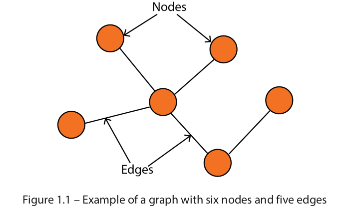

By representing a complex system as a network of entities with interactions, we can analyze their
relationships, allowing us to gain a deeper understanding of their underlying structures and patterns.
The versatility of graphs makes them a popular choice in various domains, including the following:

• Computer science, where graphs can be used to model the structure of computer programs,
making it easier to understand how different components of a system interact with each other.

• Physics, where graphs can be used to model physical systems and their interactions, such as
the relationship between particles and their properties.

• Biology, where graphs can be used to model biological systems, such as metabolic pathways,
as a network of interconnected entities.

• Social sciences, where graphs can be used to study and understand complex social networks,
including the relationships between individuals in a community.

• Finance, where graphs can be used to analyze stock market trends and relationships between
different financial instruments.

• Engineering, where graphs can be used to model and analyze complex systems, such as
transportation networks and electrical power grids.

These domains naturally exhibit a relational structure. For instance, graphs are a natural representation
of social networks: nodes are users, and edges represent friendships. But graphs are so versatile they
can also be applied to domains where the relational structure is less natural, unlocking new insights
and understanding.

For example, images can be represented as a graph, as in Figure 1.2. Each pixel is a node, and edges
represent relationships between neighboring pixels. This allows for the application of graph-based
algorithms to image processing and computer vision tasks.

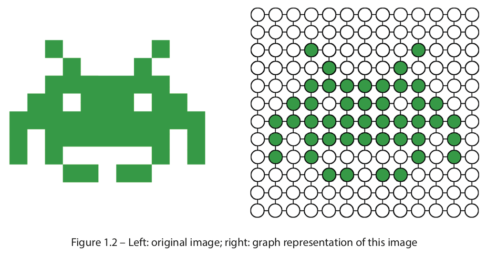

Similarly, a sentence can be transformed into a graph, where nodes are words and edges represent
relationships between adjacent words. This approach is useful in natural language processing and
information retrieval tasks, where the context and meaning of words are critical factors.

Unlike text and images, graphs do not have a fixed structure. However, this flexibility also makes
graphs more challenging to handle. The absence of a fixed structure means they can have an arbitrary
number of nodes and edges, with no specific ordering. In addition, graphs can represent dynamic data,
where the connections between entities can change over time. For example, the relationships between
users and products can change as they interact with each other. In this scenario, nodes and edges are
updated to reflect changes in the real world, such as new users, new products, and new relationships.

### 1.2. What is graph learning?

Graph learning is the application of machine learning techniques to graph data. This study area
encompasses a range of tasks aimed at understanding and manipulating graph-structured data. There
are many graphs learning tasks, including the following:

• <b> Node classification </b> is a task that involves predicting the category (class) of a node in a graph.
For example, it can categorize online users or items based on their characteristics. In this task,
the model is trained on a set of labeled nodes and their attributes, and it uses this information
to predict the class of unlabeled nodes.

• <b> Link prediction </b> is a task that involves predicting missing links between pairs of nodes in a
graph. This is useful in knowledge graph completion, where the goal is to complete a graph of
entities and their relationships. For example, it can be used to predict the relationships between
people based on their social network connections (friend recommendation).

• <b> Graph classification </b> is a task that involves categorizing different graphs into predefined
categories. One example of this is in molecular biology, where molecular structures can be
represented as graphs, and the goal is to predict their properties for drug design. In this task,
the model is trained on a set of labeled graphs and their attributes, and it uses this information
to categorize unseen graphs.

• <b> Graph generation </b> is a task that involves generating new graphs based on a set of desired
properties. One of the main applications is generating novel molecular structures for drug
discovery. This is achieved by training a model on a set of existing molecular structures and
then using it to generate new, unseen structures. The generated structures can be evaluated for
their potential as drug candidates and further studied.

Graph learning has many other practical applications that can have a significant impact. One of the
most well-known applications is <b> recommender systems </b>, where graph learning algorithms recommend
relevant items to users based on their previous interactions and relationships with other items. Another
important application is <b> traffic forecasting </b>, where graph learning can improve travel time predictions
by considering the complex relationships between different routes and modes of transportation.

The versatility and potential of graph learning make it an exciting field of research and development.
The study of graphs has advanced rapidly in recent years, driven by the availability of large datasets,
powerful computing resources, and advancements in machine learning and artificial intelligence. As
a result, we can list four prominent families of graph learning techniques:

• <b> Graph signal processing </b>, which applies traditional signal processing methods to graphs, such
as the graph Fourier transform and spectral analysis. These techniques reveal the intrinsic
properties of the graph, such as its connectivity and structure.

• <b> Matrix factorization </b>, which seeks to find low-dimensional representations of large matrices.
The goal of matrix factorization is to identify latent factors or patterns that explain the observed
relationships in the original matrix. This approach can provide a compact and interpretable
representation of the data.

• <b> Random walk </b>, which refers to a mathematical concept used to model the movement of entities
in a graph. By simulating random walks over a graph, information about the relationships
between nodes can be gathered. This is why they are often used to generate training data for
machine learning models.

• <b> Deep learning </b>, which is a subfield of machine learning that focuses on neural networks with
multiple layers. Deep learning methods can effectively encode and represent graph data as
vectors. These vectors can then be used in various tasks with remarkable performance.

It is important to note that these techniques are not mutually exclusive and often overlap in their
applications. In practice, they are often combined to form hybrid models that leverage the strengths of
each. For example, matrix factorization and deep learning techniques might be used in combination
to learn low-dimensional representations of graph-structured data.

As we delve into the world of graph learning, it is crucial to understand the fundamental building block
of any machine learning technique: the dataset. Traditional tabular datasets, such as spreadsheets,
represent data as rows and columns with each row representing a single data point. However, in many
real-world scenarios, the relationships between data points are just as meaningful as the data points
themselves. This is where graph datasets come in. Graph datasets represent data points as nodes in a
graph and the relationships between those data points as edges.

Let’s take the tabular dataset shown in Figure 1.3 as an example.

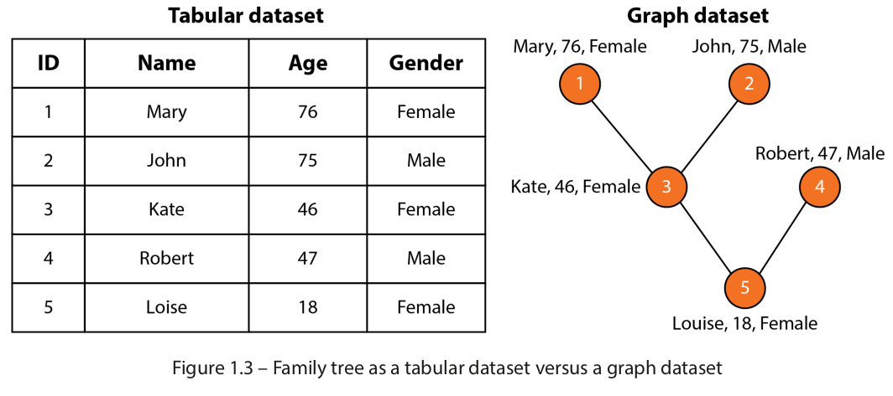

This dataset represents information about five members of a family. Each member has three features
(or attributes): name, age, and gender. However, the tabular version of this dataset doesn’t show the
connections between these people. On the contrary, the graph version represents them with edges,
which allows us to understand the relationships in this family. In many contexts, the connections
between nodes are crucial in understanding the data, which is why representing data in graph form
is becoming increasingly popular.

Now that we have a basic understanding of graph machine learning and the different types of tasks it
involves, we can move on to exploring one of the most important approaches for solving these tasks:
graph neural networks.

### 1.3. What are graph neural networks?

In this note, we will focus on the deep learning family of graph learning techniques, often referred to
as graph neural networks. GNNs are a new category of deep learning architecture and are specifically
designed for graph-structured data. Unlike traditional deep learning algorithms, which have been
primarily developed for text and images, GNNs are explicitly made to process and analyze graph
datasets (see Figure 1.4).

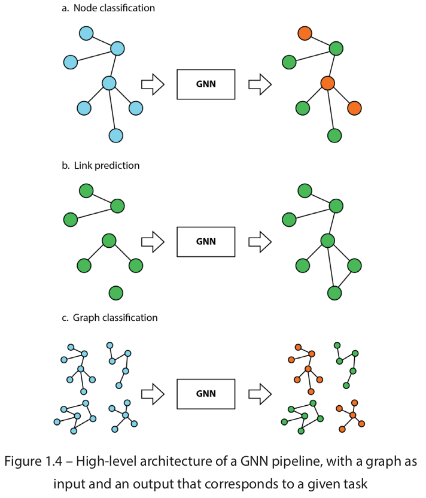

GNNs have emerged as a powerful tool for graph learning and have shown excellent results in various
tasks and industries. One of the most striking examples is how a GNN model identified a new antibiotic. The model was trained on 2,500 molecules and was tested on a library of 6,000 compounds. It
predicted that a molecule called halicin should be able to kill many antibiotic-resistant bacteria while
having low toxicity to human cells. Based on this prediction, the researchers used halicin to treat mice
infected with antibiotic-resistant bacteria. They demonstrated its effectiveness and believe the model
could be used to design new drugs.

How do GNNs work? Let’s take the example of a node classification task in a social network, like the
previous family tree (Figure 1.3). In a node classification task, GNNs take advantage of information
from different sources to create a vector representation of each node in the graph. This representation
encompasses not only the original node features (such as name, age, and gender) but also information
from edge features (such as the strength of relationships between nodes) and global features (such as
network-wide statistics).

This is why GNNs are more efficient than traditional machine learning techniques on graphs. Instead
of being limited to the original attributes, GNNs enrich the original node features with attributes from
neighboring nodes, edges, and global features, making the representation much more comprehensive
and meaningful. The new node representations are then used to perform a specific task, such as node
classification, regression, or link prediction.

Specifically, GNNs define a graph convolution operation that aggregates information from the
neighboring nodes and edges to update the node representation. This operation is performed iteratively,
allowing the model to learn more complex relationships between nodes as the number of iterations
increases. For example, Figure 1.5 shows how a GNN would calculate the representation of node 5
using neighboring nodes.

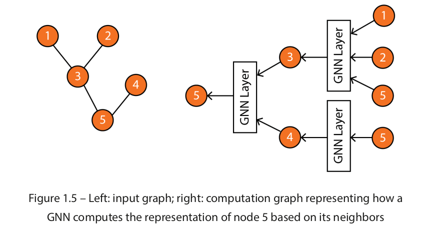

It is worth noting that Figure 1.5 provides a simplified illustration of a computation graph. In reality,
there are various kinds of GNNs and GNN layers, each of which has a unique structure and way of
aggregating information from neighboring nodes. These different variants of GNNs also have their
own advantages and limitations and are well-suited for specific types of graph data and tasks. When
selecting the appropriate GNN architecture for a particular problem, it is crucial to understand the
characteristics of the graph data and the desired outcome.

More generally, GNNs, like other deep learning techniques, are most effective when applied to
specific problems. These problems are characterized by high complexity, meaning that learning good
representations is critical to solving the task at hand. For example, a highly complex task could be
recommending the right products among billions of options to millions of customers. On the other
hand, some problems, such as finding the youngest member of our family tree, can be solved without
any machine learning technique.

Furthermore, GNNs require a substantial amount of data to perform effectively. Traditional machine
learning techniques might be a better fit in cases where the dataset is small, as they are less reliant on
large amounts of data. However, these techniques do not scale as well as GNNs. GNNs can process
bigger datasets thanks to parallel and distributed training. They can also exploit the additional
information more efficiently, which produces better results.

### 2. Graph Theory for Graph Neural Networks

Graph theory is a fundamental branch of mathematics that deals with the study of graphs and networks.
A graph is a visual representation of complex data structures that helps us understand the relationships between different entities. Graph theory provides us with tools to model and analyze a vast array of real-world problems, such as transportation systems, social networks, and internet connectivity.

### 2.1. Intruducing graph properties

In graph theory, a graph is a mathematical structure consisting of a set of objects, called <b> vertices </b> or
<b> nodes </b>, and a set of connections, called <b> edges </b>, which link pairs of vertices. The notation $ G = (V ,E )$
is used to represent a graph, where $G$ is the graph, $V$ is the set of vertices, and $E$ is the set of edges.
The nodes of a graph can represent any objects, such as cities, people, web pages, or molecules, and
the edges represent the relationships or connections between them, such as physical roads, social
relationships, hyperlinks, or chemical bonds.
This section provides an overview of fundamental graph properties that will be used extensively in
later part.

### 2.1.1. Directed graphs

One of the most basic properties of a graph is whether it is directed or undirected. In a <b> directed graph </b>,
also called a digraph, each edge has a direction or orientation. This means that the edge connects
two nodes in a particular direction, where one node is the source and the other is the destination. In
contrast, an undirected graph has undirected edges, where the edges have no direction. This means
that the edge between two vertices can be traversed in either direction, and the order in which we
visit the nodes does not matter.

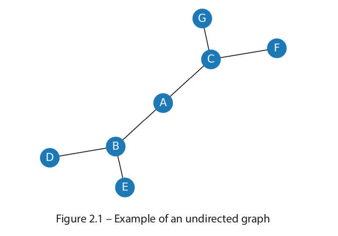

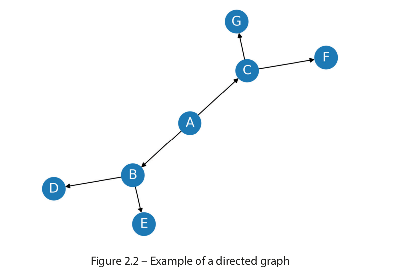

In directed graphs, edges are typically represented using arrows to denote their orientation, as in
Figure 2.2.

### 2.1.2. Weighted graphs

Another important property of graphs is whether the edges are weighted or unweighted. In a <b> weighted
graph </b>, each edge has a weight or cost associated with it. These weights can represent various factors,
such as distance, travel time, or cost.
For example, in a transportation network, the weights of edges might represent the distances between
different cities or the time it takes to travel between them. In contrast, unweighted graphs have no
weight associated with their edges. These types of graphs are commonly used in situations where the
relationships between nodes are binary, and the edges simply indicate the presence or absence of a
connection between them.

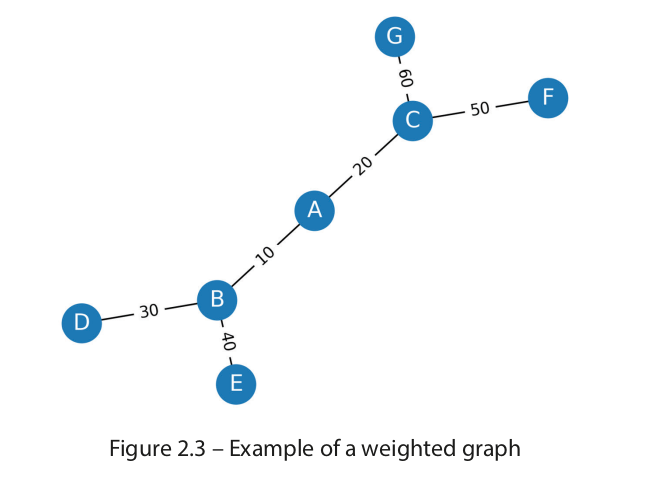

### 2.1.3. Connected graphs

Graph connectivity is a fundamental concept in graph theory that is closely related to the graph’s
structure and function.

In a <b> connected graph </b>, there is a path between any two vertices in the graph. Formally, a $G$ graph is
connected if, and only if, for every pair of $u$ and $v$ vertices in $G$ , there exists a path from $u$ to $v$ . In
contrast, a graph is disconnected if it is not connected, which means that at least two vertices are not
connected by a path.

The first graph is disconnected because of nodes 4 and 5. On the other hand, the second graph is
connected. This property is easy to visualize with small graphs, as in the following figure:

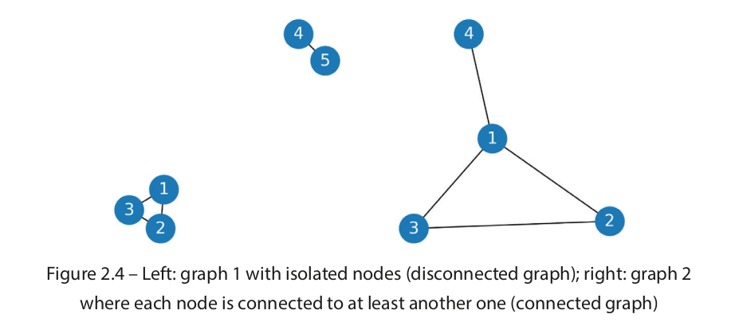

Connected graphs have several interesting properties and applications. For example, in a communication
network, a connected graph ensures that any two nodes can communicate with each other through a
path. In contrast, disconnected graphs can have isolated nodes that cannot communicate with other
nodes in the network, making it challenging to design efficient routing algorithms.

There are different ways to measure the connectivity of a graph. One of the most common measures
is the minimum number of edges that need to be removed to disconnect the graph, which is known
as the graph’s minimum cut. The minimum cut problem has several applications in network flow
optimization, clustering, and community detection.

### 2.1.4. Types of graphs

In addition to the commonly used graph types, there are some special types of graphs that have unique
properties and characteristics:

• <b> A tree </b> is a connected, undirected graph with no cycles (like the graph in Figure 2.1). Since
there is only one path between any two nodes in a tree, a tree is a special case of a graph. Trees
are often used to model hierarchical structures, such as family trees, organizational structures,
or classification trees.

• <b> A rooted tree </b> is a tree in which one node is designated as the root, and all other vertices are
connected to it by a unique path. Rooted trees are often used in computer science to represent
hierarchical data structures, such as filesystems or the structure of XML documents.

• <b> A directed acyclic graph (DAG) </b> is a directed graph that has no cycles (like the graph in
Figure 2.2). This means that the edges can only be traversed in a particular direction, and there
are no loops or cycles. DAGs are often used to model dependencies between tasks or events –
for example, in project management or in computing the critical path of a job.

• <b> A bipartite graph </b> is a graph in which the vertices can be divided into two disjoint sets, such
that all edges connect vertices in different sets. Bipartite graphs are often used in mathematics
and computer science to model relationships between two different types of objects, such as
buyers and sellers, or employees and projects.

• <b> A complete graph </b> is a graph in which every pair of vertices is connected by an edge. Complete
graphs are often used in combinatorics to model problems involving all possible pairwise
connections, and in computer networks to model fully connected networks.

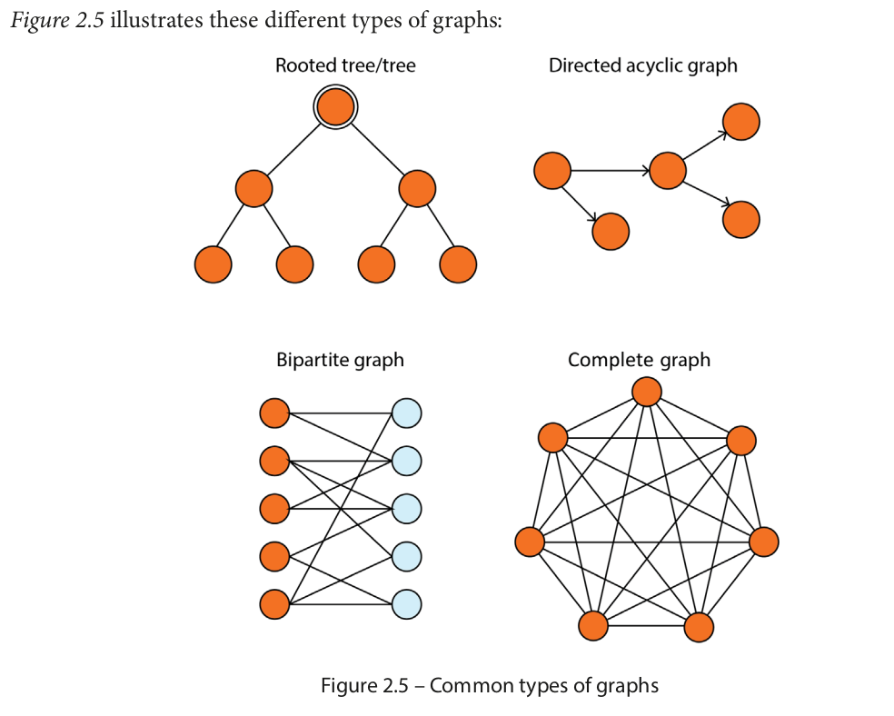

Now that we have reviewed essential types of graphs, let’s move on to exploring some of the most important
graph objects. Understanding these concepts will help us analyze and manipulate graphs effectively.

### 2.2. Graph concepts

In this section, we will explore some of the essential concepts in graph theory, including graph objects
(such as degree and neighbors), graph measures (such as centrality and density), and the adjacency
matrix representation.

### 2.2.1. Fundamental objects

One of the key concepts in graph theory is the <b> degree </b> of a node, which is the number of edges <b> incident </b>
to this node. An edge is said to be incident on a node if that node is one of the edge’s endpoints. The
degree of a node $v$ is often denoted by $deg(v)$ . It can be defined for both directed and undirected graphs:

- In an undirected graph, the degree of a vertex is the number of edges that are connected to it.
Note that if the node is connected to itself (called a loop, or self-loop), it adds two to the degree.

- In a directed graph, the degree is divided into two types: <b> indegree </b> and <b> outdegree </b>. The indegree
(denoted by $deg^{-}(v)$ ) of a node represents the number of edges that point towards that node,
while the outdegree (denoted by $deg^{+}(v)$ ) represents the number of edges that start from that
node. In this case, a self-loop adds one to the indegree and to the outdegree.

Indegree and outdegree are essential for analyzing and understanding directed graphs, as they provide
insight into how information or resources are distributed within the graph. For example, nodes with
high indegree are likely to be important sources of information or resources. In contrast, nodes with
high outdegree are likely to be important destinations or consumers of information or resources.

```python
G = nx.Graph()
G.add_edges_from([('A', 'B'), ('A', 'C'), ('B', 'D'), ('B',
'E'), ('C', 'F'), ('C', 'G')])
print(f"deg(A) = {G.degree['A']}")
DG = nx.DiGraph()
DG.add_edges_from([('A', 'B'), ('A', 'C'), ('B', 'D'), ('B',
'E'), ('C', 'F'), ('C', 'G')])
print(f"deg^-(A) = {DG.in_degree['A']}")
print(f"deg^+(A) = {DG.out_degree['A']}")
```

Output:

```
deg(A) = 2
deg^-(A) = 0
deg^+(A) = 2
```

We can compare it to the graphs from Figures 2.1 and 2.2: node $A$ is connected to two edges
$(deg(A) = deg^{+}(A) = 2)$, but is not the destination of any of them $(deg^{-}(A) = 0)$.


The concept of node degree is related to that of <b> neighbors </b>. Neighbors refer to the nodes directly
connected to a particular node through an edge. Moreover, two nodes are said to be <b> adjacent </b> if they
share at least one common neighbor. The concepts of neighbors and adjacency are fundamental to
many graph algorithms and applications, such as searching for a <b> path </b> between two nodes or identifying
clusters in a network.

In graph theory, a path is a sequence of edges that connect two nodes (or more) in a graph. The length
of a path is the number of edges that are traversed along the path. There are different types of paths,
but two of them are particularly important:

• A <b> simple path </b> is a path that does not visit any node more than once, except for the start and
end vertices

• A <b> cycle </b> is a path in which the first and last vertices are the same. A graph is said to be acyclic if it contains no cycles (such as trees and DAGs)

Degrees and paths can be used to determine the importance of a node in a network. This measure is
referred to as <b> centrality </b>.

### 2.2.2. Graph measures

Centrality quantifies the importance of a vertex or node in a network. It helps us to identify key nodes
in a graph based on their connectivity and influence on the flow of information or interactions within
the network. There are several measures of centrality, each providing a different perspective on the
importance of a node:

• <b> Degree centrality </b> is one of the simplest and most commonly used measures of centrality. It
is simply defined as the degree of the node. A high degree centrality indicates that a vertex is
highly connected to other vertices in the graph, and thus significantly influences the network.

• <b> Closeness centrality </b> measures how close a node is to all other nodes in the graph. It corresponds
to the average length of the shortest path between the target node and all other nodes in the
graph. A node with high closeness centrality can quickly reach all other vertices in the network.

• <b> Betweenness centrality </b> measures the number of times a node lies on the shortest path between
pairs of other nodes in the graph. A node with high betweenness centrality acts as a bottleneck
or bridge between different parts of the graph.

In addition to these measures, we will see how to calculate the importance of a node using machine
learning techniques in the next sections.

Indeed, <b> density </b> is another important measure, indicating how connected a graph is. It is a ratio
between the actual number of edges and the maximum possible number of edges in the graph. A
graph with high density is considered more connected and has more information flow compared to
a graph with low density.

The formula to calculate density depends on whether the grpah is directed or undirected. For an undirected graph with $n$ nodes, the maximum possible number of edges is $\frac{n(n-1)}{2}$. For a diected grpah with $n$ nodes, the maximum number of edges is $n(n-1)$.

The density of a graph is calculated as the number of edges divided bu the maximum number of edges. For example, the grpah in Figure 2.1 has 6 edges and the maximum possible numnber of edges is $\frac{7(7-1)}{2} = 21$. Therefore, the density of the graph is $\frac{6}{21} = 0.2857$.

A dense graph has a density closer to 1, while a sparse graph has a density closer to 0. There is no
strict rule for what constitutes a dense or sparse graph, but generally, a graph is considered dense if its
density is greater than 0.5 and sparse if its density is less than 0.1. This measure is directly connected
to a fundamental problem with graphs: how to represent the <b> adjacency matrix </b>.

### 2.2.3. Adjacency matrix representation

An adjacency matrix is a matrix that represents the edges in a graph, where each cell indicates whether
there is an edge between two nodes. The matrix is a square matrix of size n × n, where is the number
of nodes in the graph. A value of 1 in the cell $ ( i, j) $  indicates that there is an edge between node $i$
and node $j$, while a value of 0 indicates that there is no edge. For an undirected graph, the matrix is symmetric, while for a directed grpah, the matrix is not necessariily symmetric.

The following figure indicates the adjacency matrix associated with the graph:

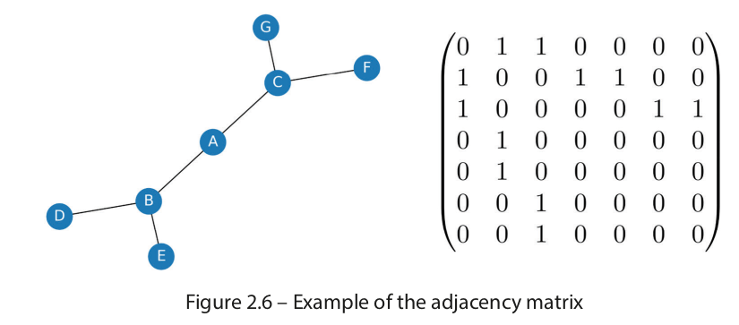

The adjacency matrix is a straightforward representation that can be easily visualized as a 2D array.
One of the key advantages of using an adjacency matrix is that checking whether two nodes are
connected is a constant time operation. This makes it an efficient way to test the existence of an edge
in the graph. Moreover, it is used to perform matrix operations, which are useful for certain graph
algorithms, such as calculating the shortest path between two nodes.

However, adding or removing nodes can be costly, as the matrix needs to be resized or shifted. One of
the main drawbacks of using an adjacency matrix is its space complexity: as the number of nodes in
the graph grows, the space required to store the adjacency matrix increases exponentially. Formally,
we say that the adjacency matrix has a space complexity of $O(|V|^2| )$ , where $|V|$ represents the number
of nodes in the graph.
Overall, while the adjacency matrix is a useful data structure for representing small graphs, it may
not be practical for larger ones due to its space complexity. Additionally, the overhead of adding or
removing nodes can make it inefficient for dynamically changing graphs.

This is why other representations can be helpful. For example, another popular way to store graphs is
the <b> edge list </b>. An edge list is a list of all the edges in a graph. Each edge is represented by a tuple or a
pair of vertices. The edge list can also include the weight or cost of each edge.

```
edge_list = [(0, 1), (0, 2), (1, 3), (1, 4), (2, 5), (2, 6)]
```

When we compare both data structures applied to our graph, it is clear that the edge list is less verbose.
This is the case because our graph is fairly sparse. On the other hand, if our graph was complete, we
would require 21 tuples instead of 6. This is explained by a space complexity of $O (|E|)$ , where $|V|$
is the number of edges. Edge lists are more efficient for storing sparse graphs, where the number of
edges is much smaller than the number of nodes.

However, checking whether two vertices are connected in an edge list requires iterating through the
entire list, which can be time-consuming for large graphs with many edges. Therefore, edge lists are
more commonly used in applications where space is a concern.

A third and popular representation is the <b> adjacency list </b>. It consists of a list of pairs, where each
pair represents a node in the graph and its adjacent nodes. The pairs can be stored in a linked list,
dictionary, or other data structures, depending on the implementation. For example, an adjacency
list for our graph might look like this:

```python
adj_list = {
    0: [1, 2],
    1: [0, 3, 4],
    2: [0, 5, 6],
    3: [1],
    4: [1],
    5: [2],
    6: [2]
}
```

An adjacency list has several advantages over an adjacency matrix or an edge list. First, the space
complexity is $ O(|V| + |E|)$ , where $|V|$ is the number of nodes and is the number of edges. This is
more efficient than the $O(|V|^{2} )$ space complexity of an adjacency matrix for sparse graphs. Second,
it allows for efficient iteration through the adjacent vertices of a node, which is useful in many graph
algorithms. Finally, adding a node or an edge can be done in constant time.

However, checking whether two vertices are connected can be slower than with an adjacency matrix.
This is because it requires iterating through the adjacency list of one of the vertices, which can be
time-consuming for large graphs.

Each data structure has its own advantages and disadvantages that depend on the specific application
and requirements.

### 2.3. Exploring graph algorithms

Graph algorithms are critical in solving problems related to graphs, such as finding the shortest path
between two nodes or detecting cycles. This section will discuss two graph traversal algorithms: BFS
and DFS.

### 2.3.1. Breadth-first search

BFS is a graph traversal algorithm that starts at the root node and explores all the neighboring nodes
at a particular level before moving to the next level of nodes. It works by maintaining a queue of nodes
to visit and marking each visited node as it is added to the queue. The algorithm then dequeues the
next node in the queue and explores all its neighbors, adding them to the queue if they haven’t been
visited yet.

The behavior of a BFS is illustrated in Figure 2.7:

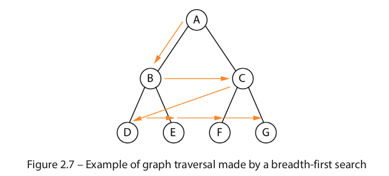

BFS is particularly useful in finding the shortest path between two nodes in an unweighted graph.
This is because the algorithm visits nodes in order of their distance from the starting node, so the first
time the target node is visited, it must be along the shortest path from the starting node.

In addition to finding the shortest path, BFS can also be used to check whether a graph is connected
or to find all connected components of a graph. It is also used in applications such as web crawlers,
social network analysis, and shortest path routing in networks.

The time complexity of BFS is $O(|V| + |E|)$ , where $|V|$ is the number of nodes and $|E|$ is the number
of edges in the graph. This can be a significant issue for graphs with a high degree of connectivity or
for graphs that are sparse. Several variants of BFS have been developed to mitigate this issue, such
as <b> bidirectional BFS </b> and <b> A* search </b>, which use heuristics to reduce the number of nodes that need
to be explored.

### 2.3.2. Depth-first search

DFS is a recursive algorithm that starts at the root node and explores as far as possible along each
branch before backtracking.

It chooses a node and explores all of its unvisited neighbors, visiting the first neighbor that has not been
explored and backtracking only when all the neighbors have been visited. By doing so, it explores the
graph by following as deep a path from the starting node as possible before backtracking to explore
other branches. This continues until all nodes have been explored.

The behavior of a DFS is illustrated in Figure 2.8:

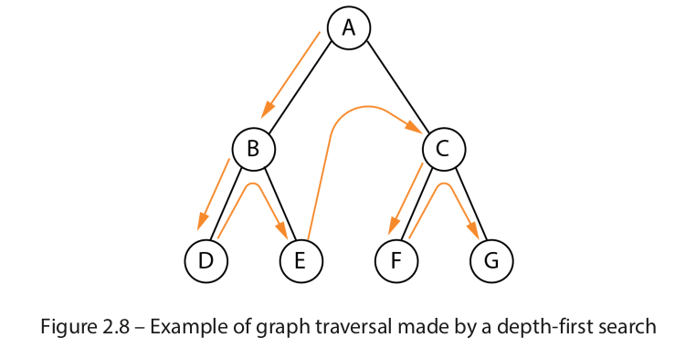

Once again, the order we obtained is the one we anticipated in Figure 2.8.
DFS is useful in solving various problems, such as finding connected components, topological sorting,
and solving maze problems. It is particularly useful in finding cycles in a graph since it traverses the
graph in a depth-first order, and a cycle exists if, and only if, a node is visited twice during the traversal.
Like BFS, it has a time complexity of $O(|V| + |E|)$ , where $|V|$ is the number of nodes and $|E|$ is the
number of edges in the graph. It requires less memory but doesn’t guarantee the shallowest path
solution. Finally, unlike BFS, you can be trapped in infinite loops using DFS.
Additionally, many other algorithms in graph theory build upon BFS and DFS, such as Dijkstra’s
shortest path algorithm, Kruskal’s minimum spanning tree algorithm, and Tarjan’s strongly connected
components algorithm. Therefore, a solid understanding of BFS and DFS is essential for anyone who
wants to work with graphs and develop more advanced graph algorithms.

### 3. Creating Node Representations with DeepWalk


