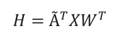
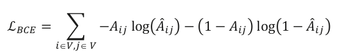
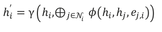

# Graph Neural Networks Using Python

## Part 1: Intruduction to Graph Learning

### 1. Getting Started with Graph Learning

### 1.1. Why graphs?

The first question we need to address is: why are we interested in graphs in the first place? Graph
theory, the mathematical study of graphs, has emerged as a fundamental tool for understanding
complex systems and relationships. A graph is a visual representation of a collection of nodes (also
called vertices) and edges that connect these nodes, providing a structure to represent entities and
their relationships (see Figure 1.1).


By representing a complex system as a network of entities with interactions, we can analyze their
relationships, allowing us to gain a deeper understanding of their underlying structures and patterns.
The versatility of graphs makes them a popular choice in various domains, including the following:

• Computer science, where graphs can be used to model the structure of computer programs,
making it easier to understand how different components of a system interact with each other.

• Physics, where graphs can be used to model physical systems and their interactions, such as
the relationship between particles and their properties.

• Biology, where graphs can be used to model biological systems, such as metabolic pathways,
as a network of interconnected entities.

• Social sciences, where graphs can be used to study and understand complex social networks,
including the relationships between individuals in a community.

• Finance, where graphs can be used to analyze stock market trends and relationships between
different financial instruments.

• Engineering, where graphs can be used to model and analyze complex systems, such as
transportation networks and electrical power grids.

These domains naturally exhibit a relational structure. For instance, graphs are a natural representation
of social networks: nodes are users, and edges represent friendships. But graphs are so versatile they
can also be applied to domains where the relational structure is less natural, unlocking new insights
and understanding.

For example, images can be represented as a graph, as in Figure 1.2. Each pixel is a node, and edges
represent relationships between neighboring pixels. This allows for the application of graph-based
algorithms to image processing and computer vision tasks.


Similarly, a sentence can be transformed into a graph, where nodes are words and edges represent
relationships between adjacent words. This approach is useful in natural language processing and
information retrieval tasks, where the context and meaning of words are critical factors.

Unlike text and images, graphs do not have a fixed structure. However, this flexibility also makes
graphs more challenging to handle. The absence of a fixed structure means they can have an arbitrary
number of nodes and edges, with no specific ordering. In addition, graphs can represent dynamic data,
where the connections between entities can change over time. For example, the relationships between
users and products can change as they interact with each other. In this scenario, nodes and edges are
updated to reflect changes in the real world, such as new users, new products, and new relationships.

### 1.2. What is graph learning?

Graph learning is the application of machine learning techniques to graph data. This study area
encompasses a range of tasks aimed at understanding and manipulating graph-structured data. There
are many graphs learning tasks, including the following:

• <b> Node classification </b> is a task that involves predicting the category (class) of a node in a graph.
For example, it can categorize online users or items based on their characteristics. In this task,
the model is trained on a set of labeled nodes and their attributes, and it uses this information
to predict the class of unlabeled nodes.

• <b> Link prediction </b> is a task that involves predicting missing links between pairs of nodes in a
graph. This is useful in knowledge graph completion, where the goal is to complete a graph of
entities and their relationships. For example, it can be used to predict the relationships between
people based on their social network connections (friend recommendation).

• <b> Graph classification </b> is a task that involves categorizing different graphs into predefined
categories. One example of this is in molecular biology, where molecular structures can be
represented as graphs, and the goal is to predict their properties for drug design. In this task,
the model is trained on a set of labeled graphs and their attributes, and it uses this information
to categorize unseen graphs.

• <b> Graph generation </b> is a task that involves generating new graphs based on a set of desired
properties. One of the main applications is generating novel molecular structures for drug
discovery. This is achieved by training a model on a set of existing molecular structures and
then using it to generate new, unseen structures. The generated structures can be evaluated for
their potential as drug candidates and further studied.

Graph learning has many other practical applications that can have a significant impact. One of the
most well-known applications is <b> recommender systems </b>, where graph learning algorithms recommend
relevant items to users based on their previous interactions and relationships with other items. Another
important application is <b> traffic forecasting </b>, where graph learning can improve travel time predictions
by considering the complex relationships between different routes and modes of transportation.

The versatility and potential of graph learning make it an exciting field of research and development.
The study of graphs has advanced rapidly in recent years, driven by the availability of large datasets,
powerful computing resources, and advancements in machine learning and artificial intelligence. As
a result, we can list four prominent families of graph learning techniques:

• <b> Graph signal processing </b>, which applies traditional signal processing methods to graphs, such
as the graph Fourier transform and spectral analysis. These techniques reveal the intrinsic
properties of the graph, such as its connectivity and structure.

• <b> Matrix factorization </b>, which seeks to find low-dimensional representations of large matrices.
The goal of matrix factorization is to identify latent factors or patterns that explain the observed
relationships in the original matrix. This approach can provide a compact and interpretable
representation of the data.

• <b> Random walk </b>, which refers to a mathematical concept used to model the movement of entities
in a graph. By simulating random walks over a graph, information about the relationships
between nodes can be gathered. This is why they are often used to generate training data for
machine learning models.

• <b> Deep learning </b>, which is a subfield of machine learning that focuses on neural networks with
multiple layers. Deep learning methods can effectively encode and represent graph data as
vectors. These vectors can then be used in various tasks with remarkable performance.

It is important to note that these techniques are not mutually exclusive and often overlap in their
applications. In practice, they are often combined to form hybrid models that leverage the strengths of
each. For example, matrix factorization and deep learning techniques might be used in combination
to learn low-dimensional representations of graph-structured data.

As we delve into the world of graph learning, it is crucial to understand the fundamental building block
of any machine learning technique: the dataset. Traditional tabular datasets, such as spreadsheets,
represent data as rows and columns with each row representing a single data point. However, in many
real-world scenarios, the relationships between data points are just as meaningful as the data points
themselves. This is where graph datasets come in. Graph datasets represent data points as nodes in a
graph and the relationships between those data points as edges.

Let’s take the tabular dataset shown in Figure 1.3 as an example.


This dataset represents information about five members of a family. Each member has three features
(or attributes): name, age, and gender. However, the tabular version of this dataset doesn’t show the
connections between these people. On the contrary, the graph version represents them with edges,
which allows us to understand the relationships in this family. In many contexts, the connections
between nodes are crucial in understanding the data, which is why representing data in graph form
is becoming increasingly popular.

Now that we have a basic understanding of graph machine learning and the different types of tasks it
involves, we can move on to exploring one of the most important approaches for solving these tasks:
graph neural networks.

### 1.3. What are graph neural networks?

In this note, we will focus on the deep learning family of graph learning techniques, often referred to
as graph neural networks. GNNs are a new category of deep learning architecture and are specifically
designed for graph-structured data. Unlike traditional deep learning algorithms, which have been
primarily developed for text and images, GNNs are explicitly made to process and analyze graph
datasets (see Figure 1.4).


GNNs have emerged as a powerful tool for graph learning and have shown excellent results in various
tasks and industries. One of the most striking examples is how a GNN model identified a new antibiotic. The model was trained on 2,500 molecules and was tested on a library of 6,000 compounds. It
predicted that a molecule called halicin should be able to kill many antibiotic-resistant bacteria while
having low toxicity to human cells. Based on this prediction, the researchers used halicin to treat mice
infected with antibiotic-resistant bacteria. They demonstrated its effectiveness and believe the model
could be used to design new drugs.

How do GNNs work? Let’s take the example of a node classification task in a social network, like the
previous family tree (Figure 1.3). In a node classification task, GNNs take advantage of information
from different sources to create a vector representation of each node in the graph. This representation
encompasses not only the original node features (such as name, age, and gender) but also information
from edge features (such as the strength of relationships between nodes) and global features (such as
network-wide statistics).

This is why GNNs are more efficient than traditional machine learning techniques on graphs. Instead
of being limited to the original attributes, GNNs enrich the original node features with attributes from
neighboring nodes, edges, and global features, making the representation much more comprehensive
and meaningful. The new node representations are then used to perform a specific task, such as node
classification, regression, or link prediction.

Specifically, GNNs define a graph convolution operation that aggregates information from the
neighboring nodes and edges to update the node representation. This operation is performed iteratively,
allowing the model to learn more complex relationships between nodes as the number of iterations
increases. For example, Figure 1.5 shows how a GNN would calculate the representation of node 5
using neighboring nodes.


It is worth noting that Figure 1.5 provides a simplified illustration of a computation graph. In reality,
there are various kinds of GNNs and GNN layers, each of which has a unique structure and way of
aggregating information from neighboring nodes. These different variants of GNNs also have their
own advantages and limitations and are well-suited for specific types of graph data and tasks. When
selecting the appropriate GNN architecture for a particular problem, it is crucial to understand the
characteristics of the graph data and the desired outcome.

More generally, GNNs, like other deep learning techniques, are most effective when applied to
specific problems. These problems are characterized by high complexity, meaning that learning good
representations is critical to solving the task at hand. For example, a highly complex task could be
recommending the right products among billions of options to millions of customers. On the other
hand, some problems, such as finding the youngest member of our family tree, can be solved without
any machine learning technique.

Furthermore, GNNs require a substantial amount of data to perform effectively. Traditional machine
learning techniques might be a better fit in cases where the dataset is small, as they are less reliant on
large amounts of data. However, these techniques do not scale as well as GNNs. GNNs can process
bigger datasets thanks to parallel and distributed training. They can also exploit the additional
information more efficiently, which produces better results.

### 2. Graph Theory for Graph Neural Networks

Graph theory is a fundamental branch of mathematics that deals with the study of graphs and networks.
A graph is a visual representation of complex data structures that helps us understand the relationships between different entities. Graph theory provides us with tools to model and analyze a vast array of real-world problems, such as transportation systems, social networks, and internet connectivity.

### 2.1. Intruducing graph properties

In graph theory, a graph is a mathematical structure consisting of a set of objects, called <b> vertices </b> or
<b> nodes </b>, and a set of connections, called <b> edges </b>, which link pairs of vertices. The notation $ G = (V ,E )$
is used to represent a graph, where $G$ is the graph, $V$ is the set of vertices, and $E$ is the set of edges.
The nodes of a graph can represent any objects, such as cities, people, web pages, or molecules, and
the edges represent the relationships or connections between them, such as physical roads, social
relationships, hyperlinks, or chemical bonds.
This section provides an overview of fundamental graph properties that will be used extensively in
later part.

### 2.1.1. Directed graphs

One of the most basic properties of a graph is whether it is directed or undirected. In a <b> directed graph </b>,
also called a digraph, each edge has a direction or orientation. This means that the edge connects
two nodes in a particular direction, where one node is the source and the other is the destination. In
contrast, an undirected graph has undirected edges, where the edges have no direction. This means
that the edge between two vertices can be traversed in either direction, and the order in which we
visit the nodes does not matter.


In directed graphs, edges are typically represented using arrows to denote their orientation, as in
Figure 2.2.

### 2.1.2. Weighted graphs

Another important property of graphs is whether the edges are weighted or unweighted. In a <b> weighted
graph </b>, each edge has a weight or cost associated with it. These weights can represent various factors,
such as distance, travel time, or cost.
For example, in a transportation network, the weights of edges might represent the distances between
different cities or the time it takes to travel between them. In contrast, unweighted graphs have no
weight associated with their edges. These types of graphs are commonly used in situations where the
relationships between nodes are binary, and the edges simply indicate the presence or absence of a
connection between them.


### 2.1.3. Connected graphs

Graph connectivity is a fundamental concept in graph theory that is closely related to the graph’s
structure and function.

In a <b> connected graph </b>, there is a path between any two vertices in the graph. Formally, a $G$ graph is
connected if, and only if, for every pair of $u$ and $v$ vertices in $G$ , there exists a path from $u$ to $v$ . In
contrast, a graph is disconnected if it is not connected, which means that at least two vertices are not
connected by a path.

The first graph is disconnected because of nodes 4 and 5. On the other hand, the second graph is
connected. This property is easy to visualize with small graphs, as in the following figure:


Connected graphs have several interesting properties and applications. For example, in a communication
network, a connected graph ensures that any two nodes can communicate with each other through a
path. In contrast, disconnected graphs can have isolated nodes that cannot communicate with other
nodes in the network, making it challenging to design efficient routing algorithms.

There are different ways to measure the connectivity of a graph. One of the most common measures
is the minimum number of edges that need to be removed to disconnect the graph, which is known
as the graph’s minimum cut. The minimum cut problem has several applications in network flow
optimization, clustering, and community detection.

### 2.1.4. Types of graphs

In addition to the commonly used graph types, there are some special types of graphs that have unique
properties and characteristics:

• <b> A tree </b> is a connected, undirected graph with no cycles (like the graph in Figure 2.1). Since
there is only one path between any two nodes in a tree, a tree is a special case of a graph. Trees
are often used to model hierarchical structures, such as family trees, organizational structures,
or classification trees.

• <b> A rooted tree </b> is a tree in which one node is designated as the root, and all other vertices are
connected to it by a unique path. Rooted trees are often used in computer science to represent
hierarchical data structures, such as filesystems or the structure of XML documents.

• <b> A directed acyclic graph (DAG) </b> is a directed graph that has no cycles (like the graph in
Figure 2.2). This means that the edges can only be traversed in a particular direction, and there
are no loops or cycles. DAGs are often used to model dependencies between tasks or events –
for example, in project management or in computing the critical path of a job.

• <b> A bipartite graph </b> is a graph in which the vertices can be divided into two disjoint sets, such
that all edges connect vertices in different sets. Bipartite graphs are often used in mathematics
and computer science to model relationships between two different types of objects, such as
buyers and sellers, or employees and projects.

• <b> A complete graph </b> is a graph in which every pair of vertices is connected by an edge. Complete
graphs are often used in combinatorics to model problems involving all possible pairwise
connections, and in computer networks to model fully connected networks.


Now that we have reviewed essential types of graphs, let’s move on to exploring some of the most important
graph objects. Understanding these concepts will help us analyze and manipulate graphs effectively.

### 2.2. Graph concepts

In this section, we will explore some of the essential concepts in graph theory, including graph objects
(such as degree and neighbors), graph measures (such as centrality and density), and the adjacency
matrix representation.

### 2.2.1. Fundamental objects

One of the key concepts in graph theory is the <b> degree </b> of a node, which is the number of edges <b> incident </b>
to this node. An edge is said to be incident on a node if that node is one of the edge’s endpoints. The
degree of a node $v$ is often denoted by $deg(v)$ . It can be defined for both directed and undirected graphs:

- In an undirected graph, the degree of a vertex is the number of edges that are connected to it.
Note that if the node is connected to itself (called a loop, or self-loop), it adds two to the degree.

- In a directed graph, the degree is divided into two types: <b> indegree </b> and <b> outdegree </b>. The indegree
(denoted by $deg^{-}(v)$ ) of a node represents the number of edges that point towards that node,
while the outdegree (denoted by $deg^{+}(v)$ ) represents the number of edges that start from that
node. In this case, a self-loop adds one to the indegree and to the outdegree.

Indegree and outdegree are essential for analyzing and understanding directed graphs, as they provide
insight into how information or resources are distributed within the graph. For example, nodes with
high indegree are likely to be important sources of information or resources. In contrast, nodes with
high outdegree are likely to be important destinations or consumers of information or resources.

```python
G = nx.Graph()
G.add_edges_from([('A', 'B'), ('A', 'C'), ('B', 'D'), ('B',
'E'), ('C', 'F'), ('C', 'G')])
print(f"deg(A) = {G.degree['A']}")
DG = nx.DiGraph()
DG.add_edges_from([('A', 'B'), ('A', 'C'), ('B', 'D'), ('B',
'E'), ('C', 'F'), ('C', 'G')])
print(f"deg^-(A) = {DG.in_degree['A']}")
print(f"deg^+(A) = {DG.out_degree['A']}")
```

Output:

```
deg(A) = 2
deg^-(A) = 0
deg^+(A) = 2
```

We can compare it to the graphs from Figures 2.1 and 2.2: node $A$ is connected to two edges
$(deg(A) = deg^{+}(A) = 2)$, but is not the destination of any of them $(deg^{-}(A) = 0)$.


The concept of node degree is related to that of <b> neighbors </b>. Neighbors refer to the nodes directly
connected to a particular node through an edge. Moreover, two nodes are said to be <b> adjacent </b> if they
share at least one common neighbor. The concepts of neighbors and adjacency are fundamental to
many graph algorithms and applications, such as searching for a <b> path </b> between two nodes or identifying
clusters in a network.

In graph theory, a path is a sequence of edges that connect two nodes (or more) in a graph. The length
of a path is the number of edges that are traversed along the path. There are different types of paths,
but two of them are particularly important:

• A <b> simple path </b> is a path that does not visit any node more than once, except for the start and
end vertices

• A <b> cycle </b> is a path in which the first and last vertices are the same. A graph is said to be acyclic if it contains no cycles (such as trees and DAGs)

Degrees and paths can be used to determine the importance of a node in a network. This measure is
referred to as <b> centrality </b>.

### 2.2.2. Graph measures

Centrality quantifies the importance of a vertex or node in a network. It helps us to identify key nodes
in a graph based on their connectivity and influence on the flow of information or interactions within
the network. There are several measures of centrality, each providing a different perspective on the
importance of a node:

• <b> Degree centrality </b> is one of the simplest and most commonly used measures of centrality. It
is simply defined as the degree of the node. A high degree centrality indicates that a vertex is
highly connected to other vertices in the graph, and thus significantly influences the network.

• <b> Closeness centrality </b> measures how close a node is to all other nodes in the graph. It corresponds
to the average length of the shortest path between the target node and all other nodes in the
graph. A node with high closeness centrality can quickly reach all other vertices in the network.

• <b> Betweenness centrality </b> measures the number of times a node lies on the shortest path between
pairs of other nodes in the graph. A node with high betweenness centrality acts as a bottleneck
or bridge between different parts of the graph.

In addition to these measures, we will see how to calculate the importance of a node using machine
learning techniques in the next sections.

Indeed, <b> density </b> is another important measure, indicating how connected a graph is. It is a ratio
between the actual number of edges and the maximum possible number of edges in the graph. A
graph with high density is considered more connected and has more information flow compared to
a graph with low density.

The formula to calculate density depends on whether the grpah is directed or undirected. For an undirected graph with $n$ nodes, the maximum possible number of edges is $\frac{n(n-1)}{2}$. For a diected grpah with $n$ nodes, the maximum number of edges is $n(n-1)$.

The density of a graph is calculated as the number of edges divided bu the maximum number of edges. For example, the grpah in Figure 2.1 has 6 edges and the maximum possible numnber of edges is $\frac{7(7-1)}{2} = 21$. Therefore, the density of the graph is $\frac{6}{21} = 0.2857$.

A dense graph has a density closer to 1, while a sparse graph has a density closer to 0. There is no
strict rule for what constitutes a dense or sparse graph, but generally, a graph is considered dense if its
density is greater than 0.5 and sparse if its density is less than 0.1. This measure is directly connected
to a fundamental problem with graphs: how to represent the <b> adjacency matrix </b>.

### 2.2.3. Adjacency matrix representation

An adjacency matrix is a matrix that represents the edges in a graph, where each cell indicates whether
there is an edge between two nodes. The matrix is a square matrix of size n × n, where is the number
of nodes in the graph. A value of 1 in the cell $ ( i, j) $  indicates that there is an edge between node $i$
and node $j$, while a value of 0 indicates that there is no edge. For an undirected graph, the matrix is symmetric, while for a directed grpah, the matrix is not necessariily symmetric.

The following figure indicates the adjacency matrix associated with the graph:


The adjacency matrix is a straightforward representation that can be easily visualized as a 2D array.
One of the key advantages of using an adjacency matrix is that checking whether two nodes are
connected is a constant time operation. This makes it an efficient way to test the existence of an edge
in the graph. Moreover, it is used to perform matrix operations, which are useful for certain graph
algorithms, such as calculating the shortest path between two nodes.

However, adding or removing nodes can be costly, as the matrix needs to be resized or shifted. One of
the main drawbacks of using an adjacency matrix is its space complexity: as the number of nodes in
the graph grows, the space required to store the adjacency matrix increases exponentially. Formally,
we say that the adjacency matrix has a space complexity of $O(|V|^2| )$ , where $|V|$ represents the number
of nodes in the graph.
Overall, while the adjacency matrix is a useful data structure for representing small graphs, it may
not be practical for larger ones due to its space complexity. Additionally, the overhead of adding or
removing nodes can make it inefficient for dynamically changing graphs.

This is why other representations can be helpful. For example, another popular way to store graphs is
the <b> edge list </b>. An edge list is a list of all the edges in a graph. Each edge is represented by a tuple or a
pair of vertices. The edge list can also include the weight or cost of each edge.

```
edge_list = [(0, 1), (0, 2), (1, 3), (1, 4), (2, 5), (2, 6)]
```

When we compare both data structures applied to our graph, it is clear that the edge list is less verbose.
This is the case because our graph is fairly sparse. On the other hand, if our graph was complete, we
would require 21 tuples instead of 6. This is explained by a space complexity of $O (|E|)$ , where $|V|$
is the number of edges. Edge lists are more efficient for storing sparse graphs, where the number of
edges is much smaller than the number of nodes.

However, checking whether two vertices are connected in an edge list requires iterating through the
entire list, which can be time-consuming for large graphs with many edges. Therefore, edge lists are
more commonly used in applications where space is a concern.

A third and popular representation is the <b> adjacency list </b>. It consists of a list of pairs, where each
pair represents a node in the graph and its adjacent nodes. The pairs can be stored in a linked list,
dictionary, or other data structures, depending on the implementation. For example, an adjacency
list for our graph might look like this:

```python
adj_list = {
    0: [1, 2],
    1: [0, 3, 4],
    2: [0, 5, 6],
    3: [1],
    4: [1],
    5: [2],
    6: [2]
}
```

An adjacency list has several advantages over an adjacency matrix or an edge list. First, the space
complexity is $ O(|V| + |E|)$ , where $|V|$ is the number of nodes and is the number of edges. This is
more efficient than the $O(|V|^{2} )$ space complexity of an adjacency matrix for sparse graphs. Second,
it allows for efficient iteration through the adjacent vertices of a node, which is useful in many graph
algorithms. Finally, adding a node or an edge can be done in constant time.

However, checking whether two vertices are connected can be slower than with an adjacency matrix.
This is because it requires iterating through the adjacency list of one of the vertices, which can be
time-consuming for large graphs.

Each data structure has its own advantages and disadvantages that depend on the specific application
and requirements.

### 2.3. Exploring graph algorithms

Graph algorithms are critical in solving problems related to graphs, such as finding the shortest path
between two nodes or detecting cycles. This section will discuss two graph traversal algorithms: BFS
and DFS.

### 2.3.1. Breadth-first search

BFS is a graph traversal algorithm that starts at the root node and explores all the neighboring nodes
at a particular level before moving to the next level of nodes. It works by maintaining a queue of nodes
to visit and marking each visited node as it is added to the queue. The algorithm then dequeues the
next node in the queue and explores all its neighbors, adding them to the queue if they haven’t been
visited yet.

The behavior of a BFS is illustrated in Figure 2.7:


BFS is particularly useful in finding the shortest path between two nodes in an unweighted graph.
This is because the algorithm visits nodes in order of their distance from the starting node, so the first
time the target node is visited, it must be along the shortest path from the starting node.

In addition to finding the shortest path, BFS can also be used to check whether a graph is connected
or to find all connected components of a graph. It is also used in applications such as web crawlers,
social network analysis, and shortest path routing in networks.

The time complexity of BFS is $O(|V| + |E|)$ , where $|V|$ is the number of nodes and $|E|$ is the number
of edges in the graph. This can be a significant issue for graphs with a high degree of connectivity or
for graphs that are sparse. Several variants of BFS have been developed to mitigate this issue, such
as <b> bidirectional BFS </b> and <b> A* search </b>, which use heuristics to reduce the number of nodes that need
to be explored.

### 2.3.2. Depth-first search

DFS is a recursive algorithm that starts at the root node and explores as far as possible along each
branch before backtracking.

It chooses a node and explores all of its unvisited neighbors, visiting the first neighbor that has not been
explored and backtracking only when all the neighbors have been visited. By doing so, it explores the
graph by following as deep a path from the starting node as possible before backtracking to explore
other branches. This continues until all nodes have been explored.

The behavior of a DFS is illustrated in Figure 2.8:


Once again, the order we obtained is the one we anticipated in Figure 2.8.
DFS is useful in solving various problems, such as finding connected components, topological sorting,
and solving maze problems. It is particularly useful in finding cycles in a graph since it traverses the
graph in a depth-first order, and a cycle exists if, and only if, a node is visited twice during the traversal.
Like BFS, it has a time complexity of $O(|V| + |E|)$ , where $|V|$ is the number of nodes and $|E|$ is the
number of edges in the graph. It requires less memory but doesn’t guarantee the shallowest path
solution. Finally, unlike BFS, you can be trapped in infinite loops using DFS.
Additionally, many other algorithms in graph theory build upon BFS and DFS, such as Dijkstra’s
shortest path algorithm, Kruskal’s minimum spanning tree algorithm, and Tarjan’s strongly connected
components algorithm. Therefore, a solid understanding of BFS and DFS is essential for anyone who
wants to work with graphs and develop more advanced graph algorithms.

### 3. Creating Node Representations with DeepWalk

DeepWalk is one of the first major successful applications of machine learning (ML) techniques to
graph data. It introduces important concepts such as embeddings that are at the core of GNNs. Unlike
traditional neural networks, the goal of this architecture is to produce representations that are then
fed to other models, which perform downstream tasks (for example, node classification).

### 3.1. Introducing Word2Vec

The first step to comprehending the DeepWalk algorithm is to understand its major component: Word2Vec.

Word2Vec has been one of the most influential deep-learning techniques in NLP. Published in 2013
by Tomas Mikolov et al. (Google) in two different papers, it proposed a new technique to translate
words into vectors (also known as embeddings) using large datasets of text. These representations can
then be used in downstream tasks, such as sentiment classification. It is also one of the rare examples
of patented and popular ML architecture.

Here are a few examples of how Word2Vec can transform words into vectors:


We can see in this example that, in terms of the Euclidian distance, the word vectors for <i> king </i> and
<i> queen </i> are closer than the ones for <i> king </i> and <i> woman </i> (4.37 versus 8.47). In general, other metrics, such
as the popular <b> cosine similarity </b>, are used to measure the likeness of these words. Cosine similarity
focuses on the angle between vectors and does not consider their magnitude (length), which is more
helpful in comparing them. Here is how it is defined:


One of the most surprising results of Word2Vec is its ability to solve analogies. A popular example is
how it can answer the question “man is to woman, what king is to ___?” It can be calculated as follows:


This is not true with any analogy, but this property can bring interesting applications to perform
arithmetic operations with embeddings.

### 3.1.1. CBOW versus skip-gram

A model must be trained on a pretext task to produce these vectors. The task itself does not need to
be meaningful: its only goal is to produce high-quality embeddings. In practice, this task is always
related to predicting words given a certain context.

The authors proposed two architectures with similar tasks:

- <b> The continuous bag-of-words (CBOW) model </b>: This is trained to predict a word using its
surrounding context (words coming before and after the target word). The order of context
words does not matter since their embeddings are summed in the model. The authors claim to
obtain better results using four words before and after the one that is predicted.

- <b> The continuous skip-gram model </b>: Here, we feed a single word to the model and try to predict
the words around it. Increasing the range of context words leads to better embeddings but also
increases the training time.

In summary, here are the inputs and outputs of both models:


In general, the CBOW model is considered faster to train, but the skip-gram model is more accurate
thanks to its ability to learn infrequent words. This topic is still debated in the NLP community: a
different implementation could fix issues related to CBOW in some contexts.

### 3.1.2. Creating skip-grams

For now, we will focus on the skip-gram model since it is the architecture used by DeepWalk. Skip-grams are implemented as pairs of words with the following structure: <i> (target word, context word) </i> ,
where <i> target word </i>
is the input and <i> context word </i>
is the word to predict. The number of skip grams
for the same target word depends on a parameter called <b> context size </b>, as shown in Figure 3.2:


The same idea can be applied to a corpus of text instead of a single sentence.

#### 3.1.3. The skip-gram model

The goal of Word2Vec is to produce high-quality word embeddings. To learn these embeddings, the
training task of the skip-gram model consists of predicting the correct context words given a target word.


<i> Note </i>

<i>

Why do we use a log probability in the previous equation? Transforming probabilities into
log probabilities is a common technique in ML (and computer science in general) for two
main reasons.
Products become additions (and divisions become subtractions). Multiplications are more
computationally expensive than additions, so it’s faster to compute the log probability:

log(A × B) = log(A) + log(B)

The way computers store very small numbers (such as 3.14e-128) is not perfectly accurate,
unlike the log of the same numbers (-127.5 in this case). These small errors can add up and
bias the final results when events are extremely unlikely.

On the whole, this simple transformation allows us to gain speed and accuracy without changing
our initial objective.
</i>

The basic skip-gram model uses the softmax function to calculate the probability of a context word
embedding $ℎ_c$ given a target word embedding $ℎ_t$ :


Where is the vocabulary of size $|V|$ . This vocabulary corresponds to the list of unique words the
model tries to predict.

The skip-gram model is composed of only two layers:

- <b> A projection layer </b> with a weight matrix $W_{embed}$
, which takes a one-hot encoded-word vector
as an input and returns the corresponding N-dim word embedding. It acts as a simple lookup
table that stores embeddings of a predefined dimensionality.

- <b> A fully connected layer </b> with a weight matrix $W_{output}$
, which takes a word embedding as input
and outputs $|V|$ -dim logits. A softmax function is applied to these predictions to transform
logits into probabilities.

<i> Note </i>

<i>
There is no activation function: Word2Vec is a linear classifier that models a linear relationship
between words.
</i>


During training, these probabilities are compared to the correct one-hot encoded-target word vectors.
The difference between these values (calculated by a loss function such as the cross-entropy loss) is
backpropagated through the network to update the weights and obtain better predictions.

The entire Word2Vec architecture is summarized in the following diagram, with both matrices and
the final softmax layer:


While this approach works well with small vocabularies, the computational cost of applying a full
softmax function to millions of words (the vocabulary size ) is too costly in most cases. This has been
a limiting factor in developing accurate language models for a long time. Fortunately for us, other
approaches have been designed to solve this issue.

Word2Vec (and DeepWalk) implements one of these techniques, called H-Softmax. Instead of a flat
softmax that directly calculates the probability of every word, this technique uses a binary tree structure
where leaves are words. Even more interestingly, a Huffman tree can be used, where infrequent words
are stored at deeper levels than common words. In most cases, this dramatically speeds up the word
prediction by a factor of at least 50.

This was the most difficult part of the DeepWalk architecture. But before we can implement it, we
need one more component: how to create our training data.

### 3.2. DeepWalk and random walks

Proposed in 2014 by Perozzi et al., DeepWalk quickly became extremely popular among graph
researchers. Inspired by recent advances in NLP, it consistently outperformed other methods on several
datasets. While more performant architectures have been proposed since then, DeepWalk is a simple
and reliable baseline that can be quickly implemented to solve a lot of problems.

The goal of DeepWalk is to produce high-quality feature representations of nodes in an unsupervised
way. This architecture is heavily inspired by Word2Vec in NLP. However, instead of words, our dataset
is composed of nodes. This is why we use random walks to generate meaningful sequences of nodes
that act like sentences. The following diagram illustrates the connection between sentences and graphs:


Random walks are sequences of nodes produced by randomly choosing a neighboring node at every
step. Thus, nodes can appear several times in the same sequence.

Why are random walks important? Even if nodes are randomly selected, the fact that they often
appear together in a sequence means that they are close to each other. Under the <b> network homophily </b>
hypothesis, nodes that are close to each other are similar. This is particularly the case in social networks,
where people are connected to friends and family.

This idea is at the core of the DeepWalk algorithm: when nodes are close to each other, we want to
obtain high similarity scores. On the contrary, we want low scores when they are farther apart.

## Part 2: Fundamentals

### 4. Improving Embeddings with Biased Random Walks in Node2Vec

### 4.1. Introducing Node2Vec


Node2Vec was introduced in 2016 by Grover and Leskovec from Stanford University [1]. It keeps the
same two main components from DeepWalk: random walks and Word2Vec. The difference is that
instead of obtaining sequences of nodes with a uniform distribution, the random walks are carefully
biased in Node2Vec. We will see why these biased random walks perform better and how to implement
them in the two following sections:

- Defining a <b> neighborhood </b>
- Implementing biased random walks

Let’s start by questioning our intuitive concept of neighborhoods.

### 4.1.1. Defining a neighborhood

How do you define the neighborhood of a node? The key concept introduced in Node2Vec is the
flexible notion of a neighborhood. Intuitively, we think of it as something close to the initial node,
but what does “close” mean in the context of a graph? Let’s take the following graph as an example:


We want to explore three nodes in the neighborhood of node <b> A </b>. This exploration process is also called
a <b> sampling strategy </b>:

- A possible solution would be to consider the three closes nodes in terms of connections. In this case, the neighborhood of $A$, noted $N(A)$, would be $N(A) = \{B, C, D\}$.

- Another possible sampling strategy consists of selecting nodes that are not adjacent to previous nodes first. In our example, the neighbnorhood of $A$ would be $N(A) = \{B, D, E\}$. 

In other words, we want to implement a <b> Breadth-First Search (BFS) </b> in the first case and a <b> Depth-First Search (DFS) </b> in the second one.

What is important to notice here is that these sampling strategies have opposite behaviors: BFS
focuses on the local network around a node while DFS establishes a more macro view of the graph.
Considering our intuitive definition of a neighborhood, it is tempting to simply discard DFS. However,
Node2Vec’s authors argue that this would be a mistake: each approach captures a different but valuable
representation of the network.

They make a connection between these algorithms and two network properties:

• <b> Structural equivalence </b>, which means that nodes are structurally equivalent if they share many of the same neighbors. So, if they share many neighbors, their structural equivalence is higher.

• <b> Homophily </b>, as seen previously, states that similar nodes are more likely to be connected.

They argue that BFS is ideal to emphasize structural equivalence since this strategy only looks at
neighboring nodes. In these random walks, nodes are often repeated and stay close to each other. DFS,
on the other hand, emphasizes the opposite of homophily by creating sequences of distant nodes. These
random walks can sample nodes that are far from the source and thus become less representative. This
is why we’re looking for a trade-off between these two properties: homophily may be more helpful for
understanding certain graphs and vice versa.

If you’re confused about this connection, you’re not alone: several papers and blogs wrongly assume
that BFS emphasizes homophily and DFS is connected to structural equivalence. In any case, we
consider graphs that combine homophily and structural equivalence to be the desired solution. This
is why, regardless of these connections, we want to use both sampling strategies to create our dataset.

Let’s see how we can implement them to generate random walks.

### 4.1.2. Introducing biases in random walks

As a reminder, random walks are sequences of nodes that are randomly selected in a graph. They have
a starting point, which can also be random, and a predefined length. Nodes that often appear together
in these walks are like words that appear together in sentences: under the homophily hypothesis, they
share a similar meaning, hence a similar representation.

In Node2Vec, our goal is to bias the randomness of these walks to either one of the following:

- Promoting nodes that are not connected to the previous one (similar to DFS)
- Promoting nodes that are close to the previous one (similar to BFS)

Let's take figure 4.2 as an example. The current node is called $j$, the previous node is $i$, and the future node is $k$. We node $\pi_{jk}$, the unnormalized transition probability from $j$ to $k$. This probability can be decomposed as  $\pi_{jk} = \alpha(j, k) . \omega_{jk} $, where $\alpha(j, k)$ is the serach bias between nodes $i$ and $k$ and $\omega_{jk}$ is the wight of the edge from $j$ to $k$.


In DeepWalk, we have $\alpha(a, b) = 1$ for any pair of nodes $a$ and $b$. In Node2Vec, the value of $\alpha(a, b)$
is defined based on the distance between the nodes and two additional parameters: $p$ , the return
parameter, and $q$, the in-out parameter. Their role is to approximate DFS and BFS, respectively.

Here is how the value of $\alpha(a, b)$ is defined:


Here, $d_{ab}$
is the shortest path distance between nodes $a$ and $b$. We can update the unnormalized
transition probability from the previous graph as follows:


Let’s decrypt these probabilities:

• The walk starts from node $i$ and now arrives at node $j$ . The probability of going back to the
previous node $i$ is controlled by the parameter $p$. The higher it is, the more the random walk
will explore new nodes instead of repeating the same ones and looking like DFS.

• The unnormalized probability of going to $k_1$ is 1 because this node is in the immediate neighborhood of our previous node, $i$.

• Finally, the probability of going to node $k_2$ is controlled by the parameter $p$. The higher it is, the more the random walk will focus on nodes that are close to the previous one and look like BFS.

The best way to understand this is to actually implement this architecture and play with the
parameters. Let’s do it step by step on Zachary’s Karate Club, 
as shown in Figure 4.4:


Note that it is an unweighted network, which is why the transition probability is only determined by
the search bias.

### 4.2. Implementing Node2Vec

[Code](./code/04-node2vec.ipynb)

### 5. Including Node Features with Vanilla Neural Networks

### 5.1. Introducing graph datasets

The graph datasets we’re going to use in this chapter are richer than Zachary’s Karate Club: they have
more nodes, more edges, and include node features. In this section, we will introduce them to give
us a good understanding of these graphs and how to process them with PyTorch Geometric. Here
are the two datasets we will use:

- <b> Cora </b>
- <b> Facebook Page-Page </b>

### 5.1.1. Cora

Introduced by Sen et al. in 2008 [1], Cora (no license) is the most popular dataset for node classification
in the scientific literature. It represents a network of 2,708 publications, where each connection is a
reference. Each publication is described as a binary vector of 1,433 unique words, where 0 and 1
indicate the absence or presence of the corresponding word, respectively. This representation is also
called a binary <b> bag of words </b> in natural language processing. Our goal is to classify each node into
one of seven categories.

Regardless of the type of data, visualization is always an important step to getting a good grasp of the
problem we face. However, graphs can quickly become too big to visualize using Python libraries such
as networkx. This is why dedicated tools have been developed specifically for graph data visualization.
In this section, we utilize two of the most popular ones: [yEd Live](https://www.yworks.com/yed-live/) and [Gephi](https://gephi.org/).

The following figure is a plot of the Cora dataset made with yEd Live. You can see nodes corresponding
to papers in orange and connections between them in green. Some papers are so interconnected that
they form clusters. These clusters should be easier to classify than poorly connected nodes.


### 5.1.2. Facebook Page-Page

This dataset was introduced by Rozemberczki et al. in 2019. It was created using the Facebook Graph
API in November 2017. In this dataset, each of the 22,470 nodes represents an official Facebook page.
Pages are connected when there are mutual likes between them. Node features (128-dim vectors) are created from textual descriptions written by the owners of these pages. Our goal is to classify each node
into one of four categories: politicians, companies, television shows, and governmental organizations.

The Facebook Page-Page dataset is similar to the previous one: it’s a social network with a node
classification task. However, there are three major differences with Cora:

• The number of nodes is much higher (2,708 versus 22,470)

• The dimensionality of the node features decreased dramatically (from 1,433 to 128)

• The goal is to classify each node into four categories instead of seven (which is easier since
there are fewer options)

The following figure is a visualization of the dataset using Gephi. First, nodes with few connections
have been filtered out to improve performance. The size of the remaining nodes depends on their
number of connections, and their color indicates the category they belong to. Finally, two layouts have
been applied: Fruchterman-Reingold and ForceAtlas2.


### 5.2. Classifying nodes with vanilla neural networks

Compared to Zachary’s Karate Club, these two datasets include a new type of information: node
features. They provide additional information about the nodes in a graph, such as a user’s age, gender,
or interests in a social network. In a vanilla neural network (also called <b> multilayer perceptron </b>), these
embeddings are directly used in the model to perform downstream tasks such as node classification.

.....

### 5.3. Classifying nodes with vanilla graph neural networks

Instead of directly introducing well-known GNN architectures, let’s try to build our own model to
understand the thought process behind GNNs. First, we need to go back to the definition of a simple
linear layer.

A basic neural network layer corresponds to a linear transformation $ℎ_A = x_A W^T $, where $x_A$
is the input vector of node $A$ and $W$ is the weight matrix. In PyTorch, this equation can be implemented with the torch.mm() function, or with the nn.Linear class that adds other parameters such as biases.

With our graph datasets, the input vectors are node features. It means that nodes are completely
separate from each other. This is not enough to capture a good understanding of the graph: like a
pixel in an image, the context of a node is essential to understand it. If you look at a group of pixels
instead of a single one, you can recognize edges, patterns, and so on. Likewise, to understand a node,
you need to look at its neighborhood.


Let's call $N_A$ the set of neighbors of node $A$. Our <b> graph linear layer </b> can be written as follows:


You can imagine several variants of this equation. For instance, we could have a weight matrix $W_1$
dedicated to the central node, and another one $W_2$ for the neighbors. Note that we cannot have a
weight matrix per neighbor, as this number can change from node to node.

We’re talking about neural networks, so we can’t apply the previous equation to each node. Instead,
we perform matrix multiplications that are much more efficient. For instance, the equation of the
linear layer can be rewritten as $H = XW^T$ 
, where $X$ is the input matrix.

In our case, the adjacency matrix $A$ contains the connections between every node in the graph.
Multiplying the input matrix by this adjacency matrix will directly sum up the neighboring node
features. We can add self loops to the adjacency matrix so that the central node is also considered
in this operation. We call this updated adjacency matrix $Ã = A + I$ . Our graph linear layer can be
rewritten as follows:



[Code](./05-vanilla_gnn.ipynb)

### 6. Introducing Graph Convolutional Networks

The <b> Graph Convolutional Network (GCN) </b> architecture is the blueprint of what a GNN looks like.
Introduced by Kipf and Welling in 2017, it is based on the idea of creating an efficient variant of
<b> Convolutional Neural Networks (CNNs) </b> applied to graphs. More accurately, it is an approximation of
a graph convolution operation in graph signal processing. Thanks to its versatility and ease of use, the
GCN has become the most popular GNN in scientific literature. More generally, it is the architecture
of choice to create a solid baseline when dealing with graph data.

### 6.1. Designing the graph convolutional layer

First, let’s talk about a problem we did not anticipate in the previous chapter. Unlike tabular or image
data, nodes do not always have the same number of neighbors. For instance, in Figure 6.1, node 1 has
3 neighbors while node 2 only has 1:


However, if we look at our GNN layer, we don’t take into account this difference in the number of
neighbors. Our layer consists of a simple sum without any normalization coefficient. Here is how we
calculated the embedding of a node, $i$:


Imagine that node 1 has 1,000 neighbors and node 2 only has 1: the embedding $ℎ_A$ will have much
larger values than $ℎ_B$ . This is an issue because we want to compare these embeddings. How are we
supposed to make meaningful comparisons when their values are so vastly different?

Fortunately, there is a simple solution: dividing the embedding by the number of neighbors. Let’s write $deg(A)$ , the degree of node $A$ . Here is the new formula for the GNN layer:


But how do we translate it into a matrix multiplication? As a reminder, this was what we obtained
for our vanilla GNN layer:


Here, $Ã = A + I$.

The only thing that is missing from this formula is a matrix to give us the normalization coefficient, $\frac{1}{deg(i)}$. This is something that can be obtained thanks to the degree matrix $D$ which counts the number
of neighbors for each node. Here is the degree matrix for the graph shown in Figure 6.1:


By definition, $D$ gives us the degree of each node, $deg(i)$. Therefore, the inverse of this matrix $D^{-1}$ directly gives us the normalization coefficents, $\frac{1}{deg(i)}$:


Now that we have our matrix of normalization coefficients, where should we put it in the formula?
There are two options:


Indeed, in the first case, the sum of every row is equal to 1. In the second case, the sum of every
column is equal to 1.

Naturally, the first option looks more appealing because it nicely
normalizes neighboring node features.

However, Kipf and Welling noticed that features from nodes with a lot of neighbors spread very
easily, unlike features from more isolated nodes. In the original GCN paper, the authors proposed a
hybrid normalization to counterbalance this effect. In practice, they assign higher weights to nodes
with few neighbors using the following formula:


In terms of individual embeddings, this operation can be written as follows:


Those are the original formulas to implement a graph convolutional layer. As with our vanilla GNN
layer, we can stack these layers to create a GCN. Let’s implement a GCN and verify that it performs
better than our previous approaches.

### 6.2. Comparing graph convolutional and graph linear layers

Compared to the vanilla GNN, the main feature of the GCN is that it considers node degrees to
weigh its features. Before the real implementation, let’s analyze the node degrees in both datasets. This
information is relevant since it is directly linked to the performance of the GCN.

From what we know about this architecture, we expect it to perform better when node degrees
vary greatly. If every node has the same number of neighbors, these architectures are equivalent:


[Predicting web traffic with node regression](./06-GCN.ipynb)

### 7. Graph Attention Networks

 <b> Graph Attention Networks (GATs) </b> are a theoretical improvement over GCNs. Instead of static
normalization coefficients, they propose weighting factors calculated by a process called <b> self-attention </b>.
The same process is at the core of one of the most successful deep learning architectures: the <b> transformer </b>,
popularized by <b> BERT </b> and <b> GPT-3 </b>. Introduced by Veličković et al. in 2017, GATs have become one of
the most popular GNN architectures thanks to excellent out-of-the-box performance.

### 7.1. Introducing the graph attention layer

The main idea behind GATs is that some nodes are more important than others. In fact, this was
already the case with the graph convolutional layer: nodes with few neighbors were more important than others, thanks to the normalization coefficient:


This approach is limiting because it only takes into account node degrees. On the other hand, the goal of the graph attention layer is to
produce weighting factors that also consider the importance of node features.

Let's call our wighting factors <b> attention scores </b> and note, $\alpha_{ij}$, the attention score between nodes $i$ and $j$. We can define the graph attention operator as follows:


An important characteristic of GATs is that the attention scores are calculated implicitly by comparing
inputs to each other (hence the name self-attention). In this section, we will see how to calculate these
attention scores in four steps and also how to make an improvement to the graph attention layer:


• Linear transformation

• Activation function

• Softmax normalization

• Multi-head attention

• Improved graph attention layer

First things first, let’s see how the linear transformation differs from previous architectures.

#### 7.1.1. Linear transformation

The attention score represents the importance between a central $i$ node $j$ and a neighbor . As stated
previously, it requires node features from both nodes. In the graph attention layer, it is represented by a concatenation between the hidden vectors $\bold{W}_{x_{i}}$ and $\bold{W}_{x_{j}}$, $[\bold{W}_{x_{i}}||\bold{W}_{x_{j}}]$. Here, $\blod{W}$ is a classic shared
weight matrix to compute hidden vectors. An additional linear transformation is applied to this result
with a dedicated learnable weight matrix $W_{att}$
. During training, this matrix learns weights to produce
attention coefficients $a_{i, j}$. This process is summarized by the following formula:


This output is given to an activation function like in traditional neural networks.

#### 7.1.2. Activation function

Nonlinearity is an essential component in neural networks to approximate nonlinear target functions.
Such functions could not be captured by simply stacking linear layers, as their final outcome would
still behave like a single linear layer.

In [the official implementation](https://github.com/PetarV-/GAT/blob/master/utils/layers.py), the authors chose the <b> Leaky Rectified Linear Unit (ReLU) </b> activation function
(see Figure 7.1). This function fixes the <b> dying ReLU </b> problem, where ReLU neurons only output zero:


This is implemented by applying the Leaky ReLU function to the output of the previous step:


However, we are now facing a new problem: the resulting values are not normalized!

#### 7.1.3. Softmax normalization


#### 7.1.4. Multi-head attention

This issue was already noticed by Vaswani et al. (2017) in the original transformer paper. Their proposed
solution consists of calculating multiple embeddings with their own attention scores instead of a single
one. This technique is called multi-head attention.

The implementation is straightforward, as we just have to repeat the three previous steps multiple
times. Each instance produces an embedding $ℎ_{j}^{k}$ , where $k$ is the index of the attention head. There
are two ways of combining these results:

- <b> Averaging: </b> With this, we sum the different embeddings and normalize the result by the number
of attention heads $n$:


- <b> Concatenation: </b> Here, we concatenate the different embeddings, which will produce a larger matrix:


In practice, there is a simple rule to know which one to use: we choose the concatenation scheme when
it’s a hidden layer and the average scheme when it’s the last layer of the network. The entire process
can be summarized by the following diagram:


This is all there is to know about the theoretical aspect of the graph attention layer. However, since its
inception in 2017, an improvement has been suggested.

#### 7.1.5. Improved graph attention layer

Brody et al. (2021) argued that the graph attention layer only computes a static type of attention. This
is an issue because there are simple graph problems we cannot express with a GAT. So they introduced
an improved version, called GATv2, which computes a strictly more expressive dynamic attention.

Their solution consists of modifying the order of operations. The weight matrix $W$
is applied after
the concatenation and the attention weight matrix $W_{att}$
after the <i> LeckyReLU </i> activation function. In summary,
here is the original <b> Graph Attentional Operator </b>, also <b> GAT </b>:


And this is the modified operator, GATv2:


Which one should we use? According to Brody et al., GATv2 consistently outperforms the GAT and
thus should be preferred. In addition to the theoretical proof, they also ran several experiments to
show the performance of GATv2 compared to the original GAT. In the rest of this chapter, we will
consider both options: the GAT in the second section and GATv2 in the third section.

### 7.2. Implementing the graph attention layer

[Code](./Lesson-7/GAT.ipynb)


## Part 3: Advanced Techniques

### 8. Scaling Up Graph Neural Networks with GraphSAGE

GraphSAGE is a GNN architecture designed to handle large graphs. In the tech industry, scalability
is a key driver for growth. As a result, systems are inherently designed to accommodate millions of
users. This ability requires a fundamental shift in how the GNN model works compared to GCNs
and GATs. Thus, it is no surprise that GraphSAGE is the architecture of choice for tech companies
such as Uber Eats and Pinterest.

### 8.1. Introducing GraphSAGE

Hamilton et al. introduced GraphSAGE in 2017 (see item [1] of the Further reading section) as a
framework for inductive representation learning on large graphs (with over 100,000 nodes). Its goal
is to generate node embeddings for downstream tasks, such as node classification. In addition, it
solves two issues with GCNs and GATs – scaling to large graphs and efficiently generalizing to unseen
data. In this section, we will explain how to implement it by describing the two main components
of GraphSAGE:

• Neighbor sampling

• Aggregation

Let’s take a look at them.

#### 8.1.1. Neighbor sampling

So far, we haven’t discussed an essential concept in traditional neural networks – <b> mini-batching </b>.
It consists of dividing our dataset into smaller fragments, called batches. They are used in <b> gradient
descent </b>, the optimization algorithm that finds the best weights and biases during training. There are
three types of gradient descent:

• <b> Batch gradient descent: </b> Weights and biases are updated after a whole dataset has been processed
(every epoch). This is the technique we have implemented so far. However, it is a slow process
that requires the dataset to fit in memory.

• <b> Stochastic gradient descent: </b> Weights and biases are updated for each training example in the
dataset. This is a noisy process because the errors are not averaged. However, it can be used to
perform online training.

• <b> Mini-batch gradient descent: </b> Weights and biases are updated at the end of every mini-batch
of training examples. This technique is faster (mini-batches can be processed in parallel using
a GPU) and leads to more stable convergence. In addition, the dataset can exceed the available
memory, which is essential for handling large graphs.

In practice, we use more advanced optimizers such as RMSprop or Adam, which also
implement mini-batching.

Dividing a tabular dataset is straightforward; it simply consists of selecting samples (rows). However,
this is an issue regarding graph datasets – how do we choose nodes without breaking essential
connections? If we’re not careful, we could end up with a collection of isolated nodes where we cannot
perform any aggregation.

We have to think about how GNNs use datasets. Every GNN layer computes node embeddings based
on their neighbors. This means that computing an embedding only requires the direct neighbors of this
node (1 hop). If our GNN has two GNN layers, we need these neighbors and their own neighbors (2
hops), and so on (see Figure 8.1). The rest of the network is irrelevant to computing these individual
node embeddings.


This technique allows us to fill batches with computation graphs, which describe the entire sequence
of operations for calculating a node embedding. Figure 8.2 shows the computation graph of node 0
in a more intuitive representation.


We need to aggregate 2-hop neighbors in order to compute the embedding of 1-hop neighbors. These
embeddings are then aggregated to obtain the embedding of node 0. However, there are two problems
with this design:

• The computation graph becomes exponentially large with respect to the number of hops

• Nodes with very high degrees of connectivity (such as celebrities on an online social network
a social network), also called <b> hub nodes </b>, create enormous computation graphs

To solve these issues, we have to limit the size of our computation graphs. In GraphSAGE, the authors
propose a technique called neighbor sampling. Instead of adding every neighbor in the computation
graph, we sample a predefined number of them. For instance, we choose only to keep (at most) three
neighbors during the first hop and five neighbors during the second hop. Hence, the computation
graph cannot exceed 3 × 5 = 15 nodes in this case.


A low sampling number is more efficient but makes the training more random (higher variance).
Additionally, the number of GNN layers (hops) must stay low to avoid exponentially large computation
graphs. Neighbor sampling can handle large graphs, but it causes a trade-off by pruning important
information, which can negatively impact performance such as accuracy. Note that computation graphs
involve a lot of redundant calculations, which makes the entire process computationally less efficient.

Nonetheless, this random sampling is not the only technique we can use. Pinterest has its own version
of GraphSAGE, called PinSAGE, to power its recommender system. It
implements another sampling solution using random walks. PinSAGE keeps the idea of a fixed number
of neighbors but implements random walks to see which nodes are the most frequently encountered.
This frequency determines their relative importance. PinSAGE’s sampling strategy allows it to select
the most critical nodes and proves more efficient in practice.

#### 8.1.2. Aggregation

Now that we’ve seen how to select the neighboring nodes, we still need to compute embeddings. This
is performed by the aggregation operator (or aggregator). In GraphSAGE, the authors have proposed
three solutions:

• A mean aggregator

• A <b> long short-term memory (LSTM) </b> aggregator

• A pooling aggregator

We will focus on the mean aggregator, as it is the easiest to understand. First, the mean aggregator
takes the embeddings of target nodes and their sampled neighbors to average them. Then, a linear
transformation with a weight matrix, $\bold{W}$ , is applied to this result:

The mean aggregator can be summarized by the following formula, where $\sigma$ is a non-linear function
such as ReLU or tanh:


In the case of PyG’s and Uber Eats’ implementation of GraphSAGE, we use two weight matrices
instead of one; the first one is dedicated to the target node, and the second to the neighbors. This
aggregator can be written as follows:


The LSTM aggregator is based on LSTM architecture, a popular recurrent neural network type.
Compared to the mean aggregator, the LSTM aggregator can, in theory, discriminate between more
graph structures and, thus, produce better embeddings. The issue is that recurrent neural networks
only consider sequences of inputs, such as a sentence with a beginning and an end. However, nodes
do not have any sequence. Therefore, we perform random permutations of the node’s neighbors to
address this problem. This solution allows us to use the LSTM architecture without relying on any
sequence of inputs.

Finally, the pooling aggregator works in two steps. First, every neighbor’s embedding is fed to an
MLP to produce a new vector. Secondly, an elementwise max operation is performed to only keep
the highest value for each feature.

We are not limited to these three options and could implement other aggregators in the GraphSAGE
framework. Indeed, the main idea behind GraphSAGE resides in its efficient neighbor sampling. In
the next section, we will use it to perform node classification on a new dataset.

### 8.2. Classifying nodes on PubMed

In this section, we will implement a GraphSAGE architecture to perform node classification on the
PubMed dataset (available under the MIT license from https://github.com/kimiyoung/
planetoid).
Previously, we saw two other citation network datasets from the same Planetoid family – Cora and
CiteSeer. The PubMed dataset displays a similar but larger graph, with 19,717 nodes and 88,648
edges. Figure 8.3 shows a visualization of this dataset as created by [Gephi](https://gephi.org/).


Node features are TF-IDF-weighted word vectors with 500 dimensions. The goal is to correctly classify
nodes into three categories – diabetes mellitus experimental, diabetes mellitus type 1, and diabetes
mellitus type 2.

### 8.3. Inductive learning on protein-protein interactions

In GNNs, we distinguish two types of learning – <b> transductive </b> and <b> inductive </b>. They can be summarized
as follows:

• In inductive learning, the GNN only sees data from the training set during training. This is
the typical supervised learning setting in machine learning. In this situation, labels are used
to tune the GNN’s parameters.

• In transductive learning, the GNN sees data from the training and test sets during training.
However, it only learns data from the training set. In this situation, the labels are used for
information diffusion.

The transductive situation should be familiar, since it is the only one we have covered so far. Indeed,
you can see in the previous example that GraphSAGE makes predictions using the whole graph during
training (<i> self(batch.x, batch.edge_index) </i>). We then mask part of these predictions
to calculate the loss and train the model only using training data ( <i> criterion(out[batch.
train_mask], batch.y[batch.train_mask]) </i> ).

Transductive learning can only generate embeddings for a fixed graph; it does not generalize for
unseen nodes or graphs. However, thanks to neighbor sampling, GraphSAGE is designed to make
predictions at a local level with pruned computation graphs. It is considered an inductive framework,
since it can be applied to any computation graph with the same feature schema.
Let’s apply it to a new dataset – the protein-protein interaction (PPI) network, described by Agrawal
et al.. This dataset is a collection of 24 graphs, where nodes (21,557) are human proteins and edges
(342,353) are physical interactions between proteins in a human cell. Figure 8.6 shows a representation
of PPI made with Gephi.


The goal of the dataset is to perform multi-label classification with 121 labels. This means that every
node can range from 0 to 121 labels. This differs from a multi-class classification, where every node
would only have one class.

[Code](./code/08-GraphSAGE.ipynb)

#### Note

We could also train GraphSAGE without labels using unsupervised learning. This is particularly
useful when labels are scarce or provided by downstream applications. However, it requires a new
loss function to encourage nearby nodes to have similar representations while ensuring that distant
nodes have distant embeddings:


Finally, PinSAGE and Uber Eats’ versions of GraphSAGE are recommender systems. They combine
the unsupervised setting with a different loss because of this application. Their objective is to rank the
most relevant entities (food, restaurants, pins, and so on) for each user, which is an entirely different
task. To perform that, they implement a max-margin ranking loss that considers pairs of embeddings.

If you need to scale up GNNs, other solutions can be considered. Here are short descriptions of two
standard techniques:

• Cluster-GCN provides a different answer to the question of how to create mini-batches.
Instead of neighbor sampling, it divides the graph into isolated communities. These communities
are then processed as independent graphs, which can negatively impact the quality of the
resulting embeddings.

• Simplifying GNNs can decrease training and inference times. In practice, simplification consists
of discarding nonlinear activation functions. Linear layers can then be compressed into one
matrix multiplication using linear algebra. Naturally, these simplified versions are not as
accurate as real GNNs on small datasets but are efficient for large graphs, such as Twitter.

As you can see, GraphSAGE is a flexible framework that can be tweaked and fine-tuned to suit your
goals. Even if you don’t reuse its exact formulation, it introduces key concepts that greatly influence
GNN architectures in general.

### 9. Defining Expressiveness for Graph Classification

### 9.1. Defining expressiveness

Neural networks are used to approximate functions. This is justified by the <b> universal approximation
theorem </b>, which states that a feedforward neural network with only one layer can approximate any
smooth function. But what about universal function approximation on graphs? This is a more complex
problem that requires the ability to distinguish graph structures.

With GNNs, our goal is to produce the best node embeddings possible. This means that different nodes
must have different embeddings, and similar nodes must have similar embeddings. But how do we
know that two nodes are similar? Embeddings are computed using node features and connections.
Therefore, we have to compare their features and neighbors to distinguish nodes.

In graph theory, this is referred to as the graph <b> isomorphism </b> problem. Two graphs are isomorphic
(“the same”) if they have the same connections, and their only difference is a permutation of their
nodes (see Figure 9.1). In 1968, Weisfeiler and Lehman proposed an efficient algorithm to solve
this problem, now known as the WL test.


The WL test aims to build the <b> canonical form </b> of a graph. We can then compare the canonical form
of two graphs to check whether they are isomorphic or not. However, this test is not perfect, and
non-isomorphic graphs can share the same canonical form. This can be surprising, but it is an intricate
problem that is still not completely understood; for instance, the complexity of the WL algorithm
is unknown.

The WL test works as follows:

1. At the beginning, each node in the graph receives the same color.

2. Each node aggregates its own color and the colors of its neighbors.

3. The result is fed to a hash function that produces a new color.

4. Each node aggregates its new color and the new colors of its neighbors.

5. The result is fed to a hash function that produces a new color.

6. These steps are repeated until no more nodes change color.

The following figure summarizes the WL algorithm.


The resulting colors give us the canonical form of the graph. If two graphs do not share the same
colors, they are not isomorphic. Conversely, we cannot be sure they are isomorphic if they obtain
the same colors.

The steps we described should be familiar; they are surprisingly close to what GNNs perform. Colors
are a form of embeddings, and the hash function is an aggregator. But it is not just any aggregator;
the hash function is particularly suited for this task. Would it still be as efficient if we were to replace
it with another function, such as a mean or max aggregator?

Let’s see the result for each operator:

• With the mean aggregator, having 1 blue node and 1 red node, or 10 blue nodes and 10 red
nodes, results in the same embedding (half blue and half red).

• With the max aggregator, half of the nodes would be ignored in the previous example; the
embedding would only consider the blue or red color.

• With the sum aggregator, however, every node contributes to the final embedding; having 1
red node and 1 blue node is different from having 10 blue nodes and 10 red nodes.

Indeed, the sum aggregator can discriminate more graph structures than the other two. If we follow
this logic, this can only mean one thing – the aggregators we have been using so far are suboptimal,
since they are strictly less expressive than a sum. Can we use this knowledge to build better GNNs?
In the next section, we will introduce the <b> Graph Isomorphism Network (GIN) </b> based on this idea.

### 9.2. Introducing Graph Isomorphism Networks

In the previous section, we saw that the GNNs introduced in the previous chapters were less expressive
than the WL test. This is an issue because the ability to distinguish more graph structures seems to be
connected to the quality of the resulting embeddings. In this section, we will translate the theoretical
framework into a new GNN architecture – the GIN.

Introduced in 2018 by Xu et al. in a paper called “How Powerful are Graph Neural Networks?”,
the GIN is designed to be as expressive as the WL test. The authors generalized our observations on
aggregation by dividing it into two functions:

• Aggregate: This function, $f$ , selects the neighboring nodes that the GNN considers

• Combine: This function, $ϕ$ , combines the embeddings from the selected nodes to produce the
new embedding of the target node

The embedding of the node $i$ can be written as the following:


In the case of a GCN, the function aggregates every neighbor of the $i$ node, and $ϕ$ applies a specific
mean aggregator. In the case of GraphSAGE, the neighborhood sampling is the $f$ function, and we
saw three options for $ϕ$ – the mean, LSTM, and max aggregators.

So, what are these functions in the GIN? Xu et al. argue that they have to be <b> injective </b>. As shown in
Figure 9.3, injective functions map distinct inputs to distinct outputs. This is precisely what we want
to distinguish graph structures. If the functions were not injective, we would end up with the same
output for different inputs. In this case, our embeddings would be less valuable because they would
contain less information.


The GIN’s authors use a clever trick to design these two functions – they simply approximate them.
In the GAT layer, we learned the self-attention weights. In this example, we can learn both functions
using a single MLP, thanks to the universal approximation theorem:


Here, $ɛ$ is a learnable parameter or a fixed scalar, representing the importance of the target node’s
embedding compared to its neighbors’. The authors also emphasize that the MLP must have more
than one layer to distinguish specific graph structures.

We now have a GNN that is as expressive as the WL test. Can we do even better? The answer is yes. The
WL test can be generalized to a hierarchy of higher-level tests known as <b> k-WL </b>. Instead of considering
individual nodes, k-WL tests look at k-tuples of nodes. It means that they are non-local, since they
can look at distant nodes. This is also why (k+ 1)-WL tests can distinguish more graph structures
than k-WL tests for k≥ 2 .
Several architectures based on k-WL tests have been proposed, such as the k-GNN by Morris et al. While these architectures help us better understand how GNNs work, they tend to underperform
in practice compared to less expressive models, such as GNNs or GATs. But all hope is not lost,
as we will see in the next section in the particular context of graph classification.

### 9.3. Classifying graphs using GIN

We could directly implement a GIN model for node classification, but this architecture is more interesting
for performing graph classification. In this section, we will see how to transform node embeddings
into graph embeddings using <b> global pooling </b> techniques. We will then apply these techniques to the
PROTEINS dataset and compare our results using GIN and GCN models.

#### 9.3.1. Graph classification

Graph classification is based on the node embeddings that a GNN produces. This operation is often
called global pooling or <b> graph-level readout </b>. There are three simple ways of implementing it:


According to what we saw in the first section, the sum global pooling is strictly more expressive than
the two other techniques. The GIN’s authors also note that to consider all structural information, it is
necessary to consider embeddings produced by every layer of the GNN. In summary, we concatenate
the sum of node embeddings produced by each of the k layers of our GNN:


This solution elegantly combines the expressive power of the sum operator with the memory of each
layer provided by the concatenation.


#### 9.3.2. Implementing graph classification

We will now implement a GIN model with the previous graph-level readout function on the PROTEINS
[5, 6, 7] dataset.

This dataset comprises 1,113 graphs representing proteins, where every node is an amino acid. An
edge connects two nodes when their distance is lower than 0.6 nanometers. The goal of this dataset
is to classify each protein as an <b> enzyme </b>. Enzymes are a particular type of protein that act as catalysts
to speed up chemical reactions in a cell. For instance, enzymes called lipases aid in the digestion of
food. Figure 9.4 shows the 3D plot of a protein.


[Code](./code/09-GIN.ipynb)

### 10. Predicting Links with Graph Neural Networks

Link prediction is one of the most popular tasks performed with graphs. It is defined as the problem of
predicting the existence of a link between two nodes. This ability is at the core of social networks and
recommender systems. A good example is how social media networks display friends and followers
you have in common with others. Intuitively, if this number is high, you are more likely to connect
with these people. This likelihood is precisely what link prediction tries to estimate.

#### 10.1. Predicting links with traditional methods

The link prediction problem has been around for a long time, which is why numerous techniques
have been proposed to solve it. First, this section will describe popular heuristics based on local and
global neighborhoods. Then, we will introduce matrix factorization and its connection to DeepWalk
and Node2Vec.

#### 10.1.1. Heuristic techniques

Heuristic techniques are a simple and practical way to predict links between nodes. They are easy
to implement and offer strong baselines for this task. We can classify them based on the number of
hops they perform (see Figure 10.1). Some of them only require 1-hop neighbors that are adjacent
to the target nodes. More complex techniques also consider 2-hop neighbors or an entire graph. In
this section, we will divide them into two categories – local (1-hop and 2-hop) and global heuristics.


Local heuristics measure the similarity between two nodes by considering their local neighborhoods.
We use $N(u)$ to denote the neighbors of node $u$. Here are three examples of popular local heuristics:

- <b> Common neighbors </b> simply counts the number of neighbors two nodes have in common
(1-hop neighbors). The idea is similar to our previous example with social networks – the more
neighbors you have in common, the more likely you are to be connected:


- <b> Jaccard’s coefficient </b> measures the proportion of neighbors shared by two nodes (1-hop
neighbors). It relies on the same idea as common neighbors but normalizes the result by the
total number of neighbors. This rewards nodes with few interconnected neighbors instead of
nodes with high degrees:


- The <B> Adamic–Adar </b> index sums the inverse logarithmic degree of neighbors shared by the two
target nodes (2-hop neighbors). The idea is that common neighbors with large neighborhoods
are less significant than those with small neighborhoods. This is why they should have less
importance in the final score:


All these techniques rely on neighbors’ node degrees, whether they are direct (common neighbors or
Jaccard’s coefficient) or indirect (the Adamic–Adar index). This is beneficial for speed and explainability
but also limits the complexity of the relationships they can capture.

Global heuristics offer a solution to this problem by considering an entire network instead of a local
neighborhood. Here are two well-known examples:

- The <b> Katz index </b> computes the weighted sum of every possible path between two nodes.
Weights correspond to a discount factor, $ β ∈ [0,1] $ (usually between 0.8 and 0.9), to penalize
longer paths. With this definition, two nodes are more likely to be connected if there are many
(preferably short) paths between them. Paths of any length can be calculated using adjacency
matrix powers, $A^n$ , which is why the Katz index is defined as follows:


- <b> Random walk with restart </b> performs random walks, starting from a target node. After
each walk, it increases the visit count of the current node. With an α probability, it restarts the
walk at the target node. Otherwise, it continues its random walk. After a predefined number of
iterations, we stop the algorithm, and we can suggest links between the target node and nodes
with the highest visit counts. This idea is also essential in DeepWalk and Node2Vec algorithms.

Global heuristics are usually more accurate but require knowing the entirety of a graph. However,
they are not the only way to predict links with this knowledge.

#### 10.1.2. Matrix factorization

Matrix factorization for link prediction is inspired by the previous work on recommender systems. With this technique, we indirectly predict links by predicting the entire adjacency matrix, ̂$\hat{A}$. This
is performed using node embeddings – similar nodes,$u$ and $v$, should have similar embeddings, $z_u$
and $z_v$ respectively. Using the dot product, we can write it as follows:

• If these nodes are similar, $z_{v}^T z_u$ should be maximal

• If these nodes are different, $z_{v}^T z_u$ should be minimal

So far, we have assumed that similar nodes should be connected. This is why we can use this dot
product to approximate each element (link) of the adjacency matrix,$A$:


In terms of matrix multiplication, we have following:


Here, $Z is the node embedding matrix. The following figure shows a visual explanation of how matrix factorization works:


This technique is called matrix factorization because the adjacency matrix,$A$, is decomposed into a
product of two matrices. The goal is to learn relevant node embeddings that minimize the L2 norm
between true and predicted elements, $A_{uv}$
, for the graph,$ G = (V,E)$ :


There are more advanced variants of matrix factorization that include the Laplacian matrix and powers
of $A$. Another solution consists of using models such as DeepWalk and Node2Vec. They produce
node embeddings that can be paired to create link representations. According to Qiu, et al., these
algorithms implicitly approximate and factorize complex matrices. For example, here is the matrix
computed by DeepWalk:


Here, $b$ is the parameter for negative sampling. The same can be said for similar algorithms, such as
LINE and PTE. Although they can capture more complex relationships, they suffer from the same
limitations:

• <b> They cannot use node features: </b> They only use topological information to create embeddings

• <b> They have no inductive capabilities: </b> They cannot generalize to nodes that were not in the
training set

• <b> They cannot capture structural similarity: </b> Structurally similar nodes in the graph can obtain
vastly different embeddings

These limitations motivate the need for GNN-based techniques, as we will see in the next sections.

#### 10.2. Predicting links with node embeddings


In the previous section, we saw how to use GNNs to produce node embeddings. A popular link
prediction technique consists of using these embeddings to perform matrix factorization. This section
will discuss two GNN architectures for link prediction – <b> the Graph Autoencoder (GAE) </b> and the
<b> Variational Graph Autoencoder (VGAE) </b>.

#### 10.2.1. Introducing Graph Autoencoders

Both architectures were introduced by Kipf and Welling in 2016 [5] in a three-page paper. They
represent the GNN counterparts of two popular neural network architectures – the autoencoder and
the variational autoencoder. Prior knowledge about these architectures is helpful but not necessary.
For ease of understanding, we will first focus on the GAE.

The GAE is composed of two modules:

- The <b> encoder </b> is a classic two-layer GCN that computes node embeddings as follows:


- The <b> decoder </b> approximates the adjacency matrix, ̂$\hat{A}$, using matrix factorization and a sigmoid
function, $σ$ , to output probabilities:


Note that we are not trying to classify nodes or graphs. The goal is to predict a probability (between
0 and 1) for each element of the adjacency matrix, ̂$\hat{A}$. This is why the GAE is trained using the binary
cross-entropy loss (negative log-likelihood) between the elements of both adjacency matrices:



However, adjacency matrices are often very sparse, which biases the GAE toward predicting zero
= 1 in
values. There are two simple techniques to fix this bias. First, we can add a weight to favor
the previous loss function. Secondly, we can sample fewer zero values during training, making labels
more balanced. The latter technique is the one implemented by Kipf and Welling.

This architecture is flexible – the encoder can be replaced with another type of GNN (GraphSAGE,
for example), and an MLP can take the role of a decoder, for instance. Another possible improvement
involves transforming the GAE into a probabilistic variant – the Variational GAE.

#### 10.2.2. Introducing VGAEs

The difference between GAEs and VGAEs is the same as between autoencoders and variational
autoencoders. Instead of directly learning node embeddings, VGAEs learn normal distributions that
are then sampled to produce embeddings. They are also divided into two modules:


With VGAEs, it is important to ensure that the encoder’s output follows a normal distribution. This is
why we add a new term to the loss function – the <b> Kullback-Leibler (KL) </b> divergence, which measures
the divergence between two distributions. We obtain the following loss, also called the <b> evidence lower
bound (ELBO) </b>:


Here, $q(Z|X,A)$ represents the encoder and $p(Z)$ is the prior distribution of $Z$.

The model’s performance is generally evaluated using two metrics – the area under the ROC (<b>AUROC</b>)
curve and the <b> average precision (AP) </b>.

#### 10.3. Predicting links with SEAL

The previous section introduced node-based methods, which learn relevant node embeddings to
compute link likelihoods. Another approach consists of looking at the local neighborhood around the
target nodes. These techniques are called subgraph-based algorithms and were popularized by <b> SEAL </b>
(which could be said to stand for <b> Subgraphs, Embeddings, and Attributes for Link prediction </b> –
though not always!). In this section, we will describe the SEAL framework and implement it using
PyTorch Geometric.

#### 10.3.1. Introducing the SEAL framework

Introduced in 2018 by Zhang and Chen, SEAL is a framework that learns graph structure features
for link prediction. It defines the subgraph formed by the target nodes $(x,y)$ and their k-hop neighbors
as the <b> enclosing subgraph </b>. Each enclosing subgraph is used as input (instead of the entire graph) to
predict a link likelihood. Another way to look at it is that SEAL automatically learns a local heuristic
for link prediction.

The framework involves three steps:

1. <b> Enclosing subgraph extraction </b>, which consists of taking a set of real links and a set of fake
links (negative sampling) to form the training data.

2. <b> Node information matrix construction </b>, which involves three components – node labels, node
embeddings, and node features.

3. <b> GNN training </b>, which takes the node information matrices as input and outputs link likelihoods.

These steps are summarized in the following figure:


The enclosing subgraph extraction is a straightforward process. It consists of listing the target nodes
and their k-hop neighbors to extract their edges and features. A high will improve the quality of the
heuristics SEAL can learn, but it also creates larger subgraphs that are more computationally expensive.

The first component of the node information construction is node labeling. This process assigns a
specific number to each node. Without it, the GNN would be unable to differentiate between target
and contextual nodes (their neighbors). It also embeds distances, which describe nodes’ relative
positions and structural importance.

In practice, the target nodes, x and y, must share a unique label to identify them as target nodes.
For contextual nodes, and , they must share the same label if they have the same distance as the
target nodes – d(i,x) = d(j,x) and d(i,y) = d(j,y) . We call this distance the double radius, noted
as (d(i,x), d(i,y)).

Different solutions can be considered, but SEAL’s authors propose the <b> Double-Radius Node Labeling (DRNL) </b> algorithm. It works as follows:

1. First, assign label 1 to x and y.
2. Assign label 1 to nodes with a radius – (1,1) .
3. Assign label 3 to nodes with a radius – (1,2) or (2,1) .
4. Assign label 4 to nodes with a radius – (1,3) , (3,1) , and so on.

The DRNL function can be written as follows:


Here, d = d( i, x) + d( i, y) , and ( d/2) and ( d%2) are the integer quotient and remainder of d divided
by 2 respectively. Finally, these node labels are one-hot encoded.

<i> Note </i>

<i>
The two other components are easier to obtain. The node embeddings are optional but can be
calculated using another algorithm, such as Node2Vec. Then, they are concatenated with the
node features and one-hot encoded labels to build the final node information matrix.
</i>

Finally, a GNN is trained to predict links, using enclosing subgraphs’ information and adjacency
matrices. For this task, SEAL’s authors chose the <b> Deep Graph Convolutional Neural Network
(DGCNN) </b>. This architecture performs three steps:

1. Several GCN layers compute node embeddings that are then concatenated (like a GIN).

2. A global sort pooling layer sorts these embeddings in a consistent order before feeding them
into convolutional layers, which are not permutation-invariant.

3. Traditional convolutional and dense layers are applied to the sorted graph representations and
output a link probability.

The DGCNN model is trained using the binary cross-entropy loss and outputs probabilities between
0 and 1.

[Code](./code/10-Predicting_Link.ipynb)

### 11. Generating Graphs Using Graph Neural Networks

Graph generation consists of finding methods to create new graphs. As a field of study, it provides
insights into understanding how graphs work and evolve. It also has direct applications in data
augmentation, anomaly detection, drug discovery, and so on. We can distinguish two types of generation:
<b> realistic graph generation </b>, which imitates a given graph (for example, in data augmentation), and
<b> goal-directed graph generation </b>, which creates graphs that optimize a specific metric (for instance,
in molecule generation).

#### 11.1. Generating graphs with traditional techniques

Traditional graph generation techniques have been studied for decades. This is why they are well
understood and can be used as baselines in various applications. However, they are often limited in
the type of graphs they can generate. Most of them are specialized to output certain topologies, which
is why they cannot simply imitate a given network.

#### 11.1.1. The Erdős–Rényi model


The strongest and most interesting assumption made by the $ G ( n,p )$ model is that links are independent
(meaning that they do not interfere with each other). Unfortunately, it is not true for most real-world
graphs, where we observe clusters and communities that contradict this rule.

#### 11.1.2. The small-world model

Introduced in 1998 by Duncan Watts and Steven Strogatz, the small-world model tries to imitate
the behavior of biological, technological, and social networks. The main concept is that real-world
networks are not completely random (as in the Erdős–Rényi model) but not totally regular either (as
in a grid). This kind of topology is somewhere in between, which is why we can interpolate it using
a coefficient. The small-world model produces graphs that have both:

• <b> Short paths: </b> The average distance between any two nodes in the network is relatively small,
which makes it easy for information to spread quickly throughout the network

• <b> High clustering coefficients: </b> Nodes in the network tend to be closely connected to one another,
creating dense clusters of nodes

Many algorithms display small-world properties. In the following, we will describe the original Watts–
Strogatz model proposed. It can be implemented using the following steps:
1. We initialize a graph with $n$ nodes.
2. Each node is connected to its nearest neighbors (or k − 1 neighbors if k is odd).
3. Each link between nodes $i$ and $j$ has a probability $p$ of being rewired between $i$ and $k$, where $k$ is another random node.

#### 11.2. Generating graphs with graph neural networks

Deep graph generative models are GNN-based architectures that are more expressive than traditional
techniques. However, it comes at a cost: they are often too complex to be analyzed and understood,
like classical methods. We list three main families of architecture for deep graph generation: VAEs,
GANs, and autoregressive models. Other techniques exist, such as normalizing flows or diffusion
models, but they are less popular and mature than these three.

This section will describe how to use VAEs, GANs, and autoregressive models to generate graphs.

#### 11.2.1. Graph variational autoencoders

As seen in the last chapter, VAEs can be used to approximate an adjacency matrix. The Graph
Variational Autoencoder (GVAE) model we saw has two components: an encoder and a decoder. The
encoder uses two GCNs that share their first layer to learn the mean and the variance of each latent
normal distribution. The decoder then samples the learned distributions to perform the inner product
between latent variables $Z$ . In the end, we obtained the approximated adjacency matrix $\hat{A} = \sigma (Z^T Z)$

In the previous chapter, we used $\hat A$ to predict links. However, it is not its only application: it directly
gives us the adjacency matrix of a network that imitates graphs seen during training. Instead of
predicting links, we can use this output to generate new graphs.

Since 2016, this technique has been expanded beyond the GVAE model to also output node and edge
features. A good example is one of the most popular VAE-based graph generative models: <b> GraphVAE </b>. Introduced in 2018 by Simonovsky and Komodakis, it is designed to generate realistic molecules.
This requires the ability to differentiate nodes (atoms) and edges (chemical bonds).


There are many other VAE-based graph generative architectures. However, their role is not limited to
imitating graphs: they can also embed constraints to guide the type of graphs they produce.

A popular way of adding these constraints is to check them during the decoding phase, such as the
<b> Constrained Graph Variational Autoencoder (CGVAE) </b>. In this architecture, the encoder is a <b> Gated Graph Convolutional Network (GGCN) </b>, and the decoder is an autoregressive model. Autoregressive
decoders are particularly suited for this task, as they can verify every constraint for each step of the
process. Finally, another technique to add constraints consists of using Lagrangian-based regularizers
that are faster to compute but less strict in terms of generation.

#### 11.2.2. Autoregressive models

Autoregressive models can also be used on their own. The difference with other models is that past
outputs become part of the current input. In this framework, graph generation becomes a sequential
decision-making process that considers both data and past decisions. For instance, at each step, the
autoregressive model can create a new node or a new link. Then, the resulting graph is fed to the
model for the next generation step until we stop it. The following diagram illustrates this process:


In practice, we use <b> Recurrent Neural Networks (RNNs) </b> to implement this autoregressive ability. In
this architecture, previous outputs are used as inputs to compute the current hidden state. In addition,
they can process inputs of arbitrary length, which is crucial for generating graphs iteratively. However,
this computation is slower than feedforward networks, as the entire sequence must be processed to
obtain the final output. The two most popular types of RNNs are the <b> Gated Recurrent Unit (GRU) </b>
and <b> Long Short-Term Memory (LSTM) </b> networks.

Introduced in 2018 by You et al., <b> GraphRNN </b> is a direct implementation of these techniques for
deep graph generation. This architecture uses two RNNs:

• A <i> graph-level RNN </i> to generate a sequence of nodes (including the initial state)

• An <i> edge-level RNN </i> to predict connections for each newly added node

The edge-level RNN takes the hidden state of the graph-level RNN as input and then feeds it with its
own output. This mechanism is illustrated in the following diagram at inference time:


Both RNNs are actually completing an adjacency matrix: each new node created by the graph-level RNN
adds a row and a column, which are filled with zeros and ones by the edge-level RNN. In summary,
GraphRNN performs the following steps:

1. <i> Add new node: </i> The graph-level RNN initializes the graph and its output if fed to the edge-level RNN.

2. <i> Add new connections: </i> The edge-level RNN predicts if the new node is connected to each of
the previous nodes.

3. <i> Stop graph generation: </i> The two first steps are repeated until the edge-level RNN outputs an
EOS token, marking the end of the process.

The GraphRNN can learn different types of graphs (grids, social networks, proteins, and so on) and
completely outperform traditional techniques. It is an architecture of choice to imitate given graphs
that should be preferred to GraphVAE.

#### 11.2.3. Generative adversarial networks

Like VAEs, GANs are a well-known generative model in ML. In this framework, two neural networks
compete in a zero-sum game with two different goals. The first neural network is a generator that
creates new data, and the second one is a discriminator that classifies each sample as real (from the
training set) or fake (made by the generator).

Over the years, two main improvements to the original architecture have been proposed. The first one
is called the <b> Wasserstein GAN (WGAN) </b>. It improves learning stability by minimizing the Wasserstein
distance (or Earth Mover’s distance) between two probability distributions. This variant is further
refined by introducing a gradient penalty instead of the original gradient clipping scheme.

Multiple works applied this framework to deep graph generation. Like previous techniques, GANs
can imitate graphs or generate networks that optimize certain constraints. The latter option is handy
in applications such as finding new chemical compounds with specific properties. This problem is
exceptionally vast (over $10^{60}$ possible combinations) and complex due to its discrete nature.

Proposed by De Cao and Kipf in 2018, the <b> molecular GAN (MolGAN) </b> is a popular solution to this
problem. It combines a WGAN with a gradient penalty that directly processes graph-structured data
and an RL objective to generate molecules with desired chemical properties. This RL objective is based
on the <b> Deep Deterministic Policy Gradient (DDPG) </b> algorithm, an off-policy actor-critic model that
uses deterministic policy gradients. MolGAN’s architecture is summarized in the following diagram:


This framework is divided into three main components:

• The <b> generator </b> is an MLP that outputs a node matrix containing the atom types and an
adjacency matrix , which is actually a tensor containing both the edges and bond types. The
generator is trained using a linear combination of the WGAN and RL loss. We translate these
dense representations into sparse objects ( ̃ X and ̃ A) via categorical sampling.

• The <b> discriminator </b> receives graphs from the generator and the dataset and learns to distinguish
them. It is solely trained using the WGAN loss.

• The <b> reward network </b> scores each graph. It is trained using the MSE loss based on the real score
provided by an external system (RDKit in this case).

The discriminator and the reward network use the GNN mode: the Relational-GCN, a GCN variant
that supports multiple edge types. After several layers of graph convolutions, node embeddings are
aggregated into a graph-level vector output:


Here, σ denotes the logistic sigmoid function, $MLP_1$ and $MLP_2$ are
two MLPs with linear output, and
$⊙$ is the element-wise multiplication. A third MLP further processes this graph embedding to produce
a value between 0 and 1 for the reward network and between $−∞$ and $+∞$ for the discriminator.
MolGAN produces valid chemical compounds that optimize properties such as drug likeliness,
synthesizability, and solubility.

[Code](./code/11-Generating_Graphs.ipynb)

### 12. Learning from Heterogeneous Graphs

#### 12.1. The message passing neural network framework

Before exploring heterogeneous graphs, let’s recap what we have learned about homogeneous GNNs. In
the previous chapters, we saw different functions for aggregating and combining features from different
nodes. As seen in section 5, the simplest GNN layer consists of summing the linear combination of
features from neighboring nodes (including the target node itself) with a weight matrix. The output
of the previous sum then replaces the previous target node embedding.

The node-level operator can be written as follows:


GCN and GAT layers added fixed and dynamic weights to node features but kept the same idea. Even
GraphSAGE’s LSTM operator or GIN’s max aggregator did not change the main concept of a GNN
layer. If we look at all these variants, we can generalize GNN layers into a common framework called
the <b> Message Passing Neural Network </b> ( <b> MPNN </b> or <b> MP-GNN </b>). Introduced in 2017 by Gilmer et al., this framework consists of three main operations:

• <b> Message: </b> Every node uses a function to create a message for each neighbor. It can simply
consist of its own features (as in the previous example) or also consider the neighboring node’s
features and edge features.

• <b> Aggregate: </b> Every node aggregates messages from its neighbors using a permutation-equivariant
function, such as the sum in the previous example.

• <b> Update: </b> Every node updates its features using a function to combine its current features and
the aggregated messages. In the previous example, we introduced a self-loop to aggregate the
current features of the node, such as a neighbor.

These steps can be summarized in a single equation:




#### 12.2. Introducing heterogeneous graphs

Heterogeneous graphs are a powerful tool to represent general relationships between different entities.
Having different types of nodes and edges creates graph structures that are more complex but also more
difficult to learn. In particular, one of the main problems with heterogeneous networks is that features
from different types of nodes or edges do not necessarily have the same meaning or dimensionality.

Therefore, merging different features would destroy a lot of information. This is not the case with
homogeneous graphs, where each dimension has the exact same meaning for every node or edge.


In this graph, we see three types of nodes (users, games, and developers) and three types of edges
(<b> follows </b>, <b> plays </b>, and <b> develops </b>). It represents a network involving people (users and developers) and
games that could be used for various applications, such as recommending games. If this graph contained
millions of elements, it could be used as a graph-structured knowledge database, or a knowledge
graph. Knowledge graphs are used by Google or Bing to answer queries such as, “Who plays games
developed by <b> Dev 1 </b> ?”

Similar queries can extract useful homogeneous graphs. For example, we might want only to consider
users who play <b> Game 1 </b>. The output would be <b> User 1 </b> and <b> User 2 </b>. We can create more complex queries,
such as, “Who are the users who play games developed by <b> Dev 1 </b> ?” The result is the same, but we
traversed two relations to obtain our users. This kind of query is called a meta-path.

In the first example, our meta-path was User → Game → User (commonly denoted as UGU), and in the
second one, our meta-path was User → Game → Dev → Game → User (or UGDGU). Note that the start
node type and the end node type are the same. Meta-paths are an essential concept in heterogeneous
graphs, often used to measure the similarity of different nodes.

#### 12.3. Transforming homogeneous GNNs to heterogeneous GNNs

To better understand the problem, let’s take a real dataset as an example. The DBLP computer science
bibliography offers a dataset, [2-3], that contains four types of nodes – papers (14,328), terms
(7,723), authors (4,057), and conferences (20). This dataset’s goal is to correctly classify the
authors into four categories – database, data mining, artificial intelligence, and information retrieval.
The authors’ node features are a bag-of-words (“0” or “1”) of 334 keywords they might have used in
their publications. The following figure summarizes the relations between the different node types.


These node types do not have the same dimensionalities and semantic relationships. In heterogeneous
graphs, relations between nodes are essential, which is why we want to consider node pairs. For example,
instead of feeding author nodes to a GNN layer, we would consider a pair such as (author, paper).
It means we now need a GNN layer per relation; in this case, the “to” relations are bidirectional, so
we would get six layers.

These new layers have independent weight matrices with the right size for each node type. Unfortunately,
we have only solved half of the problem. Indeed, we now have six distinct layers that do not share any
information. We can fix that by introducing <b> skip-connections </b>, <b> shared layers </b>,  <b> jumping knowledge </b>,
and so on.

Before we transform a homogeneous model into a heterogeneous one, let’s implement a classic GAT
on the DBLP dataset. The GAT cannot take into account different relations; we have to give it a unique
adjacency matrix that connects authors to each other. Fortunately, we now have a technique to generate
this adjacency matrix easily – we can create a meta-path, such as author-paper-author, that
will connect authors from the same papers.


<i>

Note

We can also build a good adjacency matrix through random walks. Even if the graph is
heterogeneous, we can explore it and connect nodes that often appear in the same sequences.

</i>


#### 12.4. Implementing a hierarchical self-attention network

In this section, we will implement a GNN model designed to handle heterogeneous graphs – the
<b> hierarchical self-attention network (HAN) </b>. This architecture was introduced by Liu et al. in 2021. HAN uses self-attention at two different levels:

• <b> Node-level attention </b> to understand the importance of neighboring nodes in a given meta-path
(such as a GAT in a homogeneous setting).

• <b> Semantic-level attention </b> to learn the importance of each meta-path. This is the main feature
of HAN, allowing us to select the best meta-paths for a given task automatically – for example,
the meta-path game-user-game might be more relevant than game-dev-game in some
tasks, such as predicting the number of players.

In the following section, we will detail the three main components – node-level attention,
semantic-level attention, and the prediction module. This architecture is illustrated in Figure 12.5.


Like in a GAT, the first step consists of projecting nodes into a unified feature space for each
meta-path. We then calculate the weight of a node pair (concatenation of two projected nodes) in the
same meta-path, with a second weight matrix. A nonlinear function is applied to this result, which is
then normalized with the softmax function. The normalized attention score (importance) of the
node to the node is calculated as follows:


### 13. Temporal Graph Neural Networks

#### 13.1. Introducing dynamic graphs

Dynamic graphs and temporal GNNs unlock a variety of new applications, such as transport and web
traffic forecasting, motion classification, epidemiological forecasting, link prediction, power system
forecasting, and so on. Time series forecasting is particularly popular with this kind of graph, as we
can use historical data to predict the system’s future behavior.

In this section, we focus on graphs with a temporal component. They can be divided into two categories:

• <b> Static graphs with temporal signals: </b> The underlying graph does not change, but features and
labels evolve over time.

• <b> Dynamic graphs with temporal signals: </b> The topology of the graph (the presence of nodes
and edges), features, and labels evolve over time.

In the first case, the graph’s topology is static. For example, it can represent a network of cities within
a country for traffic forecasting: features change over time, but the connections stay the same.

In the second option, nodes and/or connections are dynamic. It is useful to represent a social network
where links between users can appear or disappear over time. This variant is more general, but also
harder to learn how to implement.

In the following sections, we will see how to handle these two types of graphs with temporal signals
using PyTorch Geometric Temporal.

#### 13.2. Forecasting web traffic

In this section, we will predict the traffic of Wikipedia articles (as an example of a static graph with a
temporal signal) using a temporal GNN. This regression task has already been covered in Chapter 6,
Introducing Graph Convolutional Networks. However, in that version of the task, we performed traffic
forecasting using a static dataset without a temporal signal: our model did not have any information
about previous instances. This is an issue because it could not understand whether the traffic was
currently increasing or decreasing, for example. We can now improve this model to include information
about past instances.

#### 13.2.1. Introducing EvolveGCN

For this task, we will use the <b> EvolveGCN </b> architecture. Introduced by Pareja et al. in 2019, it proposes
a natural combination of GNNs and Recurrent Neural Networks (RNNs). Previous approaches,
such as graph convolutional recurrent networks, applied RNNs with graph convolution operators to
calculate node embeddings. By contrast, EvolveGCN applies RNNs to the GCN parameters themselves.
As the name implies, the GCN evolves over time to produce relevant temporal node embeddings. The
following figure illustrates a high-level view of this process.


This architecture has two variants:

• <b> EvolveGCN-H </b>, where the recurrent neural network considers both the previous GCN parameters
and the current node embeddings

• <b> EvolveGCN-O </b>, where the recurrent neural network only considers the previous GCN parameters

EvolveGCN-H typically uses a <b> Gated Recurrent Unit (GRU) </b> instead of a vanilla RNN. The GRU
is a streamlined version of the 
<b> Long Short-Term Memory (LSTM) </b> unit that achieves comparable
performance with fewer parameters. It is comprised of a reset gate, an update gate, and a cell state. In
this architecture, GRU updates the GCN’s weight matrix for layer $l$ at time $t$ as follows:


EvolveGCN-H can be implemented with a GRU that receives two extensions:

• The inputs and hidden states are matrices instead of vectors to store the GCN weight
matrices properly

• The column dimension of the input must match that of the hidden state, which requires $H_{t}^{(l)}$
summarizing the node embedding matrix
to only keep the appropriate number of columns

These extensions are not required for the EvolveGCN-O variant. Indeed, EvolveGCN-O is based on
an LSTM network to model the input-output relationship. We do not need to feed a hidden state to
the LSTM, as it already includes a cell that remembers previous values. This mechanism simplifies
the update step, which can be written as follows:


The resulting GCN weight matrix is used in the same way to produce the next layer’s node embeddings:


So which version should we use? As is often the case in machine learning, the best solution
is data-dependent:

• EvolveGCN-H works better when the node features are essential because its RNN explicitly
incorporates node embeddings

• EvolveGCN-O works better when the graph structure plays an important role, as it focuses
more on topological changes

Note that these remarks are primarily theoretical, which is why it can be helpful to test both variants
in your applications. This is what we will do by implementing these models for web traffic forecasting.

#### 13.2.2. Implementing EvolveGCN

In this section, we want to forecast web traffic on a static graph with a temporal signal. The WikiMaths
dataset is comprised of 1,068 articles represented as nodes. Node features correspond to the past daily
number of visits (eight features by default). Edges are weighted, and weights represent the number of
links from the source page to the destination page. We want to predict the daily user visits to these
Wikipedia pages between March 16, 2019, and March 15, 2021, which results in 731 snapshots. Each
snapshot is a graph describing the state of the system at a certain time.

Figure 13.4 shows a representation of WikiMaths made with Gephi, where the size and color of the
nodes are proportional to their number of connections.


#### 13.3. Predicting cases of COVID-19

This section will focus on a new application with epidemic forecasting. We will use the England Covid
dataset, a dynamic graph with temporal information introduced by Panagopoulos et al. in 2021.
While nodes are static, connections between and edge weights vary over time. This dataset represents
the number of reported cases of COVID-19 in 129 England NUTS 3 regions between March 3 and
May 12, 2020. Data was collected from mobile phones that installed the Facebook application and
shared their location history. Our goal is to predict the number of cases in each node (region) in 1 day.


This dataset represents England as a graph $ G = (V,E)$ . Due to the temporal nature of this dataset, it is
composed of multiple graphs corresponding to each day of the studied period $G^{(1)}$, … , $G^{(n)}$ . In these
graphs, node features correspond to the number of cases in each of the past $d$ days in this region.
Edges are unidirectional and weighted: the weight $w_{v,u}^{(t)}$ , of edge $(u,v)$ represents the number of people
that moved from region to region at time . These graphs also contain self-loops corresponding
to people moving within the same region.

#### 13.3.1. Introducing MPNN-LSTM

As its name suggests, <b> MPNN-LSTM </b> architecture relies on combining an MPNN and an LSTM
network. Like the England Covid dataset, it was also introduced by Panagopoulos et al. in 2021/

The input node features with the corresponding edge indexes and weights are fed to a GCN layer.
We apply a batch normalization layer and a dropout to this output. This process is repeated a second
time with the outcome of the first MPNN. It produces a node embedding matrix $H^{(t)}$ . We create a
sequence $H^{(1)}$, … , $H^{(T)}$ of node embedding representations by applying these MPNNs for each time
step. This sequence is fed to a 2-layer LSTM network to capture the temporal information from the
graphs. Finally, we apply a linear transformation and a ReLU function to this output to produce a
prediction at t + 1 .


The authors of MPNN-LSTM note that it is not the best-performing model on the England Covid
dataset (the MPNN with a two-level GNN is). However, it is an interesting approach that could perform
better in other scenarios. They also state that it is more suited for long-term forecasting, such as 14
days in the future instead of a single day, as in our version of this dataset. Despite this issue, we use
the latter for convenience, as it does not impact the design of the solution.

### 14. Explaining Graph Neural Networks

One of the most common criticisms of NNs is that their outputs are difficult to understand. Unfortunately,
GNNs are not immune to this limitation: in addition to explaining which features are important, it
is necessary to consider neighboring nodes and connections. In response to this issue, the area of
explainability (in the form of explainable AI or XAI) has developed many techniques to better
understand the reasons behind a prediction or the general behavior of a model. Some of these
techniques have been translated to GNNs, while others take advantage of the graph structure to offer
more precise explanations.

#### 14.1. Introducing explanation techniques

GNN explanation is a recent field that is heavily inspired by other XAI techniques. We divide it
into local explanations on a per-prediction basis and global explanations for entire models. While
understanding the behavior of a GNN model is desirable, we will focus on local explanations that are
more popular and essential to get insight into a prediction.

In this chapter, we distinguish between “interpretable” and “explainable” models. A model is called
“interpretable” if it is human-understandable by design, such as a decision tree. On the other hand,
it is “explainable” when it acts as a black box whose predictions can only be retroactively understood
using explanation techniques. This is typically the case with NNs: their weights and biases do not
provide clear rules like a decision tree, but their results can be explained indirectly.

There are four main categories of local explanation techniques:

• <b> Gradient-based methods </b> analyze gradients of the output to estimate attribution scores (for
example, <b> integrated gradients </b>)

• <b> Perturbation-based methods </b> mask or modify input features to measure changes in the output
(for example, <b> GNNExplainer </b>)

• <b> Decomposition methods </b> decompose the model’s predictions into several terms to gauge their
importance (for example, <b> graph neural network layer-wise relevance propagation (GNN-LRP) </b>)

• <b> Surrogate methods </b> use a simple and interpretable model to approximate the original model’s
prediction around an area (for example, <b> GraphLIME </b>)

These techniques are complementary: they sometimes disagree on the contribution of edges and
features, which can be used to refine the explanation of a prediction further. Explanation techniques
are traditionally evaluated using metrics such as the following:


In addition to the traditional graphs we saw in previous chapters, explanation techniques are often
evaluated on synthetic datasets, such as BA-Shapes, BA-Community, Tree-Cycles, and
Tree-Grid. These datasets were generated using graph generation algorithms to create specific
patterns. We will not use them in this chapter, but they are an interesting alternative that is easy to
implement and understand.

In the following sections, we will describe a gradient-based method (integrated gradients) and a
perturbation-based technique (GNNExplainer).

#### 14.2. Explaining GNNs with GNNExplainer

In this section, we will introduce our first XAI technique with GNNExplainer. We will use it to
understand the predictions produced by a GIN model on the MUTAG dataset.

Introduced in 2019 by Ying et al. [2], GNNExplainer is a GNN architecture designed to explain
predictions from another GNN model. With tabular data, we want to know which features are the most
important to a prediction. However, this is not enough with graph data: we also need to know which
nodes are the most influential. GNNExplainer generates explanations with these two components
by providing a subgraph $G_S$
and a subset of node features $X_S$ . The following figure illustrates an
explanation provided by GNNExplainer for a given node:


To predict $G_S$ and $X_S$ , GNNExplainer implements an edge mask (to hide connections) and a feature
mask (to hide node features). If a connection or a feature is important, removing it should drastically
change the prediction. On the other hand, if the prediction does not change, it means that this
information was redundant or simply irrelevant. This principle is at the core of perturbation-based
techniques such as GNNExplainer.

In practice, we must carefully craft a loss function to find the best masks possible. GNNExplainer
measures the mutual dependence between the predicted label distribution $Y$ and ($G_S$, $X_S$), also called
<b> mutual information (MI) </b>. Our goal is to maximize the MI, which is equivalent to minimizing the
conditional cross-entropy. GNNExplainer is trained to find the variables $G_S$ and $X_S$ that maximize
the probability of a prediction $\hat y$.

In addition to this optimization framework, GNNExplainer learns a binary feature mask and implements
several regularization techniques. The most important technique is a term used to minimize the size
of the explanation (sparsity). It is computed as the sum of all elements of the mask parameters and
added to the loss function. It creates more user-friendly and concise explanations that are easier to
understand and interpret.

GNNExplainer can be applied to most GNN architectures and different tasks such as node classification,
link prediction, or graph classification. It can also generate explanations of a class label or an entire
graph. When classifying a graph, the model considers the union of adjacency matrices for all nodes in
the graph instead of a single one. In the next section, we will apply it to explain graph classifications.

#### 14.3. Explaining GNNs with Captum

Captum (captum.ai) is a Python library that implements many state-of-the-art explanation
algorithms for PyTorch models. This library is not dedicated to GNNs: it can also be applied to text,
images, tabular data, and so on. It is particularly useful because it allows users to quickly test various
techniques and compare different explanations for the same prediction. In addition, Captum implements
popular algorithms such as LIME and Gradient SHAP for primary, layer, and neuron attributions.
In this section, we will use it to apply a graph version of integrated gradients [4]. This technique aims
to assign an attribution score to every input feature. To this end, it uses gradients with respect to the
model’s inputs. Specifically, it uses an input $x$ and a baseline input $x′$ (all edges have zero weight in our
case). It computes the gradients at all points along the path between $x$ and $x′$ and accumulates them.


In practice, instead of directly calculating this integral, we approximate it with a discrete sum.
Integrated gradients is model-agnostic and based on two axioms:

• <b> Sensitivity: </b> Every input contributing to the prediction must receive a nonzero attribution

• <b> Implementation invariance: </b> Two NNs whose outputs are equal for all inputs (these networks
are called functionally equivalent) must have identical attributions

The graph version we will employ is slightly different: it considers nodes and edges instead of features.

As a result, you can see that the output differs from GNNExplainer, which considers node features
and edges. This is why these two approaches can be complementary.

[Code](./code/14-Explaining_Graph_Neural_Networks.ipynb)