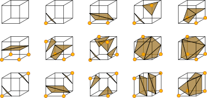
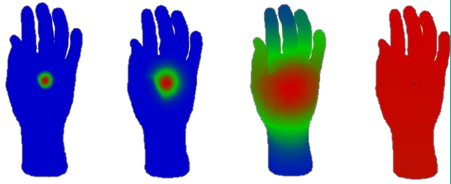
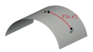
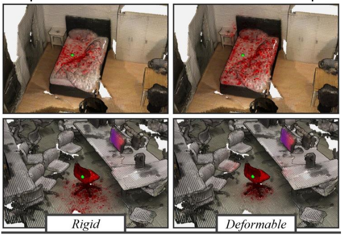
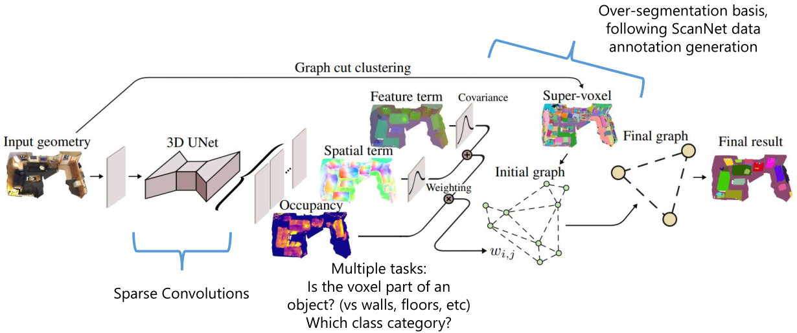
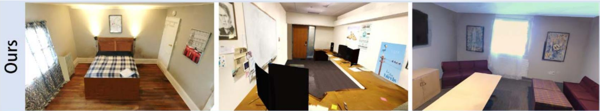
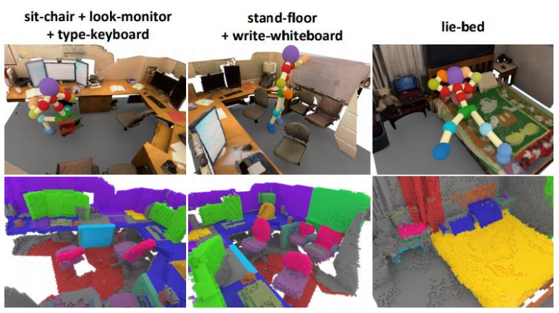
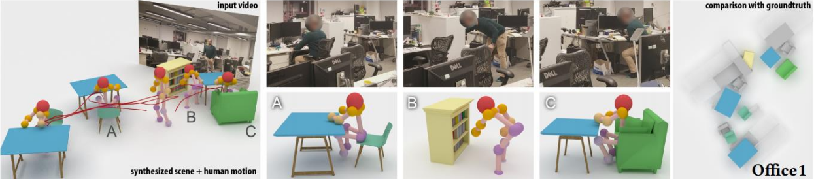
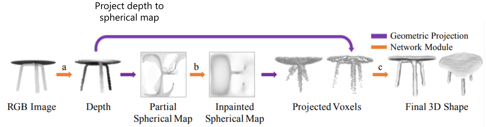

# Machine Learning for 3D Geometry

These notes are my lecture notes on the Machine Learning for 3D Geometry course held in the summer term 2021 by Prof. Angela Dai (TUM). The notes are based on the course slides. Images are taken from the course slides and related research papers which are referenced in the notes.

# Lesson 1 - Geometric Foundations: Surface Representations
There are several ways to represent 3D shapes, each with their own advantages and disadvantages. Aspects to consider are the memory usage, how efficient operations are, and the constraints of the source data and target application.

### Voxel grids
Voxels = Pixels in 3D. Each Voxel stores an attribute like occupancy (boolean), distance from the object (SDF), colors, etc.

Advantages: arbitrary topologies, easy to query, easy to operate on neighbors.

Huge disadvantage: space requirement grows cubically. Sparse surfaces in occupancy grids lead to a lot of empty space (as the resolution grows, the ratio of occupied voxels goes to zero).

### Point clouds
Set of $(x, y, z)$ locations of points (optionally, additional attributes). Unordered by definition. Can be the result of raw scanning data capture.

Advantage: More efficiently represents sparse surfaces.

Disadvantage: No spatial structure; less efficient neighbor queries.

### Polygon/Triangle meshes
Collection of *vertices*, (*edges*), and *faces*. Represent a *piecewise linear* approximation of a surface. Can approximate very closely if fine enough, though.

Advantages: arbitrary topologies, easy editing/manipulation, and easy rendering.

Definition: a polygon mesh is a finite set of closed (i.e. end = start point) and simple (not self-intersecting) polygons. Each polygon defines a face of the polygonal mesh.

*Boundary*: set of edges that belong to only one polygon. The boundary is either empty or consists of closed loops; if it is empty, the polygon mesh is closed.

Triangular meshes: polygons are triangulated. This simplies data structures/algorithms/rendering, since only triangles need to be considered.

Meshes can have additional attributes - for example, textured meshes.

##### Mesh data structures
###### STL format (*Triangle List* format)
Binary format, simply a list of triangles described by their corner coordinates: three bytes per coordinate, 9 coordinates per triangle => 36 bytes per triangle.

No connectivity information!

###### OBJ format (*Indexed Face Set* format)
First, list of point coordinates (three numbers per line preceded by a `v`); then, list of faces (three or more indices per line, which refer to the points specified above, preceded by a `f`). More primitives, e.g. lines, also possible.

Other indexed face set formats: OFF, WRL

### Parametric surfaces and curves
Functions $p: \mathbb{R} \to \mathbb{R}^3$ (curves) or $p: \mathbb{R}^2 \to \mathbb{R}^3$ (surfaces). More advanced: 
- Bezier curves
- Splines
- Bezier surfaces
- Bicubic patches

Advantages of Bezier patch meshes:
- requires fewer points than triangle mesh
- easy to manipulate: just transform the control points under a linear transformation to transform the whole mesh
- easy to sample points
- easy to ensure continuity

Disadvantages:
- hard to determine if point is inside/outside/on surface
- more complex rendering

### Implicit surfaces
Implicit surfaces are represented by functions that assign values to points which relate to the surface.

##### Signed distance function
*Signed distance function*: Function $f: \mathbb{R}^m \to \mathbb{R}$ s.t. $f(x)< 0$ on the inside, $f(x) > 0$ on the outside, and $f(x) = 0$ on the surface. Instead of using a function, one can also use a voxel grid with the SDF values filled in.

If we mostly care about values close to the surface: use a *truncated signed distance field* with N/A values far from the surface.

##### Operations on SDFs
Very efficient:
- union = $\min$ operation
- intersection = $\max$ operation
- subtraction = $\max(f, -g)$ operation
 

Advantages:
- easy operations
- easy to determine if a point is inside/outside/on the surface
Disadvantages:
- hard to sample points on the surface!

### Conversion between representations

##### Point cloud -> Implicit: Poisson Surface Reconstruction
Fit a function $f$ s.t. $f < 0$ on the inside, $f > 0$ on the outside.

Poisson surface reconstruction [Kazhdan et al. ’06]: uses *oriented points* (i.e. points + surface normals) as inputs, computes an indicator function $\chi_M$ (0 or 1).
From the point normals, the *gradient* of $\chi_M$, a vector field $V$, is computed. Then find a function $f$ whose gradient approximates $V$: Solve

$$\min_f ||\nabla f - V||$$

This can be transformed to a *Poisson problem* with the solutoin $\Delta f = \nabla * V$, then solved as least-squares fitting problem. (not more details given)

##### Implicit -> Mesh: Marching Cubes
Extract the surface belonging to $f = 0$ in form of a mesh.

Marching cubes algorithm [Lorensen and Cline 1987]: Discretize space into voxel grid. For each cube, compute the implicit function at the 8 corners. This allows to approximate the *zero crossings* (i.e. where the surface crosses the cube surface).

Lookup configuration in lookup table ($2^8$ possibilities depending on the 8 values at the edges).

Improve by linearly interpolating the exact position on the cube edges (i.e. if the sdf is -1 on one corner and +10 on the other, the zero crossing should be closer to the first corner).

Advantages:
- widely applicable
- easy to implement, trivial to parallelize

Disadvantages:
- can create skinny triangles
- lookup table with many special cases; some ambiguities are resolved arbitrarily
- No sharp features

##### Mesh -> Point cloud
...to solve problems with bad triangles in meshes, etc.

Generate point cloud by sampling the mesh: Sample each triangle uniformly with barycentric coordinates, sample triangles with probability proportional to their area.

If $r_1, r_2 \sim U([0, 1])$ are uniformly sampled, a random piont on the triangle is given by

$$p = (1 - \sqrt(r_1)) A + \sqrt(r_1)(1-r_2) B + \sqrt(r_1) r_2 C$$

Alternatively: farthest point sampling (sample next point to be farthest from all previously sampled points). However, this depends on the notion of distance (on mesh: discrete geodesic distance = path along edges).

### Geometric operators
how to describe geometry of local observation (i.e. point + its neighborhood)?

- tangent along a surface
- curvature (limiting circle as three points come together)

##### On discrete curves
On discrete curves: problem that points have no well-defined tangent/normal. One reasonable definition: weighted average of incident edges' normals, weighted by the edge lengths.

$$n_v = \frac{|e_1| n_{e_1} + |e_2| n_{e_2}}{|||e_1|n_{e_1} + |e_2| n_{e_2}||}$$

##### On point clouds
Estimate normal by approximating the plane tangent to the surface, as least-squares fitting problem.

Find neighborhood around point, then estimate a plane by PCA of this neighborhood. (Watch out: Orientation of normal is ambiguous.)

##### Mesh Laplacian
Local descriptor that describes connectivity of nodes/edges and surface geometry.

### Useful Software
- Meshlab (for viewing/processing meshes)
- OpenMesh (for processing meshes)
- CGAL (for computational geometry)

# Lesson 2 - Shapes: Alignment, Descriptors, Similarity

### 3D Shape Alignment (*Registration*)
Often needed: e.g. in 
- 3D scanning (combine different scanned parts)
- SLAM = Simultaneous Localization + Mapping (essentially, robot navigation)
- protein structure alignment

Given: two shapes $A, B$ with overlap; register together by rigid transform s.t. distance is minimized: $\min_T \delta(A, T(B))$ for some distance measure $\delta$.

Challenges: find both *point correspondences* and *transformation*.

#### Rigid 3D Alignment: Procrustes

Goal: find best alignment, given correspondences $(x_i)_i, (y_i)_i$ (even for different shapes).

Namely, find $(R, t)$ that minimizes $\sum_i ||R x_i + t - y_i||_2^2$. Solved as *orthogonal Procrustes problem* (1966).

Assume a coordinate system centered at the mean of the $(x_i)_i$: then the minimization term becomes

$$\min_{R, t} \sum_i ||t-y_i||_2^2 - 2\sum_i \langle R x_i, y_i \rangle$$

The first sum is minimized by $t = (\sum y_i)/N =: \bar{y}$. To minimize the second sum, define the mean-centered $X = (x_0 - \bar{x}, \dots, x_n - \bar{x})^\top$, $Y = (y_0 - \bar{y}, \dots, y_n - \bar{y})^\top$ and compute the SVD of $XY^\top$: $XY^\top = UDV^\top$.

Now replace the diagonal matrix $D$ by $S$: either by $S = I$ if $\det(U)\det(V)=1$, or $S = \text{diag}(1, \dots, 1, -1)$ otherwise. Then the minimizer $R$ is given by

$$R = USV^\top.$$

Question: We had problems with this formula in Exercise 1, and had to slightly change it based on the original paper. Is it valid as written here or not?

#### Obtaining point correspondences
##### Iterative Closest Points [Besl and McKay ’92]
Iterative algorithm:
- assume that the currenty closest points correspond
- align these correspondences (Procrustes)
- recompute closest points, repeat

Converges if the initialization is good enough. Optional steps: weight correspondences (by quality?), reject outlier correspondences before aligning.

Runtime: $O(N_A \cdot N_B)$ to find closest points naively, $O(N_A)$ to compute optimal alignment and update. So $O(K N_A N_B)$ overall runtime (where $K$ is the number of iterations, $N_A$ and $N_B$ the number of points in shape $A$ and shape $B$).

Better runtime with data structures like kd-trees.

Improved correspondence selection: minimize not pairwise distance, but distance to tangent plane of the surface. This can make the point correspondences more evenly distributed. No closed-form solution anymore, but faster in practice. (No details on how to compute this).

##### Global Registration: Finding ICP Initialization
General strategy: 
1. find a good initialization
2. refine with ICP

Approaches to find an initialization:

###### Exhaustive search
Just try out "all possible transforms" (or probably, a sufficiently dense subset of all transforms). Of course, this is extremely slow.

###### Normalization with PCA
Center shapes, use PCA and align such that the principal directions match up. Works well in some cases, but can also go wrong - problems are:
- inconsistent orientation of principal directions (e.g. two cars, for one the principal direction points towards the front, for the other towards the back)
- unstable axes (e.g. cup with handle => principal direction is not the expected top-bottom axis through the cup)
- partial similarity (chair with back vs. barstool without)

###### Random sampling (RANSAC)
RANSAC: pick random pairs of points, estimate alignment (details a bit unclear).

###### Matching by invariant features
Identify feature points like corners that describe local geometry ("invariant" because they should be invariant under the transformation). Align these feature points.

### Shape Descriptors
Needed for the feature point matching approach: feature descriptors that can capture the information to answer "are these points similar?".

##### Spin Images [Johnson and Hebert ’99]
To describe a point, create a *spin image* associated with its neighborhood. Neighborhood point contributions are parametrized by a) their distance to the tangent and b) their distance to the normal.

##### Point Feature Histograms [Rusu et al. ’09]
Find neighbors $(q_i)_i$ of point $p$, compute histograms based on distances, normal, curvature etc.

##### Global Shape Similarity and Global Shape Descriptors
Capture models by high-dimensional shape descriptors, compare these descriptors with some similarity measure.

###### Shape Histograms
Histograms that capture how much surface area resides withing concentric shells of different radii.

Can be made a local shape descriptor restricting the shell radii.

### Non-Rigid shape matching
Goal: find correspondences that preserve the *geodesic distance* on the shapes. In other words: even if the actual shape changes, pathes along the surface of corresponding points should stay the same.

One way to compute something like this: *near isometries preserve local structure*, so use descriptors of local regions and establish mappings between these. A problem: how to choose the scale of a local region?

#### Intrinsic similarity measures
##### Gromov-Hausdorff distance
The *Hausdorff distance* between two point sets is the *maximum of all minimum distances* $\max_p \min_{q} d(p, q)$.

The *Gromov-Hausdorff distance* is the infimum of Hausdorff distances over all mappings/correspondences.

##### Heat kernel signature [Sun et al. ’09]
Heat kernel $k_t(x, y)$: amount of heat transfered from $x$ to $y$ in time $t$. Advantage: invariant under isometric deformations, works at multiple scales. Difficult to use in real-world scenarios with partial/noisy data, though.

### Shape Search
Find shapes similar to given shape in shape search engine. Approaches: bag of geometric words, i.e. decompose shape into some parts.

Retrieve similar shapes through embedding in descriptor space.

# Lesson 3 - Shape Segmentation and Labeling

### 3D Classification tasks
##### VoxNet [Maturana and Scherer ’15]
NN architecture working on occupancy grids. One of the first 3D CNNs, used for object classification on occupancy grids.

##### 3D CNN [Qi et al. ’16]
Also, object classification on occupancy grids. Uses *anisotropic kernels* and *network in network* (details?). Interesting: Performs much better on synthetic objects (89.9% acc.) than on real objects (74.5% acc.).

##### PointNet [Qi et al. ’17]
Works on a point cloud (unordered set of points). Can then be used for
- classification
- part segmentation
- semantic segmentation

Architecture:
1. Transform all points by a learned transformation (3x3 matrix; goal: bring into *aligned coordinate system*)
2. 1x1 1d convolutions from 3 -> 64 channels (basically *shared MLP*) with ReLU and Batch norm
3. Another learned transform, 64x64 (close to orthogonal)
4. 1x1 1d convolutions from 64 channels -> 128 channels -> 1024 channels  with ReLUs and Batch norms
5. Max pooling (they argue: important that it's a symmetric operation, since the input set is unordered)
6. More MLPs -> final output

Question: How does this relate to the architecture in Ex. 2? Is it really the same?

- advantage: more efficient on sparse input data
- disadvantage: doesn't exploit local information

##### PointNet++ [Qi et al. ’17]
Unlike PointNet, also capture local structures (introduce hierarchical processing layer: grouping)

### 3D Shape segmentation tasks
Motivation: human understand shapes by their parts; can guide other tasks like shape matching, shape recognition, part-based modeling.

Labeling: assign part label to each point (or face) of the shape.

#### Classical approaches
Some (older) approaches work on single shapes: K-Means [Shalfman et al. ’02], Normalized Cuts [Golovinskiy and Funkhouser ’08], Primitive Fitting [Attene et al. ’06], Random Walks [Lai et al. ’08].

Better: learn from whole collection of shapes (consistently segment on a collection of objects)

##### Conditional Random Fields for Shape Labeling [Kalogerakis et al. ’10]
Conditional Random Fields (CRFs), encoding relationships between neighboring faces (details: see slides). 

Some limitations: e.g. all legs are labeled together, the individual legs cannot be distinguished. Also, sensitive to topology.

#### Deep Learning-based Part Segmentation
Helpful: ShapeNet dataset (~51k models in *ShapeNetCore*)

Simple option: 3D CNN for segmentation (convolve, have # classes channels in the end)

More advanced options:
##### PointNet for part segmentation [Qi et al. ’17]
Different part segmentation head (concat each of the point features from before the pooling with the global feature obtained from the pooling. Put resulting nx1088 data through shared MLPs to get output scores nxm - n points, m classes)

##### StructureNet [Mo et al. ’19]
Take into account part hierarchy.

Encode relationships between neighboring segments via a graph that encodes object parts. Use a Graph NN and encoder/decoder structure (*graph variational autoencoder*). 

(details -> slides)

##### Excursion: Graph NNs

### Unsupervised Co-Segmentation
Goal: find *most consistent* segmentation accross whole collection of shapes, without any supervision signal.

##### Feature-based approach [Sidi et al. '11]
Segment per object; find similar parts accross objects (clustering) -> end result is a part segmentation of whole collection.

Drawback: uses handcrafted features.

##### BAE-NET: Branched Autoencoder for Shape Co-Segmentation [Chen et al. ’19]
*Branched autoencoder*. Reconstruct each part of the shape. Intuition: apparently the autoencoder does not only learn good features for reconstructing the whole thing, but also for reconstructing/segmenting the parts.

##### AdaCoSeg: Weakly Supervised Co-Segmentation [Zhu et al. '20]
Train 

a) on shapes that are segmented (but not necessarily consistently; e.g. accross several chairs, you don't always have one-to-one corresponding parts/labels) (*Part prior network*)

b) in an unsupervised way on a *co-segmentation network*

Overall architecture complex -> see slides.

### Active Learning: Human-in-the-loop
System queries human "oracle", minimally. For example: 
- verification
- producing labels

Goal: human should do as little work as possible.

##### Active Part Segmentation Learning
- first: human annotates some shapes
- then: model propagates the annotations to other shapes
- next: human verifies the labelings of the model

### Datasets for Shape Segmentation
- PartNet (most useful)
- COSEG Dataset
- LabelMeshes
- Princeton Segmentation Benchmark

# Lesson 4 - Shape Generation

Goal: be able to generate shapes automatically. Usecases: for example, allow amateurs to create quality 3D models, and professionals to reduce repetitive work. Also, complete 3D structures that were partially observed.

### Example usecases
- Modeling by Example [Funkhouser et al. ’04]: Technique where the user selects a part from a model and part of another model to replace it with, which are then automatically fused. For example, fuse a chair back, chair legs, seating surface from different chair models.
- Part suggestions to support creativity [Chaudhuri and Koltun ‘10]
- Semantic part suggestion [Chaudhuri et al. ‘13] (make plane *more aerodynamic* or animal *more scary*)

### Shape Reconstruction

##### 3D-EPN for Shape Completion [Dai et al. ’17]
Classification of partial shape; class label + input scan -> encoder - predictor network (32^2 voxel grid) -> database prior, multiresolution 3D shape synthesis -> output distance field

##### 3D-R2N2: 3D Reconstruction from Multi-View Images [Choy et al. ‘16]
Recurrent approach: Encode each image with 2D CNN, then run feature vectors through convolutional LSTM and decode into a 3D occupancy grid with a CNN.

##### DeepSDF: Implicit 3D Reconstruction [Park et al. ‘19]
Auto-decoder architecture: like auto-encoder without the encoder part. Instead, the decoder works on codes sampled from an artificial latent space, which is optimized jointly with the decoder.

Allows
- shape completion from single depth image (how?)
- shape interpolation via interpolating the corresponding latent codes

##### Occupancy Networks [Mescheder et al. ‘19]
Also implicit 3D reconstruction: instead of an SDF, just reconstruct the function "p $\mapsto$ p inside the object?" implicitly.

### Point Cloud Generation
"Just predict 512 points" or similar; less resolution <-> space tradeoff problems than with voxels.

##### PSGN (Point Set Generation) [Fan et al. ‘17]
Input: segmented image. Output: point cloud that represents the segmented object.

Input image -> 2D CNN -> MLP generates points.
- Chamfer loss: for each point in target point set, distance to closest point in prediction point set; and vice versa; summed together
	- both directions, since else the loss could be "cheated" by predicting a sub- or superset

### Parametric  3D model generation [Smirnov et al. ‘21]
Sketch-based task: from a 2D sketch, generate 3D shape. 

Reconstruction via *Coon's patch*:
- parametric representation of a surface in computer graphs (smoothly joins surfaces together)
- specified: four curves that bound the patch
	- $P(\mu, 0), P(\mu, 1), P(0, \nu), P(1, \nu)$
- Linearly interpolate between these curves: 
$$P(\mu, \nu) = P(\mu, 0)(1 - \nu) + P(\mu, 1)\nu + P(0, \nu)(1-\mu) + P(1, \nu)\mu - P(0, 0)(1 - \mu)(1-\nu) - P(0, 1)(1-\mu)\nu - P(1,0)\mu(1-\nu) - P(1,1)\mu\nu$$

Per category, templates of part decomposition are generated (details?). For each category, a generator is trained:
- Resnet encodes sketch
- FC layer predicts control points

Trained with Chamfer distance loss + additional losses (*normal alignment*, *collission penalization*, *patch flatness regularizer*)

### Reconstructing Explicit 3D Meshes
(indirectly possible via previous methods, e.g. predict sdf -> apply marching cubes)

Directly: can have loss actually on the mesh. Also, possibly more efficient mesh output than from marching cubes.

##### Pixel2Mesh: Deforming template mesh [Wang et al. ‘18]
Start with ellipsoid mesh; deform to e.g. airplane

Architecture: Two pipelines, one convolving the input image, another deforming the mesh.
- Image undergoes several convolutions
- Graph NN predicts vertex displacements based on features from CNN pipeline

Disadvantage: no different topology possible

##### Mesh R-CNN [Gkioxari et al. ‘19]
- Start with coarse occupancy grid obtained from image -> create template mesh from it -> refine with deformation approach.

(not many details)

##### Freeform Mesh Generation: Scan2Mesh [Dai and Niessner ‘19]
"Cut out the template intermediary"
Details: see [[06 - Learning on Different 3D Representations#Scan2Mesh Dai et al '19|here in Lecture 6]].

##### Retrieval-based Object Representation [Li et al. ‘15]
Retrieve a similar looking object's mesh from a database (say, ShapeNet). Enables real-time 3D reconstruction!

- Retrieving similar objects: matching constellations of keypoints and descriptors.

Joint Embedding Space: space of both real images and shapes, s.t. semantically similar things are close
	- constructed from multi-view features
	- images mapped into space via CNN
	
### Joint Embedding for Retrieval
...means that shapes and images are embedded in a joint embedding space (*CNN image purification*). Used in the [[#Retrieval-based Object Representation Li et al ‘15|previous method]].

##### Joint embedding of shapes/images  [Li et al. ‘15]

- shapes: construct embedding space based on multi-view features
- images: train CNN to learn to map images into the embedding space

##### Joint embedding of 3D scans and CAD objects [Dahnert et al. ‘19]
Construct embedding space end-to-end; use triplet loss for metric learning. This means that an instance is compared with a known positive correspondence (should be close) and a known negative correspondence (should be far away).
	
	
##### Mask2CAD [Kuo et al. ‘20]
Start with image input. Segment into instances -> calculate embedding -> retrieve shape with close embeding. Also, classify the object pose. Combine retrieved shapes with refined poses into reconstruction.

# Lesson 5 - Learning on Different 3D Representations

### Types of 3D Represenations
1. Volumetric grids => 3D CNNs
2. Multi-view
3. Point clouds
4. Meshes

### Volumetric Grids

More efficient than dense grid?
=> octtree

##### OctNet: Operating on Octtree structure
Problem: "neighbor queries" needed for convolutions can be less efficient
Needed: known octtree structure => no generative tasks

Other architectures support generative tasks:

##### Octtree Generating Networks
Predict if octtree cell is empty / filled / mixed

#### Sparse Techniques
"Representing 'the fine level' in a sparse fashion"
e.g. storing only the surface voxels with hashtable

##### Submanifold sparse convolutions
Avoid spreading sparse information to dense via convolution

Submanifold sparse convolutions operate basically only close to the surface (details?)
* memory-efficient; uses hashing
* significant performance improvement (e.g. room-scale @1-2cm now possible)
* See: `MinkowskiEngine`

(Slight) disadvantage: close points in euclidean space can be far removed in geodesic distance or even disconnected, in this case no information propagation by subman. sparse conv. is possible.

##### Sparse Generative NNs (SG-NN, [Dai et al. '20])
(Used for scan completion)

Sparse Encoder -> Coarse Resolution
Dense Predictor @ Coarse Prediction
Upsample + Filter out by Geometry (e.g. mask out space known to be empty)

### Multi-View Representations
Idea:
* exploit already existing powerful 2D CNN work
* leverage high resolution of images

Advantage: can use fine-tuning on huge available 2D image datasets (which are not there for 3D)

Put in multiple images from the same object, put them through CNN. Idea: maybe one view is surer than another, and can provide more information.

Actually outperforms approaches with 3D inputs because of more training data. (Note: possibly only back then, not now)

Another idea: use on point clouds by rendering point clouds as spheres

### Handling Irregular Structures
Meshes, Point Sets, Molecule Graphs, ...

Surface geometry: up to now, gridify 2d surface in 3d space and apply (possibly sparse) convolution. => Point Cloud represents this without grid

##### Point Clouds
e.g. [[03 - Shape Segmentation and Labeling|PointNet]]: pool over points, such that agnostic to ordering

### Meshes
Interpret as graphs!

Convolutions over graphs should have, like regular convolutions: local support, weight sharing; and they should enable analysis at varying scales.

##### Geometric operators
Some geometric operators that might be useful for convolutions (how exactly? After all we're not on a continuous surface?)

- tangent plane of a point $x$
- geodesic distance between two points $x, x'$
- gradient $\nabla f(x)$ of a scalar field $f$ on the surface
- divergence $\text{div} F(x)$ of a vector field $F$ on the surface (density of outward flux of $F$ from an infinitesimal volume around $f$)
- Laplacian: $\Delta f(x) = -\text{div}(\nabla f(x))$ (difference between $f(x)$ and the average of $f(x)$ on an infinitesimal sphere around $x$)
- discrete Laplacian (on a grid structure)
	- in 1D: $(\Delta f)_i \approx 2f_i - f_{i-1} - f_{i+1}$
	- in 2D: $(\Delta f)_{i,j} \approx 4f_{ij} - f_{i-1,j} - f_{i+1,j} - f_{i,j-1} - f_{i,j+1}$

Similar definitions of discrete Laplacian on undirected graphs/triangular meshes (formulas -> see slides). Related to this: Graph Fourier transform (no more details on this).

##### Geodesic CNN
Convolutions in local geodesic coordinate system

(Polar coordinates $\rho, \theta$)

Apply filters to geodesic patches (to be rotation-invariant: apply several rotated variants of the filter. Otherwise the choice of $\theta=0$ is arbitrary)

Then one can define Convolutional networks with these geodesic convolutions [Masci et al. '15]

Computing this in practice: not trivial, but possible: uses a marching-like procedure that needs a triangular mesh. One needs to choose the radius of geodesic patches (compare with the kernel size).

Drawback: There is no natural pooling operation; can only use convolutions to increase receptive field. This is a huge drawback and hinders the performance.

##### Spectral Graph Convolutions
Relies on Graph fourier analysis. Convolution thereom: convolution in spatial domain = multiplication in frequency space.

Disadvantages: unless you have "perfect data", there are some drawbacks; e.g.g no guarantee that kernels have local support, no shift invariance. Also no natural pooling operations.

Open area for new developments.

##### MeshCNN [Hanocka et al. '19]
CNN for triangle meshes: conv. and pooling defined on edge
- each edge has a feature, and four edge neighbors (from two incident faces)
- convolution applied to edge feature + 4 neighbors
- pooling: edge collapse

Can perform reasonably well for part segmentation.

#### Message Passing Graph NNs
Nodes in a graph have features (*hidden states*) - optionally, also the edges and the graph as a whole. Hidden states are updated by aggregating messages from neighboring vertices/edges.

##### Scan2Mesh [Dai et al. '19]
Constructs a mesh from a 3D scan.

3d Input scan -> downsample (convolutions), predict vertices -> predict edges (message passing network)
-> dual graph (where each vertex corresponds to a mesh face, and an edge means that two faces are adjacent) -> output mesh.
(see slides)

Difficulty: how to define loss? combine: be close to a ground-truth mesh (not very flexible), be close to the correct surface (can have weird artifacts in mesh: e.g. self intersections)

### Combining Representations
It can be an advantage to use multiple representations at the same time.

##### Dynamic Graph CNN for Point Clouds
From point cloud, compute local neighborhood graph ($k$-nn graph)
- apply graph convolution
- re-compute local neighborhood graph for the pointcloud points

##### 3DMV (Joint 3D-Multi-View Learning) [Dai et al. ‘18]
First use a 2d CNN on images, then backproject to 3d, then a 3d CNN on reconstructed geometry (and also the actual geometry)

##### Virtual Multi-View Fusion [Kundu et al. ‘20]
Instead of real views, use rendered views. Also see [[07 - Semantic Scene Understanding#Virtual MVFusion Kundu et al '20|here]]

##### TextureNet [Huang et al. ‘19]
Semantic labeling of textured meshes. Can leverage the texture signal as well.

# Lesson 6 - Semantic Scene Understanding: Semantic Segmentation
3D Semantic segmentation: segment scene (e.g. room) in semantic parts (e.g. for each part: to which furniture type it belongs)

### Popular Benchmarks
- ScanNet benchmark (furniture scenes)
- KITTI / KITTI-360 (outdoor, captured on roads)

### Scene segmentation vs. Part segmentation
*Scene* segmentation and *part* semgentation are similar tasks. Differences: 
- in part segmentation, different types of objects have fixed sets of parts (i.e. a chair has legs, the seating surface, armrests, the back of the chair). Different types and are not considered/trained together, but separately.
- scale: small objects in part segmentation, larger rooms/building complexes in scene segmentation

### 3D inputs vs 2D inputs
- obvious: cubic vs quadratic space growth
- less obvious: in 3D, you get information about scale! 
	- in 2D you don't: you see a projection. One pixel can correspond to different real-world lengths at different positions in a picture.
	- but on the other hand, resizing 3D shapes changes this scale information

### Solving size problem
You often cannot process a huge scene at full resolution at once without resizing! Compare with [[04 - Shape Segmentation and Labeling|PointNet, PointNet++]]: combine local and global information, do things chunk by chunk.

##### Sliding window approach [Dai et al. '17]
For semantic segmentation.
- predict column-by-column in gravity direction (height-reliable feature)
- use data of local neighborhood around currently considered column

##### Joint 3d + multi-view [Dai et al. '18]
Multi-view images have higher resolution and also color information!

Process multiview: first process in 2d, then backproject to 3d using known camera params. Feed results + original 3d geometry into 3d convolutions.

##### ScanComplete [Dai et al. '18']
Convolutional architecture (no details given), key point: predicting complete geometry helps with semantic segmentation.

##### Sliding window approaches in general
Adaptive to varying scene sizes. Drawback: for w x h x d scene, needs to be run O(w x h) times.

### Convolutions to allow varying input sizes
Convolutions can have parameters s.t. the output size = input size.

##### ScanComplete [Dai et al '18] for geometric completion.
Relevant to semantic segmentation: first *completing* the scene helped later to correctly *segment* it.

### Allowing higher resolution

##### TextureNet [Huang et al. ‘19]
Augment input with textures (I think? Not clear what happens exactly...)

Textures give higher-resolution input signal.

##### Sparse convolutions
[[06 - Learning on Different 3D Representations#Submanifold sparse convolutions|Seen before:]] convolve on active sites only. Improved semantic segmentation drastically (e.g. SparseConvNet, MinkowskiNet; 2019). Mostly because whole scenes can be processed at once now without running out of memory.

### Non-Regular Grid Geometry
What about inputs that don't natively lie in a 3d grid?

##### KPConv
Based on point inputs; Goal: create *adaptive* convolution kernel ("deformable"?) by learning where points should be shifted (no details)

### Online Semantic Segmentation
##### OccuSeg [Han et al. 20]
Can perform semantic segmentation in real time + online when walking around with a camera.

- pretty complex approach
- 3D UNet followed by more stuff; also, clustering to super-voxels; then graph NN
- Most important part apparently is the clustering into super voxels

### Multi-View/3D Geometry Fusion Revisited
Goal: Fuse multi-view images with 3D geometry; get more information into the 3D geometry. 

Problems with simply backprojecting real-world images:
- limited set of views
- camera estimation, motion blur etc lead to inaccuracies
- colors may be view-dependent

##### Virtual MVFusion [Kundu et al. '20]
Generate Synthetic images from 3d scene. Lose real-world information, but also do away with inaccuracies in real-world image capture: more images, wider field of view, ensured to be consistent.

Fusing process: first, apply pretrained 2d semantic segmentation. Then back-project to 3d, aggregate projected 2d features for one 3d point by averaging.

(unclear to me: How to generaate synthetic images that are better than the original (limited) images?)

##### BPNet
*Bidirectional* interactions between 3d and 2d representations ("2d can inform 3d, but 3d can also inform 2d"). One 2D UNet which works with images and one 3D UNet which works on the reconstructed 3D scene, they interchange information and in the end predict 2D/3D labels.

Both the 2D results and the 3D results (slightly) improve because of this bidirectional information sharing.

# Lesson 7 - Object Detection + Instance Segmentation

Idea now: Not only detect object classes, but learn to actually distinguish different objects (the chair on the left, the chair on the right, etc.). So high-level goal: "Understand object-ness".

Applications: virtual furniture rearrangement; robots grabbing objects; both need to know as a first step *what the individual objects are*.

### Understanding Object-ness
1. Semantic segmentation
2. Object detection (Bounding boxes)
3. Instance segmentation (Geometry -> Instance mapping)

### 3D Object Detection (Bounding Boxes)
Bounding boxes usually work well (e.g. furniture objects). It stops to work well for more flexible things like computer cables.

##### Warm-up: Mask R-CNN for *2D* Object detection
Let's see what works well in 2D first.

Prespecified anchor boxes, find out for each: how likely is it that this covers an object => proposed bounding boxes

Propose bounding boxes -> Refine bounding boxes -> generate object masks.

##### Adapting to 3D
- more anchor boxes?
- leverage scale information?
- (+) more spatial separation between objects
- (-) difficult to capture high resolution

### First Approaches: exploit spatial separation
Example [Liu et al. ’19] : U-Net style first, semantic segmentation, finally clustering. Clustering assumes good spatial separation.

Not working well if objects are close together (multiple chairs = one chair). Inverse problem as well: 2 parts of the same chair but with one part inbetween missing from the scan => 2 different clusters.

### 3D-SIS (Semantic Instance Segmentation) [Hou et al. ’19]
Also uses anchors like Mask R-CNN, predicts masks.

Architecture starts with 2D convs, backproj. to 3D and works with 3D Convs; predict anchors and predicts if they correspond to an object, then refines; finally predicts per voxel which mask it belongs to.
(complicated architecture; don't get all the details)

Trick: train on smaller chunks (while predicting whole scenes in the end).

### RevealNet [Hou et al. ’20]
Hallucinate missing geometry patterns ("to get better priors"), in order to improve the instance segmentation performance.

Architecture: Encoder-Decoder structure (for details see slides).

### Summary: Top-down, anchor-based (Mask-R-CNN-style) approaches
##### Challenges
- Anchor basis needs to be diverse enough to cover all possibilities
- think/"anisotropic" objects easily missed
- inefficient to predict objectness for many empty space locations (much more of a problem in 3d than 2d)

##### Top-Down vs. Bottom-up
The simple Clustering approach is Bottom-up.
Top down would be e.g. starting with finding an object, then refine it to really get the object

Spectrum between these two paradigms: E.g. the next model, VoteNet, combines some of both.

### Point Cloud Object detection
Anchors on point clouds: problematic; since points are often on the surface, don't coincide with object center. Instead if anchors not restricted to point cloud (what does that mean?) => not clear how to distribute them

##### VoteNet [Qi et al. ’19]
Goal: get *object detection* without scanning too much empty space.

Point cloud representation: get votes from each point to where the center of their object is.

Related to Hough transform (which is usually used to find lines). Instead of lines, we find centers.

1. Input: point cloud. Put through "backbone" (typically PointNet++)
2. Seeds (typically farthest-point sampling from PointNet++): locations + features learned
3. Vote (shared MLP): predict 3D location (of center) + feature offset (used together with original feature to compute object feature)
4. Cluster votes: farthest point sampling based on 3D locations
5. Shared PointNet processes vote cluster (predict objectness, bounding box params, class category)
6. "3D non-max suppression": filter out near-duplicate bounding boxes

This is a leading conceptual approach for detecting objects.

##### 3D-MPA [Engelmann et al. ’20]
Multi-proposal Aggregation for 3D Semantic Instance Segmentation.
Similar to VoteNet, but now also get *instance segmentation* out. Works on Point cloud (or here, rather sparse voxels?)

1. Proposal generation (propose features for seed locations)
2. Proposal consolidation (graph NN with seeds as nodes => refined proposal features)
3. Object generation
4. again, non-max suppression postprocesssing

##### Probabilistic Embeddings for Point Cloud Instance Segmentation [Zhang and Wonka ’21]
(for point cloud instance segmentation)

Bottom-up instance segmentation on point clouds. Input unordered point set $x_i$; Output per-point embeddings $e_i$.

Measure similarities between point embeddings, and group the similar points together.

Not clear what happens exactly, but points are encoded as Gaussian distributions, and distances between the distributions are calculated (Bhattacharayya kernel, etc.)

Loss: BCE (nice to optimize; can suffer from class imbalance, e.g. way more background than interesting objects).

### Towards Part-Based Scene Understanding
Segment scene not only into instances, but even further segment instances into parts.

##### [Bokhovkin et al. ’21]

Start with synthetic priors of what e.g. chairs/tables/beds look like and how they decompose into parts. Combine linear combination of priors for a class to get a coarse estimate of how objects of this class look.

1. VoteNet-Like object detection
2. Decomposing objects into part trees => latent vector for each part
3. Prior decoder (recall: shape should be linear combination of part priors)
4. Refine priors => complete part decomposition

# Lesson 8 - Reconstructing and Generating Scenes

Motivation: make shape generation more accessible, require less expertise

- capturing 3d photos (e.g. can change viewpoint a bit)

- 3d online interaction mimicking live interaction ("mixed reality")

- reconstructing with a Kinect
	- one problem: only partial geometry (*missing geometry*)
		- maybe because the camera didn't go there
		- or objects are occluded
		- sometimes even from metallic/reflecting surfaces
		- => need to complete the scans

### Generative Tasks
##### Scan completion
Fill in missing geometry in an incomplete scan.

##### Surface reconstruction
we have a room (in this particular case, pretty much completely observed); but only point measurements (point cloud). Go from point measurements to whole continuous surfaces (e.g. implicit representation)

This could be done by classical surface reconstruction algorithms, but our goal is to learn geometric priors to help the task (to still perform well e.g. if the measurements are more sparse).

##### Pure generative task: scene generation
Sample code from latent space, then construct a plausible scene from it.

### Excursion: Generative tasks in 2D
Let's see how similar tasks are tackled in 2D.

- Encoder-Decoder approaches (encode -> decode -> L1/L2 reconstruction loss; problem with this loss: blurry generations)
- GANs (Generator generates; discriminator must tell real/fake apart)
	- both should train "at a similar pace"
- Autoregressive models
	- generate not the whole image at once, but pixel-by-pixel (i.e. when you generate the i-th pixel, you already know the i-1 previous ones)
	- examples: PixelRNN, PixelCNN, VQ-VAE, VQ-VAE2

### Scan completion/Surface reconstruction tasks (both appear in this section)
##### Synthetic vs. true data
Synthetic data: perfect ground-truth. Synthetic datasets:
- 3D-FRONT (furnished rooms with semantics)
- ICL-NUIM

Fully supervised approaches are fruitful with synthetic data because full ground-truth available.

##### SSCNet
RGB-D image -> geometry occupancy grid (of fixed size) + semantic labels

Architecture: bunch of convolutions and *dilated convolutions*.

#### ScanComplete
(not completely clear what the point is)

- Handle arbitrary-size scenes
- Trained on crops of scenes
- complete the scan at different resolutions

Also operates in auto-regressive fashion: (8 forward passes instead of one per voxel)

Note: on real-world scan data, the reconstruction is less clean

#### Learning just from incomplete real-world data
...in a self-supervised way, to get rid of the discrepancy between fake/real data.

##### SG-NN: Self-supervised Scan Complete [Dai et al. '20]
Goal: learn to reconstruct patterns that are missing in a less complete scan, but present in a more complete scan => self-supervised scan completion!

- reconstructed target scan from several depth frames (still some holes in it)
- other scan constructed from fewer frames -> more holes
- train reconstructing more complete frame from less complete frame (ignore space that is unobserved in the target scan in the loss)
	- note: if you don't ignore the missing space, the network *learns to generate holes*. Otherwise it manages to fill holes.

Multi-Scale approach as well: dense predictions at coarse level; more sparse predictions at upsampled level.

##### SPSG: Self-supervised color generation [Dai et al '21']
[[#SG-NN Self-supervised Scan Complete Dai et al '20'|Like previous approach]], but also generate color.

Problems with simple loss like L1: many walls in the input => everything becomes wall-colored.

SPSG approach: project back to images (i.e. the actual input data); then use a 2d reconstruction loss, a 2d perceptual loss + a 2d adversarial loss.

#### Leveraging implicit reconstruction networks
i.e. a technique that works well on 3D shapes -> now applied to scenes?
=> doesn't work as easily when working on scenes (not everything centered like for shapes, this makes it harder)

##### Local implicit grids [Jiang et al. '20']
- Decompose space into smaller patches (where the patches should be: convolutional enc/dec. approach: then fine detail on patches via implicit approach)

Also an advantage: can reconstruct shapes it has never seen before (otherwise, if it has never seen a car, it will turn it into something that is not a car)

##### Convolutional Occupancy Network [Peng et al. '20']
First convolutional, then implicit occupancy network at the end.
- Advantage: convolutions have translational invariance and can recognize non-centered patterns; implicit representations can reconstruct finer details.

First: (coarse) occupancy voxel grid; convolutions => feature vector per voxel

Trilinear interpolation: interpolate voxel feature vectors into feature vector for particular point 

Second: feed this feature vector of a point in a implicit occupancy network (shared between decoding locations)

#### Retrieval as Reconstruction (Exploiting training data as "dictionary")
Usually: condense training data into network weights. But we could leverage the more detailed training data during test time by using it as a dictionary to look up examples of nice constructed objects.

Advantages/Disadvantages of Retrieval as Reconstruction:
- For example: can be more sure that reconstructed objects are physically plausible (e.g. no chairs without legs etc.)
- Disadvantage: usually no exact geometric matches.

##### RetrievalFuse [Siddiqui et al. ’21]
Idea: create initial reconstruction estimate by composing chunks of train data. Then make it consistent afterwards

QUESTION: how well does this work with unseen objects?

Database retrieval (k-NN) -> attention-based refinement -> reconstruction

kNN via embedding space. Constructed with *deep metric learning*:
- a point *f* should be close to similar points *f+*
- ...and far away from dissimilar points *f-*
- done one triple (*f, f+, f-*) at a time

Use dot product similarity in more complicated expression to compute loss

k NNs merged together with attention.

##### Scan2CAD [Avetisyan et al. ’19]
Reconstruct scene by aligning CAD models (e.g. ShapeNet models) to it

For a point, estimate a heatmap on the candidate CAD models on where this point is likely to be.

Scan input, point, + candidate CAD models -> Encoded by 3D convs -> output: match (0 or 1), heatmap over CAD model, scale

Problem: objects aligned independently of each other.

##### SceneCAD [Avetisyan et al. ’20]
Take into account dependency of objects on each other via a GraphNN (used at train time)

### Scene synthesis task
 
##### [Wang et al. '18]

 Trick: create scene by iteratively adding objects to a room (easier to generate everything from scratch). It must be learned e.g. which objects appear together usually.
 
 Loop: partial scene -> decide: continue adding objects? (CNN) -> if yes: predict object category + location (CNN) and place object -> repeat

(autoregressive approach because of the loop)

### Textured Scene Generation
For content creation and visualization: need more than geometry; also textures, materials, lightning...

#### Texture optimization task
Assume texture is already known (from images), but from motion blur etc., we get blur in the reconstruction.
(Challenges: camera pose estimation, motion blur, distortion artifacts, view-dependent materials)

##### 3DLite [Huang et al. '17']
Use simple geometric primitives (i.e. planes) and project high-res textures onto these.

Apparently, uses more classical algorithms mostly. Also, kind of a "handcrafted" pipeline

##### Adversarial Texture Optimization [Huang et al. ’20]
Leraning an adversarial objective function that knows how real textures look.

In some way use differently aligned perspectives to feed into the discriminator (details a bit unclear)

# Lesson 9 - Functional Analysis of Scenes

Understanding possible interactions with objects (i.e. their *function*)

Not the object *type*, but more: e.g. to know how to open a drawer, we also need to find its handle. Which parts are the interactable parts?

Examples:
- pushcart: *wheel* - spinning -> allows movement
- fan: *rotor* - spinning -> allows to blow air
- what pose would a person be in when using a hammer/a banana/binoculars?

### Subtask: Predicting interactions
Related: predicting interaction poses (which pose does a person have when watching TV/writing on a whiteboard etc.). Can have a time component as well.

(Example: video with a horse -> can we forecast what the woman does next?)

##### Challenges
- data acquisition: how do we get enough and diverse enough data for such a task?
- how to represent objects/scene/person? (Maybe a graph?)

##### PiGraphs [Savva et al. '16]
Tracked human actors with motion capture. Learnt graph representation:
- each body part (skeleton part) and each object part becomes a node
- goal: learn co-occurence of these (e.g. "hip joint <-> sitting <-> chairs")

based on input texts ("watch-TV+restfeet-stool"), generate interaction snapshot.

Limitation: very limited because of the small training set.

### Human motion extraction
##### iMapper [Monspart et al. '18]
Get RGB video as input; Generates synthesized scene with human motion on a skeleton.

Training: with short interaction videos (*scenelests*) from PiGraph data.
First fit the skeleton statically, then perform a *scenelet fitting* using the database, then refine.

### Generating Human-Object interaction snapshots
##### Table object interaction generation [Wang et al. ‘19]
Train on interactions of a guy sitting at a table; using off-the-shelf image object recognition. Then synthesize new interactions to get animations of objects moving around.

##### Predicting pose snapshots [Li et al. '19]
Predicting static pose snapshots that showcase how the objects can be used.

extract
- semantic knowledge (skeletons of persons in videos)
- geometry knowledge

=> predict skeletons poses in 3d environment

##### Generating 3D People in Scenes [Zhang et al. '20]
Scene given. Generate bodies with VAE, use SMPL-X 3D body representation.
Then fit the human body to the scene to avoid floating/collisions.

(no architecture details given)

##### Populating 3D Scenes [Hassan et al. '21]
More or less trying to achieve the same as the previous one (also uses SMPL-X).

### Predicting human motion

##### Human motion prediction with scene context [Cao et al. '20]
Input: image + 2D pose history, Sample possible 2D destinations and predict the 3D path to the destinations.

Synthetic data generated from GTA game (persons moving in scene).

1. predict goal where person is moving (*GoalNet*)
	- heatmap over possible locations
2. predict single trajectory - i.e. where the hip moves, in 2D, without moving the full skeleton (*PathNet*)
	-  set of 2d heatmaps over time
3. predict movement of all skeleton joints (*PoseNet*)
	- transformer: start with 2d trajectory -> project to 3d as noisy input; then apply transformer to refine.
	- attention on pose level: attends over previous poses 

Excursion: transformers and attention (see slides)

##### Forecasting Characteristic Poses [Diller et al. '21]
Goal: predict not just random poses, but characteristic poses of certain actions. Specifically, start with an input pose and simulate the next poses over time when a certain action is performed.

Multi-modal prediction distribution: e.g. left hand maybe be passing or close to body (if the right hand is passing). Predicting the average of both is bad => auto-regressive prediction: predict joints in sequential order.

Achieved using attention (over previous predictions). Then decodes into 3d heatmap (aka probability distribution).

### Simulation Environments
Virtual 3D environments for training/testing AI agents
- no tedious real-world data collection and no material cost
- simulate rare/dangerous scenarios
- easier to reproduce stuff

##### Habitat
3D agent simulator (efficient rendering, on existing 3D datasets)

Has benchmark tasks:
- PointNav: agent at random position in unseen environment must navigate to target position
- ObjectNav: agent at random position in unseen environment must find instance of an object category

##### AI2Thor
Basic physics, partly dynamic objects

##### Gibson
Works with scanned data.

##### SAPIEN
PartNet has some objects with annotated parts where motion parameters (how far can it move) are specified. SAPIEN focuses on simulating interaction with such objects.

# Lesson 10 - Weak Supervision, n-shot Learning, Data Efficiency

Broad motivation for this chapter: We want to use as little (annotated) data as possible, because data collection and data annotation are expensive.

### Training methods and required amount of labeled data

- *Supervised*: manually labeled data by expert annotators (expensive)
- *Unsupervised*: no annotations at all (learn structural patterns)
- *Semi-Supervision*: both a labeled and an unlabeled set of data
- *Weak Supervision*: lower quality labels that you can get without expert annotators
- *Self-Supervision*: Automatically generate supervision signal
- *Transfer Learning*: transfer pretrained models to your task

Other hybrids exist: e.g. active learning -> use annotations more efficiently (human in the loop)

### Few-shot learning
See only few (or one) example per class.

##### Reconstruction from image on unseen classes [Zhang et al. ‘18]
Problem usually: if you train on tables and chairs then want to reconstruct a bed, it might end up looking like a table. Goal in order to avoid: "the model should memorize as little as possible"

Input image -> depth estimation -> 2d spherical map (geometry outprojected into a sphere) -> inpaint spherical map image to fill in missing geometry -> backproject to 3d shape -> refine to get a final 3d shape

##### Learning Category-Specific Mesh Reconstruction [Kanazawa et al. ‘18]

Input: lots of annotated images of one specific class (e.g. birds), but no 3d information. Then for one specific image, reconstruct a textured mesh.

(didn't get the details of the architecture)

##### Few-shot single image reconstruction [Wallace and Hariharan ‘19]
Transform an input image to a 3d representation, but this time a *category prior* can be used (e.g. image of a sofa, and the category prior is the mean of all known sofas).

Trained on image/3d shape pairs. But at test time, novel categories are presented where there are only a few (say 25) examples.

Architecture: encode image with 2d convolutions, prior shape with 3d convolutions -> concatenate (or sum?) the codes -> decode back with transposed convoutions.

The limitation is of course that some categories have much diversity, and then the approach doesn't work as well.

### Generalizing accross datasets
"Train in Germany, Test in the USA". An issue e.g. in autonomous driving: if an object detector is trained in different circumstances than it used in. If applying such a model to the different test dataset blindly, there will be a performance gap that we want to avoid.

##### [Wang et al. ’20]
Frequent issues found in self-driving car scenarios: misdetection (detect something where there isn't anything), but even more mislocalization. The latter comes from different car sizes in e.g. Germany vs. the US, or accross different cities etc.

Solved by data normalization (*domain adaption*).

### Approaches with less/no supervision
##### Discovery of Latent 3D Keypoints [Suwajanakorn et al. ’18]
Given: multi-view image observations. Goal: find keypoints in 3D without having annotated training data. (Related: annotating 3D Keypoints is not well-defined anyway but very much subjective).

Use auxiliary task as weak supervisory signal: Aux. task is pose estimation from an image. Given are two views of which the ground-truth transformation between them is known . Then as supervision, they use that transforming the keypoints output for the first image should be close to the keypoints output for the second image

This matches what you want from a keypoint: Keypoints should be points that are identifiable from several views of the shape.

##### Learning the Depths of Moving People [Li et al. ‘19]
Input: Youtube videos of people standing still. Goal: estimate depth maps.

Using the "mannquin challenge" dataset (2000 videos): people try to stand still like mannequins, which satisfies the static scene assumption quite well. Via structure from motion and multiview stereo a depth image which serves as supervision signal ist estimated.

Goal at test time: also apply it to moving people, not just static people. To improve for this, also take into account a mask that shows where the humans are and a depth from flow estimation (obtained from having a video, not only a static image).

##### SG-NN: Self-supervised scan completion [Dai et al. ‘20]
Mentioned before [[09 - Reconstructing and Generating Scenes#SG-NN Self-supervised Scan Complete Dai et al '20|in Lecture 9]]. This also uses self-supervision to complete scans, while having only a dataset of incomplete scans, by learning how to go from less to more complete.

##### PointContrast [Xie et al. ‘20]
Goal: semantic understanding of point clouds. Pretrained on large unannotated dataset, fine-tuned on small dataset.

These idea come from similar ideas in 2D representation learning:

###### Excursion: 2D Representation Learning
SimCLR [Chen et al. '20], MoCo [He et al. '20]. Use *contrastive loss function* to learn a representation where similar things are close, and dissimilar things are far away from each other. Compare with [[09 - Reconstructing and Generating Scenes#RetrievalFuse Siddiqui et al ’21|RetrievalFuse]], where a similar concept and loss were used.

The supervisory signal here is that we can generate more data samples we know to be similar by *data augmentation* (If you have an image of a cat and do some cropping and resizing, you know it's still an image of a cat; so make sure that the model learns this).

###### Similar ideas used in PointContrast
In 3D, we can even use more augmentation techniques related to multi-view constraints. So pretrain the model to be able to recognize originally close points in 2 images of the same 3d scene as similar, and far away points as dissimilar.

##### Data Efficient 3D Scene understanding [Hou et al. ‘21]
Extension of the previous PointContrast idea. Partition the scene into smaller regions, apply the contrastive loss in each region separately. This allows to get more performance out of using more sample points (while performance of the vanilla PointContrast approach saturates).

After the pretraining, train on limited number of fully-labeled scenes and on all scenes with limited point labeling budget (this would be suited to *active labeling*; not actually used here though).

### Domain Adaption
Scenario: Much labeled data in one domain, but much less in a second domain. One example: synthetic domain (object annotations for free) <-> real domain (annotations expensive).

Common tasks approached: semantic segmentation, object detection.

#### Excursion: Domain adaption in the 2D domain
##### CyCADA: Cycle-Consistent Adversarial Domain Adaption [Hoffman et al. ‘18]
Adapt between synthetic GTA images and real CityScapes images of cars on roads.
##### Classification/Segmentation
- Shape Classification: **PointNet(++)**
- Part Segmentation: **PointNet**
- Unsupervised co-segmentation: **AdaCoSeg**
	- both on non-consistently segmented (PointNet++) and unsegmented shapes (co-segmentation)

##### Reconstruction
- Shape reconstruction: **3D-EPN**
	- distance field voxel-grid UNet
- Point cloud generation: **PSGN**
	- image -> 2D CNN -> MLP generates pointcloud
	- Chamfer loss
- Parametric reconstruction: **Parametric 3D Model Generation**
	- sketch -> ResNet latent space -> FC layer -> control points of templates (per category!)
- Mesh generation: **Scan2Mesh**
	- voxel grid -> predict vertices -> edges GraphNN -> refine
- Retrieval-based reconstruction: **Joint Embedding of 3D Scan and CAD Objects**
	- embedding space end-to-end, metric learning - triplet loss

##### Different representations
- Sparse reconstruction: **SG-NN**, **MinkowskiEngine**
	- sparse input scan encoded, UNet-style decoder
- multi-view: **MVCNN**
- irregular structures: **Geodesic CNN**
	- convolutions on local patches; rotation ambiguity -> several rotations of filters
- meshes: **MeshCNN**
	- convs to adjacency n'hood
- combine representations: **3DMV**
	- 2D CNN, backproject, 3D CNN

##### Scene semantic segmentation
- sliding window scene segmentation: **3DMV**
- multiview-/3D fusion: **BPNet**

##### Scene instance segmentation/object detection
- top-down anchor based (Mask-R-CNN): **3D-SIS**
	- convolutions, anchor prediction, refinement
- vs. bottom-up: just cluster after semantic seg.
- voting-based: **VoteNet**
	- PointNet++ backbone on point cloud -> predict object centers -> voting: seeds vote -> cluster votes

##### Scene Reconstruction/Generation
- Scene scan completion: **SG-NN*
- Implicit scene reconstruction: **Conv. occupancy networks**
- retrieval-based: **SceneCad**
	- aligns CAD models, takes dependencies into account via GraphNN

##### Functional Analysis
- predicting interactions: **PiGraph**
- Human motion extraction: **iMapper**
- ....

##### Data Efficiency
- Few-shot: **Learning to Reconstruct Shapes from
Unseen Classes**
- fewer supervision: **Latent 3D Keypoints**
- domain adaption: **CyCADA** (2D)
	- GAN architecture. Source image (GTA) stylized as realistic image
GAN: Generator should stylize the source image similar to the target image. Discrimnator tries to tell apart the images and also the extracted features. The source image and stylized source image should have semantically consistent features. Then goal: be able to use the same feature extractors from the source domain on the target domain.

#### Domain Adaption in 3D
No details here, but the same thing as for 2D applies: We have synthetic data that is labeled already, and want to use it for pretraining and then be able to apply the models to real data.

# Appendix: Other Topics

##### Classification/Segmentation
- Shape Classification: **PointNet(++)**
- Part Segmentation: **PointNet**
- Unsupervised co-segmentation: **AdaCoSeg**
	- both on non-consistently segmented (PointNet++) and unsegmented shapes (co-segmentation)

##### Reconstruction
- Shape reconstruction: **3D-EPN**
	- distance field voxel-grid UNet
- Point cloud generation: **PSGN**
	- image -> 2D CNN -> MLP generates pointcloud
	- Chamfer loss
- Parametric reconstruction: **Parametric 3D Model Generation**
	- sketch -> ResNet latent space -> FC layer -> control points of templates (per category!)
- Mesh generation: **Scan2Mesh**
	- voxel grid -> predict vertices -> edges GraphNN -> refine
- Retrieval-based reconstruction: **Joint Embedding of 3D Scan and CAD Objects**
	- embedding space end-to-end, metric learning - triplet loss

##### Different representations
- Sparse reconstruction: **SG-NN**, **MinkowskiEngine**
	- sparse input scan encoded, UNet-style decoder
- multi-view: **MVCNN**
- irregular structures: **Geodesic CNN**
	- convolutions on local patches; rotation ambiguity -> several rotations of filters
- meshes: **MeshCNN**
	- convs to adjacency n'hood
- combine representations: **3DMV**
	- 2D CNN, backproject, 3D CNN

##### Scene semantic segmentation
- sliding window scene segmentation: **3DMV**
- multiview-/3D fusion: **BPNet**

##### Scene instance segmentation/object detection
- top-down anchor based (Mask-R-CNN): **3D-SIS**
	- convolutions, anchor prediction, refinement
- vs. bottom-up: just cluster after semantic seg.
- voting-based: **VoteNet**
	- PointNet++ backbone on point cloud -> predict object centers -> voting: seeds vote -> cluster votes

##### Scene Reconstruction/Generation
- Scene scan completion: **SG-NN*
- Implicit scene reconstruction: **Conv. occupancy networks**
- retrieval-based: **SceneCad**
	- aligns CAD models, takes dependencies into account via GraphNN

##### Functional Analysis
- predicting interactions: **PiGraph**
- Human motion extraction: **iMapper**
- ....

##### Data Efficiency
- Few-shot: **Learning to Reconstruct Shapes from
Unseen Classes**
- fewer supervision: **Latent 3D Keypoints**
- domain adaption: **CyCADA** (2D)
	- GAN architecture. Source image (GTA) stylized as realistic image

